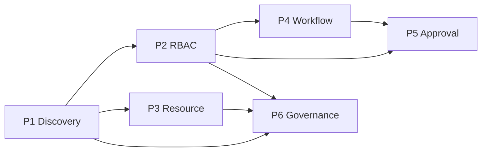

# Project Enterprise Roadmap (Phase 1–6)

**Overview:** Lộ trình từ Project Discovery → RBAC → Resource → Workflow → Approval → Governance.

```text
Project
├── Visibility          (P1)  Ai discover được project?
├── Information Level   (P1)  Thấy bao nhiêu?
└── Permissions         (P2)  Làm được gì?
```

## Index plan files

| Phase | File | Giải quyết |
|-------|------|------------|
| 1 | [phase-1-project-discovery-visibility.plan.md](./phase-1-project-discovery-visibility.plan.md) | Ai thấy được Project? |
| 2 | [phase-2-project-rbac.plan.md](./phase-2-project-rbac.plan.md) | Ai được làm gì? |
| 3 | [phase-3-resource-management.plan.md](./phase-3-resource-management.plan.md) | Capacity & allocation |
| 4 | [phase-4-workflow-engine.plan.md](./phase-4-workflow-engine.plan.md) | Custom status/transition |
| 5 | [phase-5-approval-system.plan.md](./phase-5-approval-system.plan.md) | Chuỗi duyệt |
| 6 | [phase-6-enterprise-governance.plan.md](./phase-6-enterprise-governance.plan.md) | Audit, security, compliance |

## Dependency



## Quyết định đã chốt (áp dụng P1)

- Info Level: **Hybrid** — Org default matrix theo audience; Project override nếu Allow PM Override.
- Policy công ty: Admin → Projects → **Policies** (`/app/admin/projects/policies`).
- Related Departments: discover + resource filter; **không** cấp RBAC.
- P1 **không** enforce Task/Repo permissions.

## Thứ tự implement

1. Làm **Phase 1** trước (file chi tiết implementable).
2. Phase 2–6: roadmap thiết kế; mở plan tương ứng khi bắt đầu phase đó.
