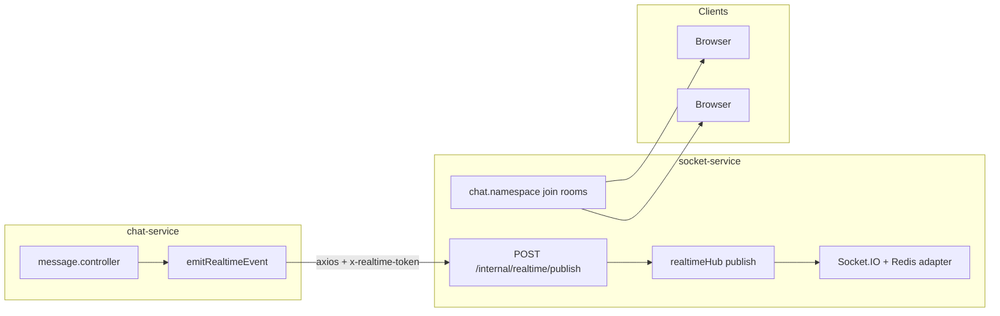

# Kế hoạch (bản 2): Storage file/hình + tích hợp hệ thống VoiceHub

Tài liệu này bổ sung các điểm: **signed URL bắt buộc**, **socket-service là service realtime riêng**, **metadata rõ ràng**, **worker copy temp → permanent**, **cleanup đồng thời DB + Storage** — và **nối mượt** với code hiện có (không đụng luồng JWT/gateway policy trừ khi thêm route mới).

---

## Hiện trạng đã rà soát (để nối không lỗi)

| Thành phần | Vai trò thực tế trong repo |
|-------------|----------------------------|
| **API Gateway** | Proxy JWT tới microservice; chat qua [`api-gateway/src/config/services.js`](api-gateway/src/config/services.js) (`/api/messages`, `/api/chat`). Thêm route JSON mới cho signed URL — không đổi cách auth. |
| **chat-service** | [`message.controller.js`](services/chat-service/src/controllers/message.controller.js) tạo message, gọi [`emitRealtimeEvent`](shared/utils/realtime.js). DM async có [`friendDmConsumer`](services/chat-service/src/workers/friendDmConsumer.js) + RabbitMQ. |
| **Realtime** | **Không** emit trực tiếp từ chat tới browser: `emitRealtimeEvent` → HTTP POST [`socket-service`](services/socket-service/src/server.js) **`POST /internal/realtime/publish`** (header `x-realtime-token` = `REALTIME_INTERNAL_TOKEN`). Socket.IO namespace trong [`chat.namespace.js`](services/socket-service/src/socket/chat.namespace.js) (join user, `friend:send`, `room:send`, Redis adapter scale). |
| **Message Mongo** | [`Message`](services/chat-service/src/models/Message.js): `content`, `messageType` (`text|image|file|system`) — cần mở rộng metadata file. |
| **Task Mongo** | [`Task`](services/task-service/src/models/Task.js) đã có `attachments[].url` — phù hợp trỏ URL sau copy sang vùng chính. |
| **Hạ tầng** | RabbitMQ, Redis, Mongo đã có trong compose. |

Luồng file mới **chỉ thêm** bước signed URL + field DB; payload realtime vẫn là object message (có URL + `messageType`), **không** cần đổi socket protocol nếu client đã nhận `friend:new_message` / `room:new_message`.

---

## 1. Upload file: bắt buộc qua signed URL (server trung gian)

**Vấn đề:** Upload trực tiếp từ client lên Storage (rules mở / token client) kém kiểm soát.

**Giải pháp chuẩn trong kế hoạch:**

1. Client gọi **API đã xác thực JWT** (qua gateway), ví dụ `POST /api/messages/storage/signed-upload` hoặc `/api/chat/storage/signed-upload`, body `{ fileName, mimeType, size, retentionContext }`.
2. **Server** (chat-service hoặc module nhỏ dùng **Firebase Admin SDK**) tạo **signed URL** (PUT) với path dạng `temp/{userId}/{uuid}/{safeName}`, TTL ngắn (vài phút).
3. Client **chỉ** `PUT` file bytes lên URL đó — **không** cần Firebase Authentication trên client.
4. Sau khi upload thành công, client gọi `POST /api/messages` (hiện có) với `messageType`, `content` (URL tải về hoặc `gs://` + metadata), kèm **cùng** `storagePath` / `expiresAt` / `retentionContext` để lưu một lần.

**Ghi chú Firebase Console:** Service account JSON cho Admin SDK (env), CORS nếu browser PUT cross-origin, bucket region — ghi trong `docs/FIREBASE_STORAGE.md` khi triển khai.

---

## 2. Realtime: tách rõ **socket-service**

Sơ đồ cập nhật (đúng production VoiceHub):

- **Scale:** Redis adapter đã có trong [`server.js`](services/socket-service/src/server.js) — không mô tả realtime như một hộp đen “emit”; **socket-service** là nơi duy nhất giữ kết nối WebSocket, join theo user/org/room.
- **File upload không đi qua socket** — chỉ sau khi message được persist, cùng pipeline `emitRealtimeEvent` như text.

---

## 3. Metadata trong database (rõ ràng cho lifecycle)

Bổ sung (message hoặc subdocument `fileMeta` — một document để tránh trùng):

- `storagePath` — full path object trong bucket (bắt buộc cho GC và copy worker).
- `storageBucket` — nếu đa bucket.
- `expiresAt` — `Date`, tính theo policy TTL.
- `retentionContext` — enum gợi ý: `dm` | `org_channel` | `meeting` | `task_permanent` (sau khi promote).
- `originalName`, `mimeType`, `byteSize`.
- `promotedToTask` / `taskAttachmentRef` (optional) — tránh GC xóa nhầm bản đã chuyển sang task.

Index Mongo: `{ expiresAt: 1 }`, `{ retentionContext: 1, expiresAt: 1 }` phục vụ cron.

---

## 4. Worker bất đồng bộ: làm rõ bước **copy temp → permanent (task)**

**Mục tiêu:** File task không phụ thuộc vùng tạm bị GC xóa.

Thứ tự job (queue Rabbit — cùng pattern [`friendDmConsumer`](services/chat-service/src/workers/friendDmConsumer.js)):

1. Nhận payload (messageId / storagePath temp, organizationId, userId).
2. **Stub phân tích** (theo yêu cầu trước: không build AI) — chỉ validate tồn tại / MIME.
3. **Firebase Admin `copy`** (hoặc upload từ stream) từ `temp/...` → `tasks/{orgId}/{taskId}/...` (vùng chính).
4. **Chỉ sau copy thành công:** tạo/cập nhật Task, `attachments[].url` trỏ **object permanent**; cập nhật Mongo message/file record (flag `promoted` / link task).
5. Thông báo (notification-service hoặc event realtime `task:created` qua cùng `emitRealtimeEvent` nếu định nghĩa thêm).

Nếu copy thất bại: retry DLQ; **không** xóa temp cho đến khi policy TTL (hoặc rollback rõ ràng).

---

## 5. Cleanup: đồng thời MongoDB và Firebase Storage

**Yêu cầu:** Khi hết hạn, **xóa metadata trong DB và xóa object trên Storage** — tránh orphan.

Chiến lược:

- Cron định kỳ (service chuyên trách hoặc trong chat-service):
  1. Query Mongo `expiresAt < now` và điều kiện chưa promote / không thuộc task permanent.
  2. Với từng bản ghi: gọi **Firebase Admin delete** theo `storagePath` — nếu thành công (hoặc 404 idempotent), cập nhật Mongo (xóa message soft hoặc xóa document phụ).
  3. Nếu delete Storage lỗi: log + retry; **không** xóa Mongo trước để tránh mất trace (hoặc ngược: mark `gcPending` — chọn một thứ tự và document trong plan implement).

**Task permanent:** object dưới `tasks/...` **không** bị cron chat TTL xóa; chỉ GC theo policy riêng (nếu có).

---

## 6. Thứ tự triển khai gợi ý

1. Firebase Admin + env + endpoint signed URL (gateway proxy).
2. Mở rộng schema Message + migration an toàn (default null cho tin cũ).
3. FE: flow signed upload → POST message.
4. Worker copy temp→tasks + Task record.
5. Cron dual-delete + monitoring lỗi Storage.

---

## Ràng buộc workspace

- Không đổi luồng JWT/permission middleware; chỉ thêm route và permission map tương ứng (`chat:write` cho upload-url).
- `populate` cross-service: không thêm populate User ngoài model đăng ký.
