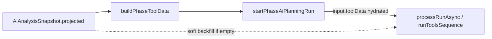

# Hydrate toolData (phase_how / SNAP → APS)

## 0. Verdict (as-is)

| Điểm | Trạng thái |
|------|------------|
| SNAP `projected.employees` / `calendar` | Có tại tạo snapshot (`buildSnapshotPayload`) |
| Job-by-job `buildJobInputFromSnapshot` → `splitContext` | Vẫn đủ field `toolData` |
| **`startPhaseAiPlanningRun`** | **`toolData: {}` hardcode** (L725) → Matching/Schedule chạy với pool rỗng |
| APS `enrichRunInputWithG1Catalogs` | Chỉ attach G1 catalogs; **không** điền `toolData` |
| `PlanningRun.input` | Schema `immutable: true` — hydrate tốt nhất **lúc start**, không phụ thuộc mutate sau |



---

## 1. Mục tiêu & phạm vi

### 1.1 Objective

- **Type:** Bugfix / harden
- **Business reason:** HOW Matching/Schedule phải dùng đúng pool + calendar đã pin trong SNAP (không live fetch).
- **Technical reason:** Phase-only cutover bỏ job pipeline nhưng quên map `splitContext` → `toolData`.
- **Expected outcome:** `phase_how` S2S gửi `toolData.employees` (array từ SNAP) + `calendar` + `overview`; APS HOW tools nhận data thật.

### 1.2 Success Criteria

- [ ] `buildPhaseToolData(snapshot, 'phase_how')` trả `employees` (array) từ `commonFiltered`/`prepared` SoT; `calendar` + `overview.startDate|deadline` khi SNAP có.
- [ ] `startPhaseAiPlanningRun` với `phase=how` **không** gửi `toolData: {}` khi SNAP có employees (ít nhất `Array.isArray` và length phản ánh pool).
- [ ] `phase_what` giữ `toolData` rỗng/`{}` hoặc omit heavy employees (không đổi WHAT contract).
- [ ] APS: nếu `input.toolData` thiếu employees nhưng `input.snapshot.projected|commonFiltered` có → soft backfill **in-memory** cho `runAgentPhase` (không bắt buộc persist nếu immutable chặn).
- [ ] Unit: project-service + APS liên quan xanh; không đổi auth/gateway.

### 1.3 In-Scope

- Helper hydrate từ SNAP (reuse `buildJobInputFromSnapshot` / `splitContext`)
- Wire `startPhaseAiPlanningRun` cho `phase_how`
- APS soft backfill khi toolData trống
- Tests

### 1.4 Out-of-Scope

- Live fetch employee pool lúc run (vi phạm SNAP-bound)
- `meetingHoursByUserDay` nếu chưa có trên SNAP (nullable như hiện tại)
- Persist mutate `PlanningRun.input` sau create (immutable) — trừ khi đã có pattern G1 update; ưu tiên start-time
- FE / Gate2 / G7 mode default
- Re-introduce public job-by-job

**Quyết định:** Hydrate **tại project-service lúc start** (SoT); APS chỉ **defense in-memory**.

---

## 2. Files Affected

### 2.1 CREATE

- `services/project-service/src/utils/aiAnalysis/pipeline/buildPhaseToolData.js` — map SNAP → toolData phase
- `services/project-service/tests/buildPhaseToolData.test.js`
- (optional) `services/ai-project-planning-service/src/knowledge/hydrateToolDataFromSnapshot.js` + test

### 2.2 MODIFY

- [`aiAnalysis.service.js`](services/project-service/src/services/aiAnalysis.service.js) — `startPhaseAiPlanningRun`: thay `toolData: {}` bằng helper khi `phase_how`
- [`pipeline/index.js`](services/project-service/src/utils/aiAnalysis/pipeline/index.js) — export helper
- [`enrichRunInputWithG1Catalogs.js`](services/ai-project-planning-service/src/knowledge/enrichRunInputWithG1Catalogs.js) **hoặc** `processRunAsync` — soft merge toolData in-memory trước `runAgentPhase`
- Tests cutover / phase start nếu assert `toolData: {}`

### 2.3 DELETE

- none

### 2.4 DO NOT MODIFY

- Auth/JWT/gateway; Matching/Schedule **formulas**; FE Gate2; Qdrant default; `container.jobs`

### 2.5 Dependency / Impact

```text
ensureActiveAiAnalysisSnapshot
  → startPhaseAiPlanningRun
      → buildPhaseToolData(snapshot)
      → aiProjectPlanningClient.startRun(input.toolData)
          → APS createQueuedRun
          → processRunAsync → enrichG1 → [soft hydrate] → runAgentPhase(toolData)
```

Deploy: `project-service` (+ `ai-project-planning-service` nếu Step 3).

### 2.6 Nguồn dữ liệu

| Loại | Kết luận |
|------|----------|
| HTTP public mới | Không |
| Route REST mới | Không |
| S2S | Giữ `startRun`; chỉ đổi shape `input.toolData` (additive fields) |

**Origin field → toolData:**

| Field | Nguồn |
|-------|--------|
| `employees` | SNAP `commonFiltered` / `preparedByJob.employeeMatching` via `buildJobInputFromSnapshot(..., 'employeeMatching'\|'scheduleCapacity')` |
| `calendar` | SNAP projected/common calendar |
| `overview` | pack/snapshot overview (startDate, deadline) |
| `skillCatalog` / `staffing` / `requirementSkills` | cùng jobFiltered SoT |
| `snapshotId` | active SNAP id |
| `meetingHoursByUserDay` | chỉ nếu đã có trên SNAP/input; không invent |

**Response / whitelist:** Không đổi public FE API; S2S payload lớn hơn (employees ≤ `MAX_EMPLOYEES` APS đã validate).

---

## 3. Thiết kế

### RULES

- **RULE-HT-01:** Phase HOW toolData chỉ từ SNAP (no live org fetch).
- **RULE-HT-02:** `phase_what` không bắt buộc employees pool trong toolData.
- **RULE-HT-03:** Empty pool hợp lệ (`employees: []`) nếu SNAP thật sự rỗng — khác với `toolData: {}` / thiếu key (sau harden requires: thiếu array → `TOOL_REQUIRES_MISSING`).
- **RULE-HT-04:** Soft backfill APS không ghi đè toolData đã có non-empty employees.

### Chi tiết

1. **`buildPhaseToolData(snapshot, phaseJob)`**
   - `phase_how`:  
     - `matching = buildJobInputFromSnapshot(snapshot, 'employeeMatching')`  
     - `sched = buildJobInputFromSnapshot(snapshot, 'scheduleCapacity')`  
     - Merge: employees từ matching (full pool filter), calendar/overview từ sched (hoặc matching + calendar patch).  
     - Shape gần `splitContext` toolData (employees, calendar, overview, staffing, skillCatalog, snapshotId, filterMeta).
   - `phase_what`: return `{}` hoặc `{ snapshotId }` only.
2. **Wire:**  
   ```js
   const toolData = buildPhaseToolData(snapshotObject, phaseJob);
   input: { ..., toolData, inputFingerprint: fingerprint(...) }
   ```
3. **APS soft backfill:** nếu `!Array.isArray(toolData.employees)` và snapshot có employees → set in-memory object passed to `runAgentPhase` / selective path.

---

## 4. Thứ tự triển khai

### Step 1 — Helper + unit (STOP)

- CREATE `buildPhaseToolData.js` + test fixture SNAP tối thiểu (1 employee, holidays).
- Validation: employees[0].userId; calendar.holidays; phase_what `{}`.
- **Review Gate:** `Implement step 1 only. Stop for review.`

### Step 2 — Wire startPhaseAiPlanningRun (STOP)

- MODIFY `aiAnalysis.service.js`; cập nhật test nếu cần.
- Validation: mock/assert payload `toolData.employees` không còn always-empty object without array.
- **Review Gate:** `Implement step 2 only. Stop for review.`

### Step 3 — APS soft backfill + regression (STOP)

- Soft hydrate trước HOW execute; unit empty toolData + snapshot.projected.
- `cd services/project-service && npm test` (hoặc file test liên quan)  
- `cd services/ai-project-planning-service && npm test`

---

## 5. Test plan

| ID | Command | Pass |
|----|---------|------|
| T1 | `node --test services/project-service/tests/buildPhaseToolData.test.js` | phase_how có employees+calendar; what rỗng |
| T2 | `node --test` file phase/cutover liên quan (nếu sửa assert) | start payload hydrated |
| T3 | `node --test` APS hydrate/soft-backfill test | empty toolData + SNAP → employees array |
| T4 | `cd services/project-service && npm test` (scoped nếu quá lâu: T1+T2) | 0 fail in-scope |
| T5 | `cd services/ai-project-planning-service && npm test` | 0 fail |

Regression: Gate2 / phase_only / requiresSatisfied vẫn pass (employees `[]` từ SNAP vẫn `Array.isArray`).

---

## 6. Risk & trade-off

| Risk | Impact | Mitigation | Fallback |
|------|--------|------------|----------|
| Payload S2S lớn (nhiều employees) | Latency / `RUN_INPUT_TOO_LARGE` | Giữ cap `MAX_EMPLOYEES`; reuse prepared filter | Truncate + warning trong filterMeta |
| `input` immutable chặn G1-style `$set` | Soft backfill không persist | Start-time hydrate là SoT | Chỉ in-memory APS |
| Double filter matching vs schedule pool lệch | Matching thiếu người | Merge employees từ `employeeMatching` prepared | Dùng commonFiltered.employees raw |
| phase_what vô tình nhận pool | Privacy / size | Helper returns `{}` for what | Explicit if-branch |

### Decision

- **Decision:** Hydrate ở project-service từ SNAP pipeline có sẵn; APS soft backfill defense.
- **Rejected:** Live fetch lúc HOW; chỉ sửa APS mà để start vẫn `{}`.
- **Rollback:** Revert helper + wire; redeploy project-service (+ APS nếu Step 3).
- **Observability:** log `[phase_how] toolData employees=N` (không log PII).
