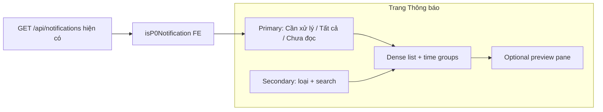

# Plan — Inbox Thông báo UX (Communicate) chuẩn VoiceHub

**Vai trò lập plan:** Senior Solution Architect (chỉ thiết kế; chưa code redesign lớn).  
**Vai trò implement sau này:** Senior Frontend Developer (FE-only mặc định). BE chỉ khi Explicit (snooze / saved views server).  
**Neo SoT:** Inbox = việc cần xử lý (P0); DM thường ≠ P0; `@mention` kênh = P0; không nới enum Notification; type lạ → `system` + `data.kind`.  
**Mở rộng không gian hiển thị:** list dày + filter gọn + (tuỳ chọn) preview pane — không biến trang thành dashboard thống kê.

---

## 1. Mục tiêu & phạm vi

### Objective
Đưa trang `/app/communicate/notifications` (và mirror Collaborate org) từ **hàng chip phẳng + card to** thành **Inbox triage** kiểu doanh nghiệp (học ClickUp / Base / Slack Activity), khớp P0 VoiceHub, sửa bug i18n, tăng mật độ đọc và tốc độ xử lý.

### Success Criteria (đo được)
1. Không còn raw key `notifications.filterPriority` (và key filter khác thiếu) trên UI vi/en.
2. User lọc **Cần xử lý (P0)** trong ≤ 2 click; chip/rail không wrap 2 hàng trên desktop ≥ 1280px.
3. Mật độ: ≥ 6–8 item nhìn thấy trong viewport 1080p (dense), vẫn a11y focus.
4. Loading / Empty / Error+Retry giữ đủ; không API spam; không đổi contract `GET /api/notifications`.
5. Click item → deep-link `/app/...` đúng (đã có `notificationNavigation`); mark-read khi mở như hiện tại.

### In-Scope
| Wave | Nội dung | Role |
|------|----------|------|
| **N0** | Vá i18n `filterPriority` (+ audit keys Mentions/Meeting nếu thiếu) | FE — **DONE** (thêm `filterNeedsAction` + `filterPriority`) |
| **N1** | IA filter: rail dọc hoặc segmented Primary (Cần xử lý / Tất cả / Chưa đọc) + secondary filters | FE — **DONE** (segmented Primary + chip Loại scroll ngang) |
| **N2** | Dense row + hierarchy unread; giữ time group | FE — **DONE** (row 32px icon, 1-line title/preview, list divide) |
| **N3** | (Tuỳ chọn) Split list \| preview / empty state “chọn tin” — mở rộng không gian | FE — **DONE** (desktop split + mobile detail back) |
| **N4** | (Sau) Keyboard shortcuts, bulk clear — chỉ FE nếu state local; snooze/Later → BE Explicit | FE — **DONE** (j/k/Enter/E/Del/Esc/X/? + bulk select; không snooze) |
| **N4b visual** | Icon + màu semantic theo tab/loại/item (Slack Activity style, token DS) | FE — **DONE** (`notificationVisualMeta.js`) |

### Out-of-Scope
- Đổi producer notify / enum Notification / R1 receipts  
- Bottleneck Hub cache  
- Custom saved views persist DB (ClickUp-level) — wave sau  
- Push mobile OS  

---

## 2. Files Affected (dự kiến)

### MODIFY (N0–N3, FE)
- `client/src/locales/appStrings.pages.js` — `notifications.filterPriority`, `filterMentions`, …
- `client/src/pages/Notifications/NotificationsPage.jsx` — filter options / IA
- `client/src/components/Notifications/NotificationsFigmaView.jsx` — layout rail + dense
- `client/src/components/Notifications/NotificationFeedItem.jsx` — mật độ card
- `client/src/components/Notifications/figmaNotificationsClasses.js` — token spacing
- (nếu org panel dùng chip riêng) `client/src/features/orgNotifications/OrganizationNotificationsWorkspacePanel.jsx`

### DO NOT MODIFY
- `services/notification-service/**` (trừ N4 Explicit)
- Gateway / JWT / shared auth
- `notificationP0Policy.js` logic P0 (chỉ **consume**; không nới P0 trừ SoT)

### §2.5 Impact
- Blast: FE only → deploy client (Vite). Không rolling Swarm.
- Regression: bell badge, mark-all-read, friend accept/reject, voice join CTAs.

---

## 3. Thiết kế & trách nhiệm

### 3.1 Hiện trạng (as-is)

```text
[ Header: title | search | Đọc tất cả | settings ]
[ Chip wrap: Tất cả | Chưa đọc | filterPriority(BUG) | Kết bạn | Mentions | Họp | Việc | Hạn ]
[ Time groups → card lớn (ít mật độ) ]
```

- Filter = hàng chip ngang → wrap, loãng, không phân tầng **cần xử lý vs xem cho biết**.
- `t('notifications.filterPriority')` **thiếu key** trong locale → hiện raw string.
- P0 đã có (`isP0Notification`) nhưng chip “Ưu tiên” gãy dịch + cạnh tranh với quá nhiều loại ngang hàng.

### 3.2 To-be IA (khuyến nghị — học Base + ClickUp, khớp SoT VoiceHub)

**Tách 2 tầng (đừng xếp 8 chip ngang bằng nhau):**

| Tầng | UI | Ý nghĩa VoiceHub |
|------|-----|------------------|
| **Primary** | Rail dọc trái *hoặc* segmented 3 nút sticky | **Cần xử lý** (= P0 / `isP0Notification`) · **Tất cả** · **Chưa đọc** |
| **Secondary** | Dropdown “Loại” hoặc chip nhỏ 1 hàng | Mentions · Công việc · Hạn · Họp · Kết bạn · (Message DM — không P0) |

Học **Base**: tab *Cần xử lý / Nhắc tới tôi / Tất cả*.  
Học **ClickUp Inbox**: *Primary vs Other* + filter Mentions/Unread.  
Học **Slack Activity**: dense vs detailed + triage (inbox chứ không feed).



### 3.3 Layout “mở rộng không gian hiển thị”

| Breakpoint | Layout |
|------------|--------|
| Desktop ≥ lg | `grid`: rail 200px + list (flex-1) + **preview** 360px (N3); hoặc list full nếu chưa N3 |
| Tablet | Primary segmented trên; list full |
| Mobile | Primary tabs; secondary trong sheet “Bộ lọc” |

**Dense row:** avatar/icon 32 · title 1 dòng · preview 1 dòng truncate · relative time · unread dot — bỏ card padding thừa.

### 3.4 Bug N0 (bắt buộc trước UX lớn)

```js
// notifications locale — thiếu:
filterPriority: 'Ưu tiên' / 'Priority'
filterMentions: 'Mentions' // nếu đang hardcode EN
```

### 3.5 Options & quyết định

| Phương án | Ưu | Nhược | Quyết |
|-----------|----|-------|-------|
| A. Giữ chip ngang, chỉ sửa i18n | Nhanh | Vẫn đơn giản / wrap | Chỉ N0 |
| **B. Primary 3 + secondary filters + dense** | Đúng triage, khớp P0/Base | Diff FE vừa | **Chọn N1–N2** |
| C. Full ClickUp (Later/Cleared/snooze + customize importance) | Mạnh | Cần BE + scope lớn | Wave sau |

### 3.6 API
- Giữ `GET /api/notifications`, mark-read, delete hiện có.
- Filter P0 / type: **client-side** trên page đã fetch (như hiện tại) — không route mới.
- Nếu sau này filter server-side: query param trên route sẵn — Explicit plan BE.

---

## 4. Thứ tự triển khai

1. **N0** — i18n keys. *Stop for review* nếu chỉ hotfix.  
   **Vai trò:** Senior Frontend Developer  
2. **N1** — Primary rail/segment + secondary “Loại”. Map `priority` → P0.  
3. **N2** — Dense `NotificationFeedItem` + classes.  
4. **N3** — Preview pane desktop (reuse org pick hint pattern).  
5. **N4** — Shortcuts / bulk (sau khi N1–N2 ổn).

Mỗi step: `Implement step Nx only. Stop for review.`

---

## 5. Test plan

| ID | Cách | Pass |
|----|------|------|
| T0 | Mở `/app/communicate/notifications` | Không raw `filterPriority` |
| T1 | Chip/rail **Cần xử lý** | Chỉ item `isP0Notification===true` |
| T2 | DM “gửi tin nhắn” | Không nằm Cần xử lý; có trong Tất cả |
| T3 | Mention / hạn / assign | Có trong Cần xử lý |
| T4 | Viewport 1280 / 768 / 375 | Không vỡ; filter usable |
| T5 | `cd client && npm run build` | pass |
| T6 | Mark all / delete / friend CTA | regression OK |

---

## 6. Risk & trade-off

| Risk | Mitigation |
|------|------------|
| User quen chip ngang | Primary vẫn có “Tất cả”; secondary giữ loại |
| Dense quá chặt a11y | Giữ min touch 32–36px; focus ring |
| P0 vs “Ưu tiên” wording | Copy **Cần xử lý** (Base) hoặc **Ưu tiên** — chốt 1 term trong N1 |
| Scope phình snooze | Out-of-scope đến N4+BE |

**Rollback:** revert FE commit; API không đổi.

---

## Phụ lục A — Nguồn tri thức (click đọc)

### ClickUp
- https://help.clickup.com/hc/en-us/articles/33947959867543-What-is-the-Inbox  
- https://help.clickup.com/hc/en-us/articles/16101057400471-Customize-your-Inbox  
- https://clickup.com/features/inbox  

### Base.vn (gần SE/VN enterprise)
- https://help.base.vn/support/solutions/articles/63000281222-base-platform-cập-nhật-hệ-thống-notifications-thông-báo-  
- https://help.base.vn/support/solutions/articles/63000284731-base-wework-my-tasks-  

### Slack Activity (triage / dense)
- https://slack.com/blog/news/slack-activity-triage-for-notifications  
- https://slack.design/articles/no-small-task-evolving-the-way-millions-catch-up-in-slack/  
- https://slack.com/help/articles/19693583638803-Get-your-work-done-from-the-Activity-view  

### UX principles
- https://www.nngroup.com/articles/indicators-validations-notifications/  
- https://www.courier.com/blog/in-app-notification-center-design  
- https://www.eleken.co/blog-posts/notification-ux  

### Áp vào VoiceHub (tóm tắt học được)
| Nguồn | Học gì | Áp VoiceHub |
|-------|--------|-------------|
| Base | Cần xử lý / @mention / Tất cả | Primary = P0 + Mentions secondary |
| ClickUp | Primary vs Other + filter Unread | Cần xử lý vs Tất cả; không spam Other bằng mọi event |
| Slack | Dense + triage inbox | Dense rows; không chỉ “feed đẹp” |
| NN/g + Courier | Action-required vs passive | Đúng SoT P0; DM/info không ngang hàng assign |

---

## Phụ lục B — Prompt tham vấn Cursor sau này

```text
Vai trò: Senior Solution Architect
Neo: Inbox = P0 cần xử lý; plan đủ 6 mục Plan Standard; FE-only trừ khi Explicit BE.
Task: <mô tả>
Tham chiếu nguồn: ClickUp Inbox, Base notifications, Slack Activity (link trong plan notify-inbox-ux).
Trước khi code: files / API / Out-of-scope. Implement step N only. Stop for review.
```

Khi code FE: `Vai trò: Senior Frontend Developer` — không paste full ràng buộc (đã có trong `.cursor/agents/frontend-dev.md`).
