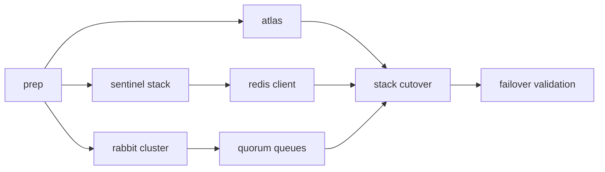

# Phase 1 Stateful HA — Master Index

> **Môi trường:** Staging Docker Swarm  
> **Tiền đề:** [stabilization sign-off](../stabilization/00-master-index.plan.md)  
> **Mô hình:** Hybrid — Atlas (Mongo) + Redis/Rabbit self-hosted Swarm  
> **Map hạ tầng:** Phase **1** trong roadmap Phase 0–5 (= [`ha-infra-roadmap.md`](../../../devops/swarm/ha-infra-roadmap.md) Phase 2)

## Cấu trúc thư mục

```
.cursor/plans/phase-1-stateful-ha/
├── 00-master-index.plan.md          ← file này
├── foundation/
│   └── p1-prep-backup-inventory.plan.md
├── mongodb/
│   └── p1-atlas-migration.plan.md
├── redis/
│   ├── p1-redis-sentinel-stack.plan.md
│   └── p1-redis-client-cutover.plan.md
├── rabbitmq/
│   ├── p1-rabbit-cluster-stack.plan.md
│   └── p1-rabbit-quorum-queues.plan.md
├── cutover/
│   └── p1-swarm-stack-cutover.plan.md
└── validation/
    └── p1-failover-validation.plan.md
```

## Thứ tự bắt buộc



| Bước | Thư mục | Plan |
|------|---------|------|
| 1 | `foundation/` | [p1-prep-backup-inventory](foundation/p1-prep-backup-inventory.plan.md) |
| 2 | `mongodb/` | [p1-atlas-migration](mongodb/p1-atlas-migration.plan.md) |
| 3a | `redis/` | [p1-redis-sentinel-stack](redis/p1-redis-sentinel-stack.plan.md) |
| 3b | `redis/` | [p1-redis-client-cutover](redis/p1-redis-client-cutover.plan.md) |
| 4a | `rabbitmq/` | [p1-rabbit-cluster-stack](rabbitmq/p1-rabbit-cluster-stack.plan.md) |
| 4b | `rabbitmq/` | [p1-rabbit-quorum-queues](rabbitmq/p1-rabbit-quorum-queues.plan.md) |
| 5 | `cutover/` | [p1-swarm-stack-cutover](cutover/p1-swarm-stack-cutover.plan.md) |
| 6 | `validation/` | [p1-failover-validation](validation/p1-failover-validation.plan.md) |

**Nguyên tắc:** migrate **một component một lần** — Mongo Atlas → Redis Sentinel → Rabbit cluster → quorum queues → cutover stack → validation.

**Trước Phase 2:** chạy gate [G1](../phase-gates/gates/gate-p1-to-p2.plan.md) (bug + plan completion) — không chỉ dựa vào validation pass.

## Success criteria tổng (Phase 1 done)

| Thành phần | Done khi |
|------------|----------|
| **MongoDB** | Mọi service dùng `mongodb+srv://` Atlas; không còn `mongodb` single trong stack |
| **Redis** | Sentinel failover; ioredis + Socket.IO adapter reconnect |
| **RabbitMQ** | Cluster 3 node; queue critical quorum; DLQ drain sau node kill |
| **Validation** | [`load-chaos-validation.md`](../../../devops/swarm/load-chaos-validation.md) pass + `docs/ha-baseline-staging-*.md` |

## Vị trí roadmap Phase 0–5

| Phase hạ tầng | Phase 1 folder |
|---------------|----------------|
| 0 Baseline | [stabilization](../stabilization/) — tiền đề |
| **1 Stateful HA** | **Folder này — đầy đủ** |
| 2 Stateless scale | Plan riêng sau Phase 1 sign-off | [`phase-2-stateless-scale/`](../phase-2-stateless-scale/00-master-index.plan.md) |
| 3–5 Edge/Gateway/CF | Sau Phase 2 |

## Out-of-scope

- K8s, Cloudflare, Kafka, Mongo sharding trên Swarm
- `ha-infra-roadmap` Phase 3 (toàn managed Redis/Rabbit cloud)
- Meilisearch HA

## Quy tắc triển khai

- Dừng review sau bất kỳ plan con (`Implement p1-atlas-migration only. Stop for review.`).
- Backup + restore drill trước mọi cutover.
- Không đổi JWT/auth/gateway permission contract.
- Biến môi trường chỉ qua `.env` — không hardcode URI trong code.

## Liên kết

| Tài liệu | Quan hệ |
|----------|---------|
| [stabilization/](../stabilization/) | Bắt buộc trước Phase 1 |
| [ha-infra-roadmap.md](../../../devops/swarm/ha-infra-roadmap.md) | Phase 2 infra = nội dung này |
| [observability-baseline.md](../../../devops/swarm/observability-baseline.md) | Queue list cho prep |
| [load-chaos-validation.md](../../../devops/swarm/load-chaos-validation.md) | Validation criteria |
