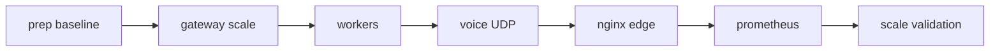

# Phase 2 Stateless Scale — Master Index

> **Môi trường:** Staging Docker Swarm  
> **Tiền đề:** [Phase 1 sign-off](../phase-1-stateful-ha/validation/p1-failover-validation.plan.md) **và** [Gate G1 PASS](../phase-gates/gates/gate-p1-to-p2.plan.md)  
> **Map:** Phase **2** trong roadmap Phase 0–5 ([stabilization](../stabilization/00-master-index.plan.md) bảng hạ tầng)  
> **Không nhầm:** [`ha-infra-roadmap.md`](../../../devops/swarm/ha-infra-roadmap.md) mục "Phase 2 — Scale & edge" = **folder này** (sau khi Phase 1 infra tick ✅)

## Cấu trúc thư mục

```
.cursor/plans/phase-2-stateless-scale/
├── 00-master-index.plan.md          ← file này
├── foundation/
│   └── p2-prep-replica-baseline.plan.md
├── gateway/
│   └── p2-gateway-scale.plan.md
├── workers/
│   └── p2-worker-replicas-autoscale.plan.md
├── voice/
│   └── p2-voice-udp-strategy.plan.md
├── edge/
│   └── p2-nginx-staging-edge.plan.md
├── observability/
│   └── p2-prometheus-metrics.plan.md
└── validation/
    └── p2-scale-load-validation.plan.md
```

## Thứ tự bắt buộc



| Bước | Thư mục | Plan |
|------|---------|------|
| 1 | `foundation/` | [p2-prep-replica-baseline](foundation/p2-prep-replica-baseline.plan.md) |
| 2 | `gateway/` | [p2-gateway-scale](gateway/p2-gateway-scale.plan.md) |
| 3 | `workers/` | [p2-worker-replicas-autoscale](workers/p2-worker-replicas-autoscale.plan.md) |
| 4 | `voice/` | [p2-voice-udp-strategy](voice/p2-voice-udp-strategy.plan.md) |
| 5 | `edge/` | [p2-nginx-staging-edge](edge/p2-nginx-staging-edge.plan.md) |
| 6 | `observability/` | [p2-prometheus-metrics](observability/p2-prometheus-metrics.plan.md) |
| 7 | `validation/` | [p2-scale-load-validation](validation/p2-scale-load-validation.plan.md) |

**Đã có từ stabilization (verify, không implement lại):** `SOCKET_SERVICE_REPLICAS>=2`, `SOCKET_IO_REDIS_ADAPTER=true`, realtime HA checklist.

## Success criteria tổng (Phase 2 done)

| Thành phần | Done khi |
|------------|----------|
| **Gateway** | `API_GATEWAY_REPLICAS>=2`; login/BFF/cache ổn định; không sticky bắt buộc |
| **Workers** | Scale policy áp dụng ([`autoscale-policy.md`](../../../devops/swarm/autoscale-policy.md)); queue drain sau burst |
| **Voice** | Chiến lược UDP/host documented; 2 user call smoke pass |
| **Edge** | Nginx TLS staging (optional LAN); `TRUST_PROXY=1`; client same-origin |
| **Observability** | Queue depth + task restart metrics; baseline so sánh pre/post scale |
| **Validation** | [`load-chaos-validation.md`](../../../devops/swarm/load-chaos-validation.md) pass với stack scaled |

## Out-of-scope

- Cloudflare / WAF (Phase 5)
- K8s migration
- Mongo sharding, Meilisearch HA
- Thay đổi JWT/auth contract
- Autoscale fully automated (Swarm không có HPA native — manual/script scale trước)

## Vị trí roadmap Phase 0–5

| Phase | Nội dung | Folder |
|-------|----------|--------|
| 0 | Stabilization | [stabilization/](../stabilization/) |
| 1 | Stateful HA | [phase-1-stateful-ha/](../phase-1-stateful-ha/) |
| **2** | **Stateless scale** | **Folder này** |
| 3 | Edge TLS prod polish | Một phần trùng `edge/` (staging trước) |
| 4–5 | Gateway prod scale + CF | Sau Phase 2 sign-off |

## Quy tắc triển khai

- Một plan con một PR khi có thể (`Implement p2-gateway-scale only. Stop for review.`).
- Scale từng service; canary trước full replica bump.
- Biến môi trường chỉ qua `.env` — replica qua `*_REPLICAS` trong `docker-stack.yml`.
- Không thêm REST route mới nếu endpoint hiện có đủ.

## Liên kết

| Tài liệu | Quan hệ |
|----------|---------|
| [ha-infra-roadmap.md](../../../devops/swarm/ha-infra-roadmap.md) | Phase 2 bullet list |
| [autoscale-policy.md](../../../devops/swarm/autoscale-policy.md) | Worker thresholds |
| [staging-nginx-edge.md](../../../devops/swarm/staging-nginx-edge.md) | Edge runbook |
| [observability-baseline.md](../../../devops/swarm/observability-baseline.md) | Metrics list |
| [realtime-ha-checklist.md](../../../devops/swarm/realtime-ha-checklist.md) | Socket verify |
