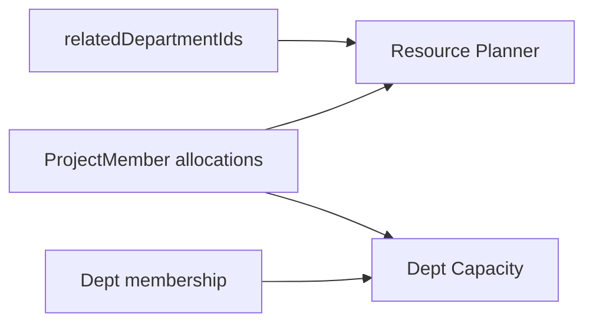

# Phase 3 — Resource Management

**Status:** Roadmap (sau Phase 1; song song được với P2)  
**Depends on:** Phase 1 (`relatedDepartmentIds`), mầm `ProjectMember.allocations`  
**Unlocks:** Phase 6 capacity/budget dashboards

## 1. Mục tiêu & phạm vi

### Done khi
- Xem **Department Capacity**: headcount / allocated / available theo phòng.
- **Member Allocation** % across projects (CRM 50% + ERP 30% + …).
- **Resource Planner** cho PM: filter related depts → ai còn available / overallocated.
- Related Departments trên project dùng để scope planner & báo cáo (vẫn không thay RBAC).

### In-scope
- Aggregates capacity từ org structure + ProjectMember allocations.
- UI Admin/Hub: Capacity board, Allocation editor (đã có segments — hoàn thiện), Planner view.
- API: capacity by department, availability candidates (mở rộng member-candidates).

### Out-of-scope
- Payroll/budget accounting thật (P6 có thể mở rộng).
- Auto-assign staff (chỉ gợi ý).

---

## 2. Files affected (dự kiến)

### Tạo mới
- `services/project-service/src/services/resourceCapacity.service.js`
- `services/project-service/src/controllers/resource.controller.js` (+ routes)
- `client/.../ResourcePlannerPanel.jsx`, `DepartmentCapacityPanel.jsx`
- Tests: `resourceCapacity.test.js`

### Sửa / tận dụng
- `ProjectMember` + `AllocationSegmentsEditor` (đã có)
- `projectMemberCandidate.service.js` — filter theo related dept + available capacity
- `Project.relatedDepartmentIds` (P1)
- Org structure / department membership APIs
- Admin domain Projects: nav Capacity / Planner
- Locales

---

## 3. Thiết kế & trách nhiệm module

### Department Capacity
```text
Backend dept
  headcount = active members in dept
  allocated = sum(allocation% overlapping now) of members on active projects
  available = max(0, headcount*100% - allocated)  // hoặc count people with free %
```

### Member Allocation
- Đã có segments start/end + percent trên `ProjectMember`.
- Enforce overlap rules (đã có `allocationOverlap.js`) + cảnh báo overallocated.
- UI timeline multi-project per user.

### Resource Planner
- Input: projectId (related depts) hoặc deptId + date range.
- Output: users ranked Available → Partial → Overallocated.
- PM add member từ planner → reuse setMemberRoles / ensure membership (P2 permissions).



---

## 4. Thứ tự triển khai

1. Capacity aggregate API + unit tests (fake allocations).
2. FE Department Capacity panel.
3. Harden allocation editor + overallocated badge trên Members.
4. Resource Planner panel gắn related depts.
5. Wire member-candidates với capacity score.
6. Smoke với data seed multi-project.

---

## 5. Test plan

| ID | Pass khi |
|----|----------|
| T1 | Capacity math đúng với fixture |
| T2 | Overlap >100% → overallocated |
| T3 | Planner chỉ user thuộc related depts |
| T4 | User không related không hiện (trừ admin) |
| T5 | Add từ planner tạo membership |

---

## 6. Risk & trade-off

| Risk | Mitigation |
|------|------------|
| Headcount ≠ FTE thực | Dùng count member active; ghi chú “approx” |
| Cross-service joins nặng | Aggregate theo dept batch; cache ngắn |
| PM thấy PII allocation | Chỉ actor có `members:manage` / PM (P2) |

**Rollback:** ẩn nav Capacity/Planner; giữ allocation segments hiện có.
