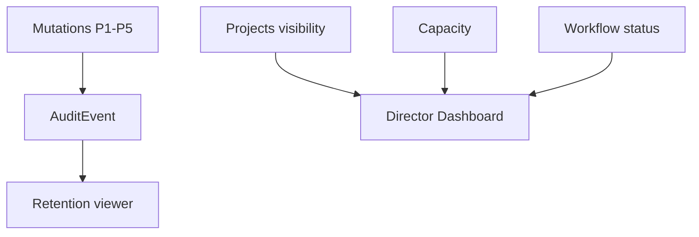

# Phase 6 — Enterprise Governance

**Status:** Roadmap (sau P1–P5 dần chín)  
**Depends on:** P1 visibility data, P2 actions, P3 capacity, P5 approval evidence  
**Unlocks:** — (enterprise maturity)

## 1. Mục tiêu & phạm vi

### Done khi
- **Audit Log** field-level: ai / lúc nào / old / new cho project & task mutations.
- **Security** baseline enterprise: MFA/SSO hooks, IP allowlist (policy), WebAuthn nếu stack sẵn.
- **Compliance:** retention, archive, backup runbook (ops + product toggles).
- **Org Report / Director Dashboard:** projects delayed/on-track, capacity, burndown, budget stub.

### In-scope (chia wave)
- Wave A: Audit log + director project health dashboard (dùng P1 list + status).
- Wave B: Retention/archive project; backup docs/runbook.
- Wave C: SSO/LDAP/AD/MFA/IP — phối hợp auth-service (scope lớn, plan riêng khi làm).

### Out-of-scope ban đầu
- Full SIEM export; SOC2 chứng nhận; budget accounting ERP.

---

## 2. Files affected (dự kiến)

### Tạo mới
- `AuditEvent` model (hoặc mở rộng activity log hiện có `TaskActivityLog`)
- `audit.service.js` — append-only writer
- Director dashboard BFF hoặc project-service report endpoints
- Admin: Audit viewer, Retention policy panel
- Docs: `devops/.../backup-retention-runbook.md`

### Sửa
- Mutating services emit audit (project, membership, task, approval)
- auth-service: MFA/SSO feature flags (Wave C)
- notification / reporting FE Admin domain
- Gateway rate/IP middleware nếu IP restriction

---

## 3. Thiết kế & trách nhiệm module

### Audit event
```js
{
  organizationId, actorUserId, action, resourceType, resourceId,
  before, after, requestId, createdAt
}
```
- Append-only; không update/delete từ API user.
- Index theo org + resource + time.

### Director Dashboard widgets
- Projects: Delayed / On Track / Completed (từ `Project.status` + dueDate).
- Capacity: reuse P3 aggregates.
- Burn-down: từ sprint/task completed (P4 statuses).
- Budget: placeholder field nếu chưa có finance.

### Security (Wave C)
- Tách plan con: không nhét SSO vào cùng PR audit.
- VoiceHub constraint: không đổi auth flow trừ khi task nêu rõ.



---

## 4. Thứ tự triển khai

1. **Wave A:** AuditEvent + instrument project/task/member writes; Audit admin list.
2. **Wave A:** Director dashboard read-only (projects health).
3. **Wave B:** Soft-archive project + retention job stub; backup runbook.
4. **Wave C:** Plan riêng SSO/MFA/IP (auth-service).

---

## 5. Test plan

| ID | Pass khi |
|----|----------|
| T1 | PATCH project tạo audit old/new |
| T2 | User thường không xóa audit |
| T3 | Dashboard counts khớp fixture |
| T4 | Archive ẩn khỏi default list, admin vẫn xem |
| T5 | Wave C: MFA challenge smoke (khi làm) |

---

## 6. Risk & trade-off

| Risk | Mitigation |
|------|------------|
| Volume audit lớn | TTL / cold storage; sample high-churn fields |
| Auth changes rủi ro | Wave C plan riêng + security checklist VoiceHub |
| Dashboard nặng | Pre-aggregate nightly hoặc on-read cache |

**Rollback:** tắt write audit (no-op publisher); ẩn dashboard nav.
