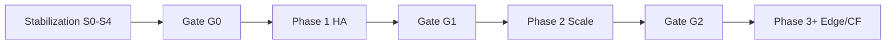

# Phase Gates — Master Index

> **Mục đích:** Trước **mỗi** lần chuyển phase (0→1, 1→2, 2→3…), chạy **một gate plan** — không chỉ validation kỹ thuật cuối phase mà còn **rà bug mở** và **xác nhận mọi plan con đã done**.

## Cấu trúc

```
.cursor/plans/phase-gates/
├── 00-master-index.plan.md     ← file này
├── README.md
└── gates/
    ├── gate-s0-to-p1.plan.md   # Stabilization → Phase 1
    ├── gate-p1-to-p2.plan.md   # Phase 1 → Phase 2
    └── gate-p2-to-p3.plan.md   # Phase 2 → Phase 3/edge
```

## Luồng tổng thể



| Gate | Chạy khi | Block nếu |
|------|----------|-----------|
| **G0** | Trước plan đầu Phase 1 (`p1-prep`) | Stabilization sign-off thiếu; security smoke fail; P0 bug mở |
| **G1** | Trước plan đầu Phase 2 (`p2-prep`) | P1 validation chưa pass; cutover chưa xong; P0 infra bug |
| **G2** | Trước Phase 3 / Cloudflare prep | P2 validation chưa pass; gateway scale regress |

## Mỗi gate plan gồm (6 phần chuẩn)

1. Mục tiêu — PASS/FAIL/WAIVE criteria
2. Files — smoke scripts, checklist doc
3. Bug triage — nguồn issue, severity, owner
4. Plan completion matrix — tick từng plan con phase vừa xong
5. Test plan — lệnh bash/node smoke
6. Risk — waive có điều kiện; rollback nếu gate fail giữa phase mới

## Quan hệ với validation plan

| Loại | Vai trò |
|------|---------|
| `*/validation/p*-*.plan.md` | Chaos/failover **trong** phase — kỹ thuật cuối phase |
| `phase-gates/gate-*.plan.md` | **Cổng** trước phase **tiếp theo** — bug + completion + sign-off |

Validation pass **cần** nhưng **chưa đủ** — gate thêm bug board + master index todos.

## Liên kết

| Phase | Master index |
|-------|--------------|
| Stabilization | [stabilization/00-master-index](../stabilization/00-master-index.plan.md) |
| Phase 1 | [phase-1-stateful-ha](../phase-1-stateful-ha/00-master-index.plan.md) |
| Phase 2 | [phase-2-stateless-scale](../phase-2-stateless-scale/00-master-index.plan.md) |

## Quy tắc triển khai

- Gate chạy trên **staging thật** (Swarm), không chỉ đọc code.
- Ghi kết quả: `docs/phase-gate-YYYY-MM-DD-<gate-id>.md` (no secrets).
- P0 mở → **FAIL** (trừ waive Dev lead + ticket + ETA).
- P1 có thể **PASS có điều kiện** nếu không chạm infra phase kế.
