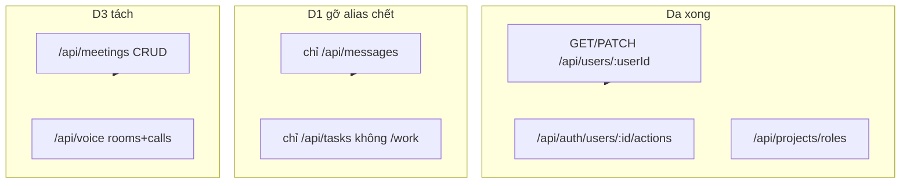

# Plan — dọn dual-path REST (cùng chức năng, hai URL)

> Neo: 2 hình gốc (không `/admin` trên path API; route mỏng + controller). Wave `/admin` User/Auth/Project **đã xong**. Plan này chỉ phần **còn lại cùng bệnh**.

Vai trò triển khai: Senior Backend + Senior API (gateway map) + Senior Frontend khi wave đụng `client/`. Không đổi JWT / `x-user-id` / internal token.

---

## 1. Mục tiêu & phạm vi

**Done khi:**

- Không còn **hai public prefix** gắn cùng một Express router cho cùng collection (trừ S2S `/internal/*`).
- Friend: **một** bộ path action; FE + BFF chỉ gọi bộ đó.
- Voice: `/api/meetings` và `/api/voice` **không** còn là alias toàn bộ của nhau (tách resource).
- Swagger Swarm (`openapi.bundle.json`) **không** còn path `/admin` đã gỡ.
- Route file không thêm handler nghiệp vụ inline mới; leftover `app.js` chỉ health/debug/raw-upload.

**In-scope**

| Lớp | Ví dụ | Hành động |
|-----|--------|-----------|
| Dual prefix chết (FE đã canonical) | `/api/chat/messages`, `/api/work` | Gỡ mount + gateway + swagger |
| Dual path Friend (FE còn gọi cả hai) | `/friends/accept/:id` vs `/:id/accept` | Chốt canonical → migrate FE → gỡ alias |
| Dual mount Voice | `app.use('/api/voice', meetingRoutes)` | Tách router theo resource |
| HTTP alias chết | `PUT …/watch` + `POST …/watch`; `POST …/archive` + `DELETE` card | Giữ method FE đang dùng, gỡ cái kia |
| Dead path | `GET /friends/user/:userId`, `GET /notifications/user/:userId`, `GET /friends/requests`, prefix gateway `/api/channels` | Gỡ |
| Docs | `openapi.bundle.json` path `/admin` cũ | Regenerated / prune |

**Out-of-scope (cố ý không đụng)**

| Cặp | Lý do |
|-----|--------|
| `/api/projects` vs `/api/tasks` | SoT NhatHuy — hai prefix, **cấm gộp** |
| `/app/admin/*` React | Trang UI, không phải REST |
| `/internal/*` S2S | Kiến trúc bắt buộc |
| Team vs Channel org | Hai model khác nhau (`Team` ≠ `Channel`) |
| `GET /users/me` vs `GET /users/:userId` | Convenience identity, khác policy `/admin` |
| `PUT /users/:userId` vs `PATCH /users/:userId` | PUT = self-only contract cũ; PATCH = actor |
| `GET /projects/role-catalog` vs `GET /projects/roles` | Hai collection |
| `POST …/lock` auth | Action không CRUD — giữ POST |
| `VITE_TASK_API_MODE` workspace vs `/tasks/boards` | Strangler S4b — wave riêng (D5 optional), không gộp vào D1–D4 |
| Đổi schema DB / permission atomic | Không cần để dọn path |

**Success criteria đo được**

- Grep `app.use('/api/chat/messages'` và `app.use('/api/work'` = 0.
- Client `src/services` không gọi path đã gỡ.
- Admin JWT: `GET /api/meetings` 200; `GET /api/voice/rooms/:id/bootstrap` 200; `GET /api/voice` (list meeting) **404** sau D3.
- Member: chat vẫn `GET /api/messages` 200; `GET /api/chat/messages` **404**.

---

## 2. Files affected

### Wave D0 — Swagger lệch `/admin` (docs)

- Sửa: `api-gateway/src/swagger/openapi.bundle.json` (prune path `/api/users/admin`, `/api/auth/admin/users`, `/api/projects/admin/roles`).
- Đã đúng, không đụng: `api-gateway/src/swagger/paths/{users,auth,projects}.paths.js`.
- Script `devops/scripts/openapi-scan-routes` **được require** trong `mountSwagger.js` nhưng **không có trong repo** — không invent generator mới trừ khi D0 bắt buộc; prune bundle bằng tay / node one-shot.

### Wave D1 — Alias chết (không đổi FE call)

- `services/chat-service/src/app.js`
- `api-gateway/src/config/permissions.js`, `services.js`, `middlewares/permission.middleware.js`
- `api-gateway/tests/permissionsSignedUpload.test.js`
- `services/project-service/src/app.js`
- `README.md`, `api-gateway/README.md` (một dòng `/api/work`)
- `services/friend-service/src/routes/friend.routes.js` — chỉ gỡ `GET /user/:userId` + `GET /requests`
- `services/notification-service/src/routes/notification.routes.js` — gỡ `GET /user/:userId`
- Test: `api-gateway/tests/permissionsAdminBypass.test.js` (nếu assert `/api/work`); smoke gateway map

**Không sửa:** `client/` (đã `/messages`, `/tasks`).

### Wave D2 — Friend một bộ action

- `services/friend-service/src/routes/friend.routes.js`
- `services/friend-service/src/controllers/friend.controller.js`
- `services/friend-service/src/controllers/friendController.js` — gỡ sau khi chuyển `searchByPhone` / legacy handlers vào controller chính
- `client/src/services/friendService.js`
- Call site: `AddFriendModal.jsx`, `FriendChatPage.jsx`, `FriendPendingRequestsRail.jsx`, `NotificationsPage.jsx`, `OrganizationMemberSidebar.jsx`
- BFF giữ `GET /api/friends/pending` (canonical list lời mời) — `api-gateway/src/bff/bootstrap.service.js`, `dashboardSummary.service.js`, `report-service` snapshot nếu gọi pending

**Canonical (chốt):**

| Việc | Path giữ | Gỡ |
|------|----------|-----|
| List bạn | `GET /friends` | `GET /friends/user/:userId` (D1) |
| Pending | `GET /friends/pending` | `GET /friends/requests` (D1) |
| Accept / reject | `POST /friends/:friendId/accept` · `POST /friends/:friendId/reject` | `POST /accept/:id` · `DELETE /reject/:id` |
| Block / unblock | `POST /friends/:friendId/block` · `POST /friends/:friendId/unblock` | `POST /block` body · `DELETE /unblock/:userId` |

`POST /friends/request`, `GET /friends/search` giữ.

### Wave D3 — Voice tách resource

- `services/voice-service/src/app.js`
- `services/voice-service/src/routes/meeting.routes.js` — tách mount call/room ra router voice
- Có thể tạo `services/voice-service/src/routes/voice.routes.js` (mỏng) nếu cần; **không** nhét logic vào `app.js`
- Gateway `permissions.js` / tests: `GET /api/voice` không còn nghĩa “list meetings”
- FE **không đổi** nếu đang: `/meetings/*` calendar, `/voice/rooms/*`, `/voice/calls/*`

**Không** mount `meetingRoutes` lên `/api/voice`.

### Wave D4 — Board HTTP alias chết

- `services/project-service/src/routes/taskBoard.routes.js`
- Giữ: `DELETE /cards/:cardId` (FE); `POST …/lists/:listId/watch` + `DELETE …/watch`
- Gỡ nếu grep client/BFF = 0: `POST /cards/:cardId/archive`; `PUT …/watch`; block `/lists/:listId` **không** `boardId`

**Không** gỡ `/api/tasks/boards` (legacy strangler — D5).

### Wave D5 — Optional, stop for review

Gỡ `VITE_TASK_API_MODE=dual/legacy` và mount `/api/work` đã xong ở D1. Chỉ freeze `/workspaces/:slug/task-boards` vs `/tasks/boards` khi user Explicit. **Không** gộp `/api/projects`.

### Wave D6 — Style leftover (không đổi URL)

- `organization-service/src/app.js` invite accept → route public trong `organizationRoutes` **không** `protect` (giữ contract).
- Tên file `projectRoleAdmin*`, `adminUser.controller.js` — rename **không** bắt buộc cùng PR path.
- `user.routes.js` wrapper multer CV — middleware, không phải hình 2.
- Chat storage trên `app.js` — **giữ** (raw body trước `express.json`).

**Cố ý không đụng:** `task-service` scaffold health; socket namespace `/voice`.

---

## 3. Thiết kế & trách nhiệm module



**Quy tắc path (giống User):**

1. Resource trên URL; **actor** (JWT + membership) quyết định quyền — không nhét `admin` / `self` vào path.
2. Action không CRUD → `POST /:id/<action>` (accept, lock, archive board).
3. Một collection = một prefix public. Alias chỉ tồn tại trong **một** wave deprecate rồi xóa (User đã xóa luôn vì FE không gọi).
4. Route file: `router.METHOD(path, middleware…, controller.fn)` — không `async (req,res)` nghiệp vụ.

**Voice sau D3**

| Prefix | Resource |
|--------|----------|
| `/api/meetings` | Meeting + recording + internal meeting patches |
| `/api/voice/calls` | Friend 1-1 |
| `/api/voice/rooms` | Org/channel room, lobby, bootstrap |

`GET /api/voice/` không list meetings.

**Gateway:** mỗi prefix còn sống phải có `services.js` + `DOWNSTREAM_AUTH_PREFIXES` / `routeActionMap` khớp. Gỡ prefix chết để `DENY_UNMAPPED` 403/404 sớm (đúng như alias `/users/admin` sau S1).

**Không** đổi `internalGatewayAuth` / tin `x-user-id` thiếu token.

---

## 4. Thứ tự triển khai

Phụ thuộc: D1 không cần FE → làm trước. D2 cần FE trước khi gỡ alias (khác User S1). D3 độc lập D2. D4 độc lập, sau D1. D0 có thể song song hoặc sau D1 (bundle hết `/work`). D5 chỉ khi review. D6 cuối, PR riêng nếu muốn.

1. **D0** — prune swagger `/admin`. Stop for review nếu bundle quá lớn (review diff path keys).
2. **D1** — gỡ chat `/chat/messages`, project `/work`, dead GET friend/notification, prefix `/api/channels` nếu không có handler. Unit gateway + grep. Rolling: `chat-service`, `project-service`, `friend-service`, `notification-service`, `api-gateway`. **Stop for review.**
3. **D2** — FE chỉ gọi canonical friend → rồi gỡ alias BE → xóa `friendController.js` nếu trống. Rolling `friend-service` + client. **Stop for review.**
4. **D3** — tách voice routers. Rolling `voice-service` + gateway nếu map đổi. **Stop for review.**
5. **D4** — gỡ HTTP alias board. Rolling `project-service`.
6. **D5** — chỉ khi user bảo freeze workspace board URL.
7. **D6** — invite accept mount; rename `*Admin*` optional.

Lệnh deploy (một service/lần, `SWARM_USE_LOCAL_IMAGES=1`):

```bash
bash devops/swarm/build-local-images.sh <service>
docker service update --force --update-parallelism 1 --update-order start-first voicehub_<service>
```

Không `build-local-images.sh` không tham số. Không `docker compose up` stack app.

**Implement step 1 only:** D0. Stop for review.

---

## 5. Test plan

| ID | Wave | Cách | Pass |
|----|------|------|------|
| T0 | D0 | Mở `/api/docs.json` (hoặc grep bundle) | 0 path chứa `/admin/` REST |
| T1 | D1 | `GET /api/messages` JWT | 200 |
| T2 | D1 | `GET /api/chat/messages` | 404 service hoặc 403 gateway unmapped |
| T3 | D1 | `GET /api/tasks` (board/list tùy quyền) | không regress; `GET /api/work` 404/403 |
| T4 | D1 | `GET /api/friends/pending` BFF/bootstrap | 200 như cũ |
| T5 | D1 | `GET /api/friends/requests`, `GET /api/notifications/user/:id` | 404 |
| T6 | D2 | UI: accept/reject/block/unblock 1 luồng | chỉ canonical; 404 trên alias |
| T7 | D3 | `GET /api/meetings`, end/mute | 200 |
| T8 | D3 | `GET /api/voice/rooms/:id/bootstrap`, initiate call | 200 |
| T9 | D3 | `GET /api/voice` (không subpath) | không còn list meeting |
| T10 | D4 | FE archive card + watch list | DELETE/POST hiện tại vẫn chạy |
| Unit | D1–D4 | `node --test api-gateway/tests/*.test.js` liên quan permissions; friend/project/voice route contract test (thêm assert `includes` path như `projectRoleAdminRoutes.test.js`) | pass |
| FE | D2 | `cd client && npm run build` | pass |
| Smoke LAN | sau rolling | `devops/nginx/verify-lan-https.ps1 -BaseUrl https://voicehub.local` nếu stack lên | không 500 login/bootstrap |
| Skip | — | Gộp `/api/projects`+`/api/tasks`; đổi `/app/admin` | N/A |

Mock: JWT admin + member như wave User (không commit secret; script smoke tạm `tmp/` nếu cần).

---

## 6. Risk & trade-off

**R1 — Client lạ / bookmark gọi `/api/chat/messages` hoặc `/api/work`.**  
Chọn: xóa luôn (giống S1 User) vì **repo client không gọi**. Không giữ Deprecation header trừ khi user đòi. Rollback: revert commit + rolling image cũ.

**R2 — D3 phá `GET /api/meetings/rooms/...` nếu có caller ẩn.**  
Grep repo = FE dùng `/voice/rooms`. Vẫn smoke bootstrap room + meeting list trước khi xóa alias.

**R3 — D2 AddFriendModal nhánh `requestId` vs `friendId`.**  
Phải map cả hai case sang `POST /:friendId/…` (id người gửi), không giữ `POST /accept/:requestId`. Test modal + notification accept.

**R4 — Gỡ `PUT /watch` / `POST /archive` card** nếu mobile/script ngoài repo.  
Mitigate: grep + 404 một sprint; rollback mount 1 dòng.

**R5 — Swagger bundle khổng lồ, prune tay dễ sót.**  
Chấp nhận: xóa key path `/admin` bằng script node một lần trong D0; curated `*.paths.js` là SoT mô tả.

**Không chọn:** gộp `/messages` thành `/chat/messages` (FE toàn `/messages`). Không gộp meetings vào `/voice` (calendar API đã `/meetings`). Không big-bang D1–D5 một PR.

**Rollback:** revert git wave; `docker service update --force` image tag trước đó. Không migration DB.
