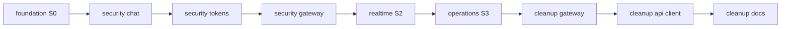
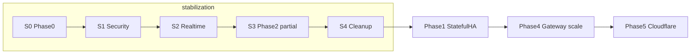

# Stabilization — Master Index

> **Môi trường:** Staging Docker Swarm  
> **Out-of-scope:** K8s, Cloudflare, Kafka, Mongo sharding  
> **Canonical realtime:** `socket-service` (không chat-service Socket.IO)

## Cấu trúc thư mục

```
.cursor/plans/stabilization/
├── 00-master-index.plan.md          ← file này
├── foundation/
│   └── s0-secrets-observability.plan.md
├── security/
│   ├── s1-chat-idor-dm.plan.md
│   ├── s1-internal-tokens.plan.md
│   ├── s1-gateway-permissions.plan.md
│   └── s1-p1-p2-backlog.plan.md      ← sau sign-off (P1/P2)
├── realtime/
│   └── s2-socket-canonical.plan.md
├── operations/
│   └── s3-realtime-ha-chaos.plan.md
└── cleanup/
    ├── s4-gateway-legacy.plan.md
    ├── s4-api-pagination-client.plan.md
    └── s4-docs-alignment.plan.md
```

## Thứ tự bắt buộc



| Phase | Thư mục | Plan | Tiêu chí |
|-------|---------|------|----------|
| S0 | `foundation/` | [s0-secrets-observability](foundation/s0-secrets-observability.plan.md) | Ổn định |
| S1 | `security/` | [s1-chat-idor-dm](security/s1-chat-idor-dm.plan.md) | An toàn |
| S1 | `security/` | [s1-internal-tokens](security/s1-internal-tokens.plan.md) | An toàn |
| S1 | `security/` | [s1-gateway-permissions](security/s1-gateway-permissions.plan.md) | An toàn |
| S1+ | `security/` | [s1-p1-p2-backlog](security/s1-p1-p2-backlog.plan.md) | An toàn (sau sign-off) |
| S2 | `realtime/` | [s2-socket-canonical](realtime/s2-socket-canonical.plan.md) | Thống nhất |
| S3 | `operations/` | [s3-realtime-ha-chaos](operations/s3-realtime-ha-chaos.plan.md) | Ổn định |
| S4 | `cleanup/` | [s4-gateway-legacy](cleanup/s4-gateway-legacy.plan.md) | Sạch sẽ |
| S4 | `cleanup/` | [s4-api-pagination-client](cleanup/s4-api-pagination-client.plan.md) | Thống nhất |
| S4 | `cleanup/` | [s4-docs-alignment](cleanup/s4-docs-alignment.plan.md) | Sạch sẽ |

## Vị trí trong roadmap Phase 0–5 (hạ tầng)

Stabilization **không** trùng một phase hạ tầng duy nhất. Map với lộ trình triển khai edge/scale (Phase 0–5):

| Phase hạ tầng | Nội dung | Stabilization | Plan |
|---------------|----------|---------------|------|
| **0 — Baseline** | Secrets, health, observability, rollback | **Đầy đủ** | `foundation/s0-secrets-observability` |
| **1 — Stateful HA** | Mongo RS, Redis Sentinel, RabbitMQ quorum | **Folder riêng** (sau sign-off) | [`phase-1-stateful-ha/00-master-index.plan.md`](../phase-1-stateful-ha/00-master-index.plan.md) |
| **2 — Stateless scale** | Socket 2+ replica, Redis adapter, HA test | **Một phần** (socket only; gateway vẫn 1 replica) | `operations/s3-realtime-ha-chaos` |
| **3 — Edge TLS** | Nginx/HAProxy, `TRUST_PROXY` | **Tùy chọn** | Mục optional trong `s3-realtime-ha-chaos` |
| **4 — Gateway scale** | API Gateway 2+ replica | **Không** | Phase sau stabilization |
| **5 — Cloudflare** | CDN/WAF/WS edge | **Không** | Out-of-scope master index |

**Tiền đề không gắn phase hạ tầng** (làm trong stabilization, trước Phase 1+):

| Stabilization | Vai trò | Làm trước |
|---------------|---------|-----------|
| `security/s1-*` | An toàn P0 | Phase 2 scale, Phase 3 public edge |
| `realtime/s2-socket-canonical` | Một luồng WS | Phase 2 (tránh scale khi còn dual realtime) |
| `cleanup/s4-*` | Legacy + API/docs | Phase 4–5 |

**Tóm tắt:** stabilization ≈ **Phase 0** + tiền đề an toàn/thống nhất (S1–S2) + **một phần Phase 2** (S3) + optional **Phase 3** — **không** làm Phase 1, 4, 5.



### Thứ tự toàn cục (Phase 0–5)

1. **Xong toàn bộ stabilization** (S0 → S4c)
2. **Phase 1** — [`phase-1-stateful-ha/`](../phase-1-stateful-ha/00-master-index.plan.md) (Atlas + Redis Sentinel + Rabbit quorum)
3. **Phase 2** — [`phase-2-stateless-scale/`](../phase-2-stateless-scale/00-master-index.plan.md) (gateway scale, workers, edge, observability)
4. **Phase 3** — Nginx prod (nếu chưa làm optional ở S3)
5. **Phase 4** — Gateway 2+ replica (một phần gộp vào Phase 2 gateway plan)
6. **Phase 5** — Cloudflare

### Không nhầm với `ha-infra-roadmap` Phase 1/2/3

[`ha-infra-roadmap.md`](../../../devops/swarm/ha-infra-roadmap.md) đánh số **riêng** cho infra Swarm (Plan A → RS/Sentinel → managed). Stabilization S3 xong vẫn là **Plan A single-node stateful**; bước **ha-infra Phase 2** tương đương **Phase 1** trong bảng hạ tầng 0–5 ở trên.

## Success criteria tổng (done toàn bộ stabilization)

| Tiêu chí | Điều kiện | Sign-off |
|----------|-----------|----------|
| **Ổn định** | S0 baseline + S3 HA/chaos pass | pass |
| **An toàn** | S1 cả 3 plan + security smoke | pass |
| **Thống nhất** | S2 socket canonical + S4 pagination/BFF | pass |
| **Sạch sẽ** | S4 không còn route `@deprecated` mount + docs aligned | pass |

## Stabilization sign-off (S4c — 2026-06)

- [x] S0 — `devops/swarm/observability-baseline.md`, perf baseline, rollback runbook
- [x] S1 — `devops/scripts/check-security-env.sh`, gateway permission smoke, internal tokens
- [x] S2 — `CHAT_SOCKET_ENABLED=false`; client/socket `docs/SOCKET_LB.md`; spec §9
- [x] S3 — `SOCKET_SERVICE_REPLICAS=2`; `bash devops/swarm/run-s3-validation.sh`
- [x] S4a — gateway BFF only; `orgEventsConsumer`; `tests/s4-gateway-legacy.smoke.js`
- [x] S4b — `pageToken`/`before`; task API workspace; auth refresh; `tests/s4-api-pagination-client.smoke.js`
- [x] S4c — `ARCHITECTURE.md`, `MIGRATION.md`, `01-SYSTEM-SPEC.md` §9–§11

**Tiếp theo:** [phase-1-stateful-ha](../phase-1-stateful-ha/00-master-index.plan.md) — **sau** [Gate G0 PASS](../phase-gates/gates/gate-s0-to-p1.plan.md)

## Quy tắc triển khai

- Mỗi plan độc lập review được — có thể dừng sau bất kỳ plan nào (`Implement s1-chat-idor-dm only. Stop for review.`).
- Không scale replica trước khi S0 pass.
- Không gỡ chat socket trước khi S1 pass và S2 port event xong.
- Tham chiếu backlog bảo mật rộng hơn: [security-hardening-plan.md](../security-hardening-plan.md) (P1/P2 làm sau S1).

## Liên kết ngoài stabilization

| Plan hiện có | Quan hệ |
|--------------|---------|
| `wave-0-observability` | S0 mở rộng metric/pagination contract |
| `wave-2e-cursor-pagination-dto` | S4 api-pagination chi tiết implementation |
| `security-hardening-plan` | S1 là subset P0; P1/P2 backlog sau stabilization |
| [`phase-1-stateful-ha/`](../phase-1-stateful-ha/00-master-index.plan.md) | Phase 1 hạ tầng 0–5 sau sign-off (hybrid Atlas) |
| [`phase-gates/`](../phase-gates/00-master-index.plan.md) | Cổng bug + completion trước mỗi phase |
| `devops/swarm/ha-infra-roadmap` | Nội dung = phase-1-stateful-ha; Phase 3 = managed full cloud |
