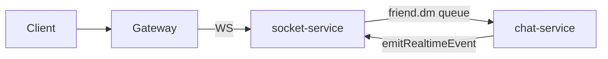

# S2 — Socket-Service Canonical

**Phụ thuộc:** [security/s1-gateway-permissions.plan.md](../security/s1-gateway-permissions.plan.md)  
**Tiếp theo:** [operations/s3-realtime-ha-chaos.plan.md](../operations/s3-realtime-ha-chaos.plan.md)  
**Tiêu chí:** Thống nhất

## 1. Mục tiêu & phạm vi

### Done
- Client chỉ WebSocket qua gateway → `socket-service` (`/chat`)
- `chat-service` không bind Socket.IO public
- Org channel + DM hoạt động qua luồng mới
- Spec §9 ghi rõ canonical path

### In-scope
- [`services/chat-service/src/server.js`](../../../services/chat-service/src/server.js)
- [`services/chat-service/src/socket/*`](../../../services/chat-service/src/socket/)
- [`services/socket-service/src/socket/chat.namespace.js`](../../../services/socket-service/src/socket/chat.namespace.js)
- [`client/src/context/SocketContext.jsx`](../../../client/src/context/SocketContext.jsx)
- [`docs/SOCKET_LB.md`](../../../docs/SOCKET_LB.md)

### Out-of-scope
- Scale socket replicas (S3)
- Voice mediasoup path

## 2. Files affected

| Sửa | Gỡ/deprecate sau port event |
|-----|----------------------------|
| `socket-service/.../chat.namespace.js` | `chat-service/src/socket/index.js` |
| `chat-service/src/server.js` | `friend.socket.js`, `server.socket.js` |
| `SocketContext.jsx`, spec §9 | |

## 3. Thiết kế & trách nhiệm

| Module | Vai trò |
|--------|---------|
| socket-service | Giữ connection, presence, fan-out |
| chat-service | REST persist, consumer, publish internal HTTP |
| Client | `VITE_SOCKET_USE_GATEWAY=true` staging |

**So sánh event** (`chat-service/src/socket/server.socket.js` vs `socket-service/chat.namespace.js`): `join_room`, `send_message`, `typing`, `mark_read`.

## 4. Thứ tự triển khai

1. **Audit client** — grep không còn URL socket trỏ chat-service
2. **Gap analysis** — bảng event: chat socket vs socket-service
3. **Port thiếu** — implement trong socket-service trước
4. **Feature flag** `CHAT_SOCKET_ENABLED=false` default — deploy staging
5. **E2E** DM + org channel + typing + read receipt
6. **Gỡ code** socket chat-service khi E2E pass
7. Cập nhật spec + SOCKET_LB.md

**Rollback:** `CHAT_SOCKET_ENABLED=true` + redeploy chat-service.

## 5. Test plan

- Login 2 user → DM realtime 2 chiều
- Org channel: join, send, typing, mark read
- Network tab: WS chỉ tới gateway `/socket.io`, không `:3006`
- Không regression friend:send qua RabbitMQ

## 6. Risk & trade-off

| Rủi ro | Quyết định | Rollback |
|--------|------------|----------|
| Event org room thiếu trên socket-service | Port trước khi gỡ | Bật CHAT_SOCKET_ENABLED |
| CORS socket-service | `CORS_ORIGIN` gồm staging origin | |
