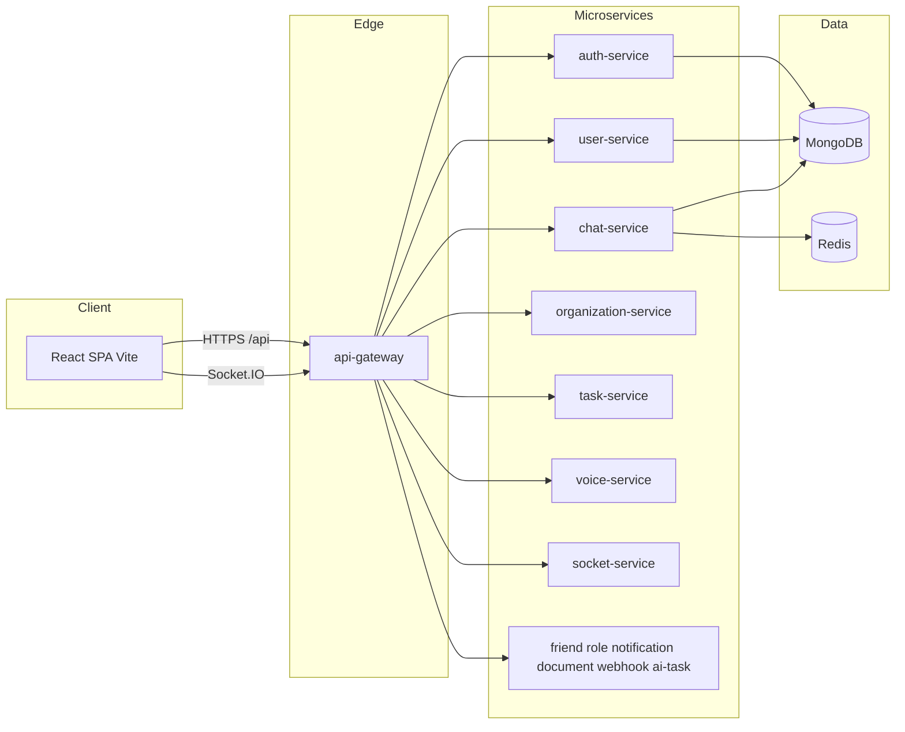

# Kiến trúc VoiceHub

Hệ thống theo mô hình **microservices**; **một API Gateway** (HTTP) là điểm vào duy nhất cho REST từ client. **Socket.IO** phục vụ realtime (namespace `/chat`), thường đi qua gateway hoặc nối thẳng socket-service trong dev.

## Sơ đồ luồng (logical)

## Vai trò từng nhóm

| Thành phần | Vai trò |
|------------|---------|
| **api-gateway** | Xác thực JWT, kiểm tra permission (RBAC), proxy tới service, forward header `x-user-id` / `x-user-email`. |
| **auth-service** | Đăng ký, đăng nhập, refresh, verify email, forgot/reset password. |
| **user-service** | UserProfile: `/api/users/me`, `/api/users/:userId`, search, … |
| **chat-service** | Tin nhắn, kênh, REST; tích hợp file retention / signed URL tùy cấu hình. |
| **socket-service** | Socket.IO `/chat`: DM, presence, tích hợp với chat-service. |
| **organization-service** | Organization, server, department, member, channel (theo route hiện tại). |
| **task-service** | Task, comment, worker RabbitMQ tùy bật. |
| **voice-service** | Meeting / mediasoup signaling, UDP. |
| **friend-service** | Bạn bè, lời mời, block. |
| **role-permission-service** | Role, permission, check cho gateway. |
| **notification-service** | Thông báo lưu trữ. |
| **document-service** | Metadata tài liệu. |
| **webhook-service** | Nhận webhook nội bộ, dispatch notification. |
| **ai-task-service** + **ai-task-worker** | Pipeline AI task (RabbitMQ, Ollama, … theo env). |

## Frontend

- **SPA** gọi chỉ **`/api`** (cùng origin với Vite dev nhờ proxy) hoặc `VITE_API_URL`.  
- **Hai lớp axios** (`services/api.js` và `services/api/apiClient.js`) là **cố ý** — interceptor khác nhau; không gộp một PR (rủi ro auth/toast). Xem [`client/src/services/HTTP_CONVENTIONS.md`](client/src/services/HTTP_CONVENTIONS.md).

## Dữ liệu và messaging

- **MongoDB**: mỗi service có DB/collection riêng theo cấu hình.  
- **Redis**: cache, session, presence (tùy service).  
- **RabbitMQ**: hàng đợi (chat-service / task-service / ai-task — theo `docker-compose`).

## Triển khai

- **Docker Compose**: [`docs/DOCKER-COMPOSE.md`](docs/DOCKER-COMPOSE.md).  
- Production: có thể Kubernetes / orchestrator khác; gateway vẫn là điểm vào REST.
