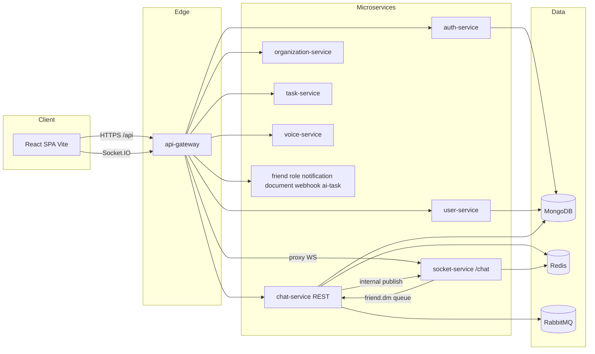

# Kiến trúc VoiceHub

Hệ thống theo mô hình **microservices**; **một API Gateway** là điểm vào REST cho client. **Realtime canonical:** `socket-service` namespace `/chat` (path `/socket.io`) — client qua gateway hoặc proxy Vite; `chat-service` chỉ REST + queue, **không** bind Socket.IO public (`CHAT_SOCKET_ENABLED=false`).

## Sơ đồ luồng (logical)

```mermaid
flowchart LR
  subgraph client [Client]
    SPA[React SPA Vite]
  end
  subgraph edge [Edge]
    GW[api-gateway]
  end
  subgraph ms [Microservices]
    AUTH[auth-service]
    USER[user-service]
    CHAT[chat-service REST]
    ORG[organization-service]
    TASK[task-service]
    VOICE[voice-service]
    SOCK[socket-service /chat]
    OTHER[friend role notification document webhook ai-task]
  end
  subgraph data [Data]
    M[(MongoDB)]
    R[(Redis)]
    Q[(RabbitMQ)]
  end
  SPA -->|HTTPS /api| GW
  SPA -->|Socket.IO| GW
  GW --> AUTH
  GW --> USER
  GW --> CHAT
  GW --> ORG
  GW --> TASK
  GW --> VOICE
  GW --> OTHER
  GW -->|proxy WS| SOCK
  SOCK -->|friend.dm queue| CHAT
  CHAT -->|internal publish| SOCK
  AUTH --> M
  USER --> M
  CHAT --> M
  CHAT --> R
  CHAT --> Q
  SOCK --> R
```

## Vai trò từng nhóm

| Thành phần | Vai trò |
|------------|---------|
| **api-gateway** | Xác thực JWT, kiểm tra permission (RBAC), proxy tới service, forward header `x-user-id` / `x-user-email`. |
| **auth-service** | Đăng ký, đăng nhập, refresh, verify email, forgot/reset password. |
| **user-service** | UserProfile: `/api/users/me`, `/api/users/:userId`, search, … |
| **chat-service** | Tin nhắn DM/org REST, consumer RabbitMQ, `emitRealtimeEvent` → socket-service. Không WS public (legacy tắt). |
| **socket-service** | Socket.IO `/chat`: connection, presence, DM/org fan-out; Redis adapter khi scale replica. |
| **organization-service** | Organization, server, department, member, channel (theo route hiện tại). |
| **task-service** | Task, comment, worker RabbitMQ tùy bật. |
| **voice-service** | Meeting / mediasoup signaling, UDP. |
| **friend-service** | Bạn bè, lời mời, block. |
| **role-permission-service** | Role, permission, check cho gateway. |
| **notification-service** | Thông báo lưu trữ. |
| **document-service** | Metadata tài liệu. |
| **webhook-service** | Nhận webhook nội bộ, dispatch notification. |
| **ai-task-service** + **ai-task-worker** | Pipeline AI task (RabbitMQ, Ollama, … theo env). |

## Frontend

- **SPA** gọi chỉ **`/api`** (cùng origin với Vite dev nhờ proxy) hoặc `VITE_API_URL`.  
- **Hai lớp axios** (`services/api.js` và `services/api/apiClient.js`) là **cố ý** — interceptor khác nhau; không gộp một PR (rủi ro auth/toast). Xem [`client/src/services/HTTP_CONVENTIONS.md`](client/src/services/HTTP_CONVENTIONS.md).

## Dữ liệu và messaging

- **MongoDB**: mỗi service có DB/collection riêng theo cấu hình.  
- **Redis**: cache, session, presence (tùy service).  
- **RabbitMQ**: hàng đợi (chat-service / task-service / ai-task — theo `docker-compose`).

## Triển khai

| Môi trường | Công cụ | Ghi chú |
|------------|---------|---------|
| **Local dev** | Docker Compose | [`docs/DOCKER-COMPOSE.md`](docs/DOCKER-COMPOSE.md) |
| **Staging / production hiện tại** | **Docker Swarm** | [`docker-stack.yml`](docker-stack.yml), [`devops/swarm/deploy-stack.sh`](devops/swarm/deploy-stack.sh) |
| **Tương lai** | K8s, edge Cloudflare | Không phải path đang chạy — xem [`devops/swarm/ha-infra-roadmap.md`](devops/swarm/ha-infra-roadmap.md) |

Socket HA staging: `SOCKET_SERVICE_REPLICAS>=2`, `SOCKET_IO_REDIS_ADAPTER=true` — [`docs/SOCKET_LB.md`](docs/SOCKET_LB.md), [`devops/swarm/realtime-ha-checklist.md`](devops/swarm/realtime-ha-checklist.md).

## Stateful HA (Phase 1 — staging)

| Thành phần | Triển khai | Ghi chú |
|------------|------------|---------|
| **MongoDB** | Atlas M10+ RS (`mongodb+srv://`) | Không service `mongodb` trong `docker-stack.yml` cutover |
| **Redis** | Stack `voicehub-redis` — Sentinel + master/replica | Client: `REDIS_SENTINELS`, `REDIS_SENTINEL_NAME=mymaster` |
| **RabbitMQ** | Stack `voicehub-rabbit` — 3 node cluster | `RABBITMQ_URL=@rabbitmq-1:5672`, `RABBITMQ_QUORUM_QUEUES=true` |
| **Overlay** | `voicehub_enterprise-network` | Shared bởi app + HA stacks |

Baseline & failover sign-off: [`docs/ha-baseline-staging-2026-06.md`](docs/ha-baseline-staging-2026-06.md).  
Validation: `bash devops/swarm/run-p1-failover-validation.sh`.  
Roadmap: [`devops/swarm/ha-infra-roadmap.md`](devops/swarm/ha-infra-roadmap.md).

## Stateless scale (Phase 2 — staging)

| Thành phần | Triển khai | Ghi chú |
|------------|------------|---------|
| **api-gateway** | `API_GATEWAY_REPLICAS>=2` | Stateless JWT; BFF cache Redis (`BFF_CACHE_ENABLED`) |
| **socket-service** | `SOCKET_SERVICE_REPLICAS>=2` | Redis adapter; client WS qua gateway (S2) |
| **Workers** | `*_WORKER_REPLICAS` trong `.env` | Manual scale — [`autoscale-policy.md`](devops/swarm/autoscale-policy.md) |
| **voice-service** | `VOICE_SERVICE_REPLICAS=1` default | UDP host 40000–40010; [`voice-swarm-scale-strategy.md`](docs/voice-swarm-scale-strategy.md) |
| **Edge** | Nginx `dev-https.conf` / `staging-swarm-edge.conf` | `TRUST_PROXY=1`; [`lan-https-voicehub.local.md`](docs/lan-https-voicehub.local.md) |

Phase 2 sign-off: [`docs/ha-baseline-staging-phase2-2026-06.md`](docs/ha-baseline-staging-phase2-2026-06.md).  
Validation: `bash devops/swarm/run-p2-scale-validation.sh`.

Lộ trình ổn định đã hoàn tất: [`.cursor/plans/stabilization/`](.cursor/plans/stabilization/00-master-index.plan.md).
