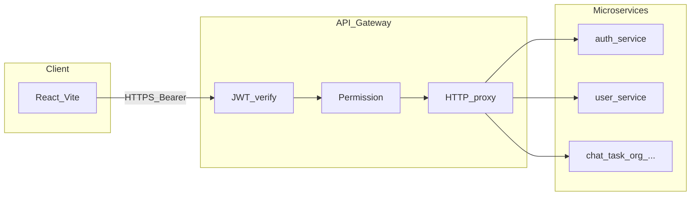

# VoiceHub

Nền tảng **microservices** (Node.js / Express, MongoDB, Redis, RabbitMQ) với **API Gateway** làm điểm vào REST duy nhất cho client; **React (Vite)** gọi API qua `/api`; realtime qua **Socket.IO** (proxy qua gateway hoặc cấu hình LB — xem [`docs/SOCKET_LB.md`](docs/SOCKET_LB.md)).

Đặc tả nghiệp vụ / SRS: [`docs/spec-pack/`](docs/spec-pack/).

---

## Mục tiêu hệ thống

- Xác thực JWT, hồ sơ người dùng, đăng ký / verify email  
- Chat DM & kênh tổ chức, file, thông báo  
- Tổ chức, phòng ban, vai trò (RBAC qua gateway)  
- Mô hình tổ chức nhiều tầng (chi nhánh/khối/phòng/nhóm/kênh) + đơn gia nhập  
- Task, tài liệu, voice / mediasoup  
- Webhook → notification  
- AI task (queue, worker) tùy triển khai  

---

## Kiến trúc luồng chính



1. **Client** → `http(s)://<host>:3000/api/...` (chỉ **API Gateway** mặc định publish ra host trong Docker Compose).  
2. **Gateway**: xác thực **JWT** ([`api-gateway/src/middlewares/auth.middleware.js`](api-gateway/src/middlewares/auth.middleware.js)) → kiểm tra quyền ([`permission.middleware.js`](api-gateway/src/middlewares/permission.middleware.js)) → **proxy** tới service đích, đồng thời gắn header tin cậy nội bộ (`x-gateway-internal-token`, `x-user-id`, …).  
3. **Service**: nghiệp vụ, MongoDB / Redis / RabbitMQ tùy module.  
4. **Gọi nội bộ service → service**: dùng **`x-internal-token`** (hoặc header chuyên biệt) khớp biến môi trường từng đích — xem [`docs/security-runbook.md`](docs/security-runbook.md).

---

## Cổng mạng (Docker Compose mặc định)

Theo [`docker-compose.core.yml`](docker-compose.core.yml), **chỉ publish ra máy host**:

| Thành phần | Port (host) | Ghi chú |
|-------------|-------------|---------|
| **api-gateway** | **3000** | REST + proxy `/socket.io` (và voice signaling theo cấu hình) |
| **voice-service** | **3005** + **40000–40100** (TCP/UDP) | mediasoup / WebRTC |

Các service còn lại (**auth**, **user**, **chat**, **task**, …) chỉ lắng nghe trên **mạng Docker nội bộ** (`enterprise-network`). Gọi trực tiếp từ máy dev: dùng `docker compose exec` hoặc **tạm** thêm `ports:` khi debug.

**socket-service**: thường chỉ `expose` nội bộ; client đi qua gateway hoặc cấu hình dev map cổng (xem [`docs/SOCKET_LB.md`](docs/SOCKET_LB.md)).

**webhook-service**: không map port mặc định; nếu cần URL công khai từ bên thứ ba, thêm `ports` hoặc đặt sau reverse proxy (ghi chú trong compose).

Infra: **MongoDB**, **Redis**, **RabbitMQ** — [`docs/DOCKER-COMPOSE.md`](docs/DOCKER-COMPOSE.md).

---

## Công nghệ

| Tầng | Stack |
|------|--------|
| Frontend | React 18, Vite, React Router, Tailwind, Axios, Socket.IO client, mediasoup-client (lazy) |
| Backend | Node.js + Express (microservices), Python (webhook-service nếu bật) |
| Dữ liệu | MongoDB, Redis |
| Triển khai | Docker Compose (`docker-compose.yml` gồm `include` infra + core) |

---

## Cấu trúc thư mục

```
VoiceHub/
  api-gateway/           # JWT, RBAC, proxy, rate limit, helmet
  client/                # SPA React
  services/
    auth-service/
    user-service/
    friend-service/
    organization-service/
    role-permission-service/
    chat-service/
    voice-service/
    task-service/
    document-service/
    notification-service/
    socket-service/
    webhook-service/
    ai-task-service/
    ai-task-worker/
  shared/                  # Mongo, logger, gatewayTrust, corsPolicy, …
  docs/                    # Docker, socket, security runbook, spec-pack
  scripts/                 # Ví dụ: security-boundary-check.js
```

Sơ đồ / cây chi tiết: [`STRUCTURE.md`](STRUCTURE.md), [`ARCHITECTURE.md`](ARCHITECTURE.md).

---

## API Gateway → service (prefix)

| Prefix REST | Service |
|-------------|---------|
| `/api/auth` | auth-service |
| `/api/users` | user-service |
| `/api/friends` | friend-service |
| `/api/organizations`, `/api/channels`, … | organization-service |
| `/api/roles`, `/api/permissions` | role-permission-service |
| `/api/messages`, `/api/chat` | chat-service |
| `/api/voice`, `/api/meetings` | voice-service |
| `/api/tasks`, `/api/work` | task-service |
| `/api/ai/tasks` | ai-task-service |
| `/api/documents` | document-service |
| `/api/notifications` | notification-service |

**Public (không JWT trên gateway)** — ví dụ: đăng ký/đăng nhập, refresh, forgot/reset password, verify email, `GET /api/health/gateway-trust`. Chi tiết: [`api-gateway/README.md`](api-gateway/README.md), [`api-gateway/src/config/services.js`](api-gateway/src/config/services.js).

---

## Mô hình tổ chức mới

`organization-service` hiện dùng mô hình phân cấp:

`Organization` → `Branch` → `Division` → `Department` → `Team` → `Channel`

Thực thể chính:

| Thực thể | Vai trò |
|----------|---------|
| `Organization` | Gốc của tenant; chứa settings, trạng thái và cấu hình form gia nhập (`joinApplicationForm`). |
| `Membership` | Liên kết user với organization, role (`owner/admin/hr/member`) và vị trí trong cây (`branch/division/department/team`). |
| `Branch` / `Division` | Tầng chi nhánh và khối nghiệp vụ trong mỗi organization. |
| `Department` / `Team` | Tầng phòng ban và nhóm vận hành. |
| `Channel` + `ChannelAccess` | Kênh chat theo phạm vi; phân quyền truy cập theo thành viên/cấu trúc. |
| `JoinApplication` | Quy trình nộp đơn gia nhập, duyệt/từ chối, lưu snapshot form theo version. |

API chính liên quan mô hình mới:

- `GET /api/organizations/:orgId/structure` — lấy cây cấu trúc tổ chức.
- `GET|PUT /api/organizations/:orgId/join-application-form` — xem/cập nhật form gia nhập (owner/admin).
- `POST /api/organizations/:orgId/join-applications` — user nộp đơn gia nhập.
- `GET|PATCH /api/organizations/:orgId/join-applications` — owner/admin duyệt đơn.
- `POST /api/organizations/:orgId/members/invite-link` + `POST /join-link` — mời tham gia qua link có token.
- `GET|POST /api/organizations/:orgId/hierarchy/...` — quản lý branch/division/department/team/channel theo từng tầng.

Lưu ý tương thích:

- Route legacy `/teams` vẫn được giữ để frontend cũ hoạt động, nhưng hướng mới ưu tiên thao tác qua `channels` và `hierarchy`.

---

## Bảo mật & biến môi trường quan trọng

| Biến | Ý nghĩa ngắn |
|------|----------------|
| **`JWT_SECRET`** | Phải **trùng** giữa **api-gateway**, **auth-service**, và mọi chỗ verify JWT (vd. `shared/middleware/auth.js`). Production: gateway & auth **thoát process** nếu để mặc định yếu. |
| **`GATEWAY_INTERNAL_TOKEN`** | Gateway gửi `x-gateway-internal-token`; service dùng `gatewayTrust` **bắt buộc** cùng giá trị — thiếu/sai → không tin `x-user-id`. |
| **`USER_SERVICE_INTERNAL_TOKEN`** | Gọi route **`/api/users/internal/*`** (bootstrap profile sau verify email, presence, profile nội bộ, …). **auth-service** cần biến này khi tạo profile. |
| **`CHAT_INTERNAL_TOKEN`** | Route nội bộ chat (`/api/messages/internal/...`). |
| **`NOTIFICATION_INTERNAL_TOKEN`** | Tạo notification nội bộ; organization-service gửi header `x-internal-notification-token`. |
| **`REALTIME_INTERNAL_TOKEN`** | Publish realtime qua socket-service (HTTP nội bộ). |
| **`CORS_ORIGIN`** | Danh sách origin (phẩy) cho gateway và các service dùng [`shared/middleware/corsPolicy.js`](shared/middleware/corsPolicy.js). Production: chỉ whitelist. |

Ma trận đầy đủ + rotate secret: **[`docs/security-runbook.md`](docs/security-runbook.md)**.

---

## Chạy hệ thống

**Docker (khuyến nghị)** — [`docs/DOCKER-COMPOSE.md`](docs/DOCKER-COMPOSE.md):

```bash
# Đầy đủ (tạo .env ở root repo trước)
docker compose up -d --build

# Dev + hot reload (nếu dùng file dev)
docker compose -f docker-compose.yml -f docker-compose.dev.yml up -d --build
```

**Frontend** (API gateway đã có tại `:3000`):

```bash
cd client && npm install && npm run dev
# Mặc định Vite: http://localhost:5173 — proxy /api (vite.config)
```

**Kiểm tra tĩnh (file then chốt bảo mật):**

```bash
node scripts/security-boundary-check.js
```

---

## Frontend (`client/`)

- Entry: [`client/src/main.jsx`](client/src/main.jsx) — providers + `App`.  
- HTTP chính: [`client/src/services/api.js`](client/src/services/api.js) (token, toast, 401, gateway-trust).  
- Hướng dẫn UI / cài đặt: [`client/README.md`](client/README.md).

---

## Mục lục tài liệu

| Tài liệu | Nội dung |
|----------|----------|
| [`docs/README.md`](docs/README.md) | Hub `docs/` |
| [`docs/DOCKER-COMPOSE.md`](docs/DOCKER-COMPOSE.md) | Compose, infra |
| [`docs/security-runbook.md`](docs/security-runbook.md) | Token, header, kiểm tra sau deploy |
| [`docs/SOCKET_LB.md`](docs/SOCKET_LB.md) | Socket / load balancer |
| [`docs/spec-pack/00-INDEX.md`](docs/spec-pack/00-INDEX.md) | Gói đặc tả |
| [`shared/README.md`](shared/README.md) | Thư viện shared |

---

## License

Xem [LICENSE](LICENSE) nếu có trong repo.
