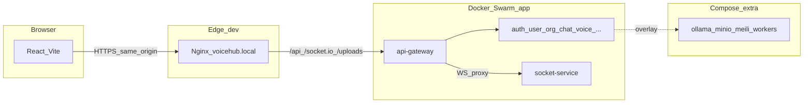

# VoiceHub

Nền tảng **cộng tác nội bộ** (chat, voice/meeting, task, tài liệu, thông báo) theo mô hình **microservices** — **API Gateway** là điểm vào REST duy nhất; **React (Vite)** gọi `/api`; realtime qua **Socket.IO**; họp thoại qua **mediasoup / WebRTC**.

**Dev chuẩn (LAN):** [`https://voicehub.local`](https://voicehub.local) — Nginx TLS, không mở thẳng `localhost:3000` / `IP:port` trên máy client. Chi tiết: [`docs/lan-https-voicehub.local.md`](docs/lan-https-voicehub.local.md).

Đặc tả / luồng nghiệp vụ: [`docs/spec-pack/`](docs/spec-pack/), [`docs/luong nghiep vu/`](docs/luong%20nghiep%20vu/).

---

## Mục đích sản phẩm

VoiceHub gom giao tiếp và làm việc của **một công ty** (và mạng lưới bạn bè cá nhân) vào một app:

| Vùng | Người dùng làm gì |
|------|-------------------|
| **Communicate** (`/app/communicate`) | Chat bạn bè (DM), kênh tổ chức, phòng voice/meeting, thông báo |
| **Collaborate** (`/app/collaborate`) | Workspace, task, tài liệu, duyệt đơn gia nhập |
| **Me** (`/app/me`) | Dashboard cá nhân, lịch, cài đặt |
| **Admin** (`/app/admin`) | Quản trị công ty: người dùng, cấu trúc, RBAC, cấu hình hệ thống |

Đăng nhập một tài khoản; dữ liệu tenant gắn **organization** (workspace). Deploy hiện tại ưu tiên **một công ty** (`SINGLE_ORG_MODE=true`) — seed IT/admin, hạn chế tạo org công khai; multi-org vẫn còn trong code cho tương thích.

---

## Kiến trúc hiện tại (tóm tắt)


```mermaid
flowchart LR
  subgraph browser [Browser]
    SPA[React_Vite]
  end
  subgraph edge [Edge_dev]
    NGX[Nginx_voicehub.local]
  end
  subgraph swarm [Docker_Swarm_app]
    GW[api-gateway]
    MS[auth_user_org_chat_voice_...]
    SOCK[socket-service]
  end
  subgraph extra [Compose_extra]
    AI[ollama_minio_meili_workers]
  end
  SPA -->|HTTPS_same_origin| NGX
  NGX -->|/api_/socket.io_/uploads| GW
  GW --> MS
  GW -->|WS_proxy| SOCK
  MS -.->|overlay| AI
```

1. **Browser** → `https://voicehub.local` (Nginx) → gateway `:3000` (`/api`, `/socket.io`, `/uploads`, voice signaling theo cấu hình).
2. **Gateway**: JWT → RBAC → proxy; gắn `x-gateway-internal-token`, `x-user-id`.
3. **Service**: nghiệp vụ + Mongo / Redis / RabbitMQ.
4. **S2S**: header internal token — [`docs/security-runbook.md`](docs/security-runbook.md).
5. **Realtime**: `chat-service` REST + queue; **`socket-service`** giữ Socket.IO `/chat` (không bind WS public từ chat-service).

Chi tiết: [`ARCHITECTURE.md`](ARCHITECTURE.md), [`MIGRATION.md`](MIGRATION.md).

---

## Triển khai: Swarm vs Compose

| Runtime | File / lệnh | Dùng cho |
|---------|-------------|----------|
| **Docker Swarm** | `docker-stack.yml` + `bash devops/swarm/deploy-stack.sh` | Toàn bộ microservices app (`api-gateway`, `auth`, `chat`, `voice`, …) |
| **Compose extra** | `docker-compose.swarm-extra.yml` | Infra/AI bổ sung trên cùng overlay: `ollama`, `minio`, `meilisearch`, `voice-recording-worker`, `voice-stt-worker`, … |
| **Compose legacy** | `docker-compose.yml` (+ infra/core/dev) | Có thể chạy full stack local; **không** thay Swarm khi môi trường đã deploy Swarm |

**Không** `docker compose up` cho các service đã nằm trong Swarm. Cập nhật một service: build đúng image đó + `docker service update --force` — xem [`.cursor/rules/swarm-compose-split.mdc`](.cursor/rules/swarm-compose-split.mdc), [`devops/swarm/README.md`](devops/swarm/README.md).

### Services app (Swarm — `docker-stack.yml`)

| Nhóm | Service |
|------|---------|
| Edge / identity | `api-gateway`, `auth-service`, `user-service` |
| Org / social | `organization-service`, `friend-service`, `role-permission-service` |
| Chat / realtime | `chat-service`, `socket-service` |
| Work | `task-service`, `task-worker`, `document-service` |
| Voice | `voice-service` (mediasoup; UDP media publish ra host) |
| AI / summary | `ai-task-service`, `ai-task-worker`, `ai-task-extract-worker`, `ai-task-sync-worker`, `summary-service`, `summary-worker` |
| Notify / webhook | `notification-service`, `notification-dispatch-worker`, `webhook-service`, `webhook-delivery-worker` |
| Tuỳ stack | `ollama`, `paddleocr-service` (có thể scale 0 khi chuyển sang Compose extra) |

### Compose extra (AI / storage / STT)

`voice-recording-worker`, `voice-stt-worker`, MinIO (ghi âm meeting), Meilisearch, Ollama/PaddleOCR khi chạy ngoài Swarm.

### Cổng / edge

| Thành phần | Ghi chú |
|------------|---------|
| **Nginx** `voicehub.local:443` | Dev LAN — [`devops/nginx/dev-https.conf`](devops/nginx/dev-https.conf) |
| **api-gateway** `:3000` | REST + proxy Socket.IO (ingress Swarm) |
| **voice-service** | Signaling + UDP mediasoup (dải port theo `.env` / stack) |
| Service khác | Chỉ mạng overlay `voicehub_enterprise-network` / `enterprise-network` |

Infra HA (staging): Mongo Atlas, Redis Sentinel, Rabbit cluster — xem [`ARCHITECTURE.md`](ARCHITECTURE.md).

---

## Công nghệ

| Tầng | Stack |
|------|--------|
| Frontend | React 18, Vite, React Router (suite shell), Tailwind, Axios, Socket.IO client, mediasoup-client |
| Backend | Node.js + Express (microservices); Python (webhook / một số worker) |
| Dữ liệu / queue | MongoDB, Redis, RabbitMQ |
| Media / AI | mediasoup, MinIO (recording), Ollama, Meilisearch (tuỳ bật) |
| Triển khai | **Swarm** app + **Compose extra**; Compose full stack vẫn có cho local |

Cấu hình: file **`.env`** (root + từng service). Không dùng `.env.example` làm luồng chuẩn.

---

## Cấu trúc thư mục

```
VoiceHub/
  api-gateway/              # JWT, RBAC, BFF bootstrap, proxy
  client/                   # SPA — suite Communicate / Collaborate / Me / Admin
  services/
    auth-service/
    user-service/
    friend-service/
    organization-service/
    role-permission-service/
    chat-service/
    socket-service/
    voice-service/
    voice-recording-worker/
    voice-stt-worker/
    task-service/
    document-service/
    notification-service/
    webhook-service/
    ai-task-service/
    ai-task-worker/
    summary-service/
    summary-worker/
    …
  shared/                   # @enterprise/shared (gatewayTrust, singleCompany, …)
  devops/                   # swarm/, nginx/, scripts/
  docs/                     # Docker, LAN HTTPS, security, spec-pack, luồng nghiệp vụ
  docker-stack.yml          # Swarm app
  docker-compose.swarm-extra.yml
  docker-compose.yml        # Compose entry (infra + core)
```

Cây chi tiết: [`STRUCTURE.md`](STRUCTURE.md) (một số tên worker mới có thể chưa liệt kê đủ — lấy `docker-stack.yml` / Compose extra làm nguồn đúng).

---

## API Gateway → service

| Prefix REST | Service |
|-------------|---------|
| `/api/auth` | auth-service |
| `/api/users` | user-service |
| `/api/friends` | friend-service |
| `/api/organizations`, `/api/channels` | organization-service |
| `/api/roles`, `/api/permissions` | role-permission-service |
| `/api/messages`, `/api/chat` | chat-service |
| `/api/voice`, `/api/meetings` | voice-service |
| `/api/tasks`, `/api/work` | task-service |
| `/api/ai/tasks` | ai-task-service |
| `/api/ai/summaries` | summary-service |
| `/api/documents` | document-service |
| `/api/notifications` | notification-service |

**Public (không JWT trên gateway)** — đăng ký/đăng nhập (khi cho phép), refresh, forgot/reset, verify email, accept company invite, `GET /api/health/gateway-trust`. Map đầy đủ: [`api-gateway/src/config/services.js`](api-gateway/src/config/services.js).

Với **`SINGLE_ORG_MODE=true`**, đăng ký công khai thường tắt (`ALLOW_PUBLIC_REGISTER`); tài khoản qua invite / provision nội bộ (seed).

---

## Tổ chức & single-company

Cây phân cấp (organization-service):

`Organization` → `Branch` → `Division` → `Department` → `Team` → `Channel`

| Thực thể | Vai trò |
|----------|---------|
| `Organization` | Tenant / công ty; settings, form gia nhập |
| `Membership` | User ↔ org, role, vị trí trong cây |
| `Channel` + `ChannelAccess` | Kênh chat theo phạm vi |
| `JoinApplication` | Nộp / duyệt đơn vào công ty |

**Single-company** (`shared/config/singleCompany.js`):

- Env: `SINGLE_ORG_MODE`, `ALLOW_PUBLIC_REGISTER`
- Seed: `node devops/scripts/seed-single-company.js`
- Smoke: `node devops/scripts/smoke-single-company.js`

UI admin: `/app/admin/*` (hub, users, structure, RBAC, …).

---

## Bảo mật — biến quan trọng

| Biến | Ý nghĩa ngắn |
|------|----------------|
| **`JWT_SECRET`** | Trùng giữa gateway, auth, mọi chỗ verify JWT |
| **`GATEWAY_INTERNAL_TOKEN`** | Tin `x-user-id` chỉ khi header internal đúng |
| **`USER_SERVICE_INTERNAL_TOKEN`** | Route `/api/users/internal/*` |
| **`CHAT_INTERNAL_TOKEN`** | Chat internal |
| **`NOTIFICATION_INTERNAL_TOKEN`** | Tạo notification nội bộ |
| **`REALTIME_INTERNAL_TOKEN`** | `POST` publish → socket-service |
| **`CORS_ORIGIN`** | Whitelist origin (có `https://voicehub.local` khi dev LAN) |
| **`SINGLE_ORG_MODE`** | Một công ty / hạn chế tạo org công khai |

Runbook: [`docs/security-runbook.md`](docs/security-runbook.md). Sau đổi secret: `bash devops/scripts/check-security-env.sh`.

---

## Chạy hệ thống (dev hiện tại)

### 1. Swarm app

```bash
# .env root + service .env đã có (SINGLE_ORG_MODE, token, …)
VOICEHUB_ENV_CHECK=staging bash devops/scripts/check-security-env.sh   # hoặc env tương ứng
bash devops/swarm/build-local-images.sh <service-name>   # chỉ service vừa sửa
bash devops/swarm/deploy-stack.sh
# hoặc: docker service update --force --update-parallelism 1 --update-order start-first voicehub_<service>
```

### 2. Compose extra (recording / STT / MinIO / Ollama)

```bash
bash devops/swarm/dev-enable-profile.sh --skip-deploy   # scale Swarm trùng tên về 0 nếu cần
docker compose -f docker-compose.swarm-extra.yml --env-file .env up -d --no-build
```

### 3. Edge HTTPS + frontend

```powershell
# Cert + hosts — docs/lan-https-voicehub.local.md
powershell -File devops/nginx/mkcert-setup.ps1 -HostName voicehub.local
# Chạy Nginx (dev-https.conf), rồi:
cd client && npm install && npm run dev
# Mở https://voicehub.local — VITE_API_URL=/api, VITE_SOCKET_USE_GATEWAY=true, HMR qua Nginx
```

Verify: `powershell -File devops/nginx/verify-lan-https.ps1 -BaseUrl https://voicehub.local`

### 4. Single-company seed / smoke

```bash
node devops/scripts/seed-single-company.js
node devops/scripts/smoke-single-company.js
```

### Compose full stack (tuỳ chọn)

```bash
docker compose up -d --build
# Dev hot reload: docker compose -f docker-compose.yml -f docker-compose.dev.yml up -d --build
```

Chi tiết Compose: [`docs/DOCKER-COMPOSE.md`](docs/DOCKER-COMPOSE.md).

---

## Frontend (`client/`)

- Entry: [`client/src/main.jsx`](client/src/main.jsx) — providers + `App`.
- Routes suite: [`client/src/App.jsx`](client/src/App.jsx) (`/app/communicate`, `/app/collaborate`, `/app/me`, `/app/admin`).
- HTTP: [`client/src/services/api.js`](client/src/services/api.js); BFF bootstrap qua gateway.
- Hướng dẫn: [`client/README.md`](client/README.md).

---

## Mục lục tài liệu

| Tài liệu | Nội dung |
|----------|----------|
| [`ARCHITECTURE.md`](ARCHITECTURE.md) | Kiến trúc + realtime + HA phases |
| [`MIGRATION.md`](MIGRATION.md) | Compose vs Swarm; stabilization |
| [`STRUCTURE.md`](STRUCTURE.md) | Cây thư mục |
| [`docs/README.md`](docs/README.md) | Hub `docs/` |
| [`docs/lan-https-voicehub.local.md`](docs/lan-https-voicehub.local.md) | Dev HTTPS LAN |
| [`docs/DOCKER-COMPOSE.md`](docs/DOCKER-COMPOSE.md) | Compose infra/core/dev |
| [`docs/security-runbook.md`](docs/security-runbook.md) | Token, header, sau deploy |
| [`docs/SOCKET_LB.md`](docs/SOCKET_LB.md) | Socket / LB |
| [`docs/FIREBASE_STORAGE.md`](docs/FIREBASE_STORAGE.md) | Signed URL chat files |
| [`docs/spec-pack/00-INDEX.md`](docs/spec-pack/00-INDEX.md) | Gói đặc tả |
| [`docs/luong nghiep vu/00-overview.md`](docs/luong%20nghiep%20vu/00-overview.md) | Luồng nghiệp vụ theo code |
| [`devops/swarm/README.md`](devops/swarm/README.md) | Deploy / ops Swarm |
| [`shared/README.md`](shared/README.md) | Package `@enterprise/shared` |

---

## License

Xem [LICENSE](LICENSE).
