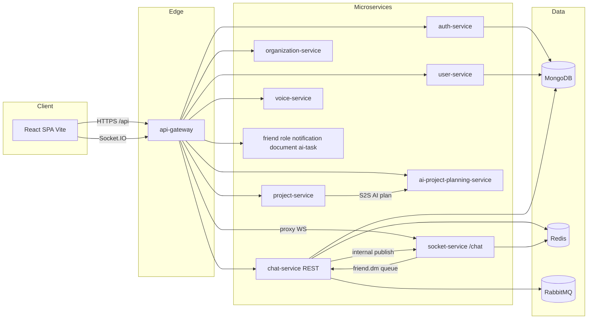

# Kiến trúc VoiceHub

Hệ thống theo mô hình **microservices**; **một API Gateway** là điểm vào REST cho client. **Realtime canonical:** `socket-service` namespace `/chat` (path `/socket.io`) — client qua gateway hoặc proxy Vite; `chat-service` chỉ REST + queue, **không** bind Socket.IO public (`CHAT_SOCKET_ENABLED=false`).

## Sơ đồ luồng (logical)

## Vai trò từng nhóm

| Thành phần | Vai trò |
|------------|---------|
| **api-gateway** | Xác thực JWT, kiểm tra permission (RBAC), proxy tới service, forward header `x-user-id` / `x-user-email`. |
| **auth-service** | Đăng ký, đăng nhập, refresh, verify email, forgot/reset password. |
| **user-service** | UserProfile: `/api/users/me`, `/api/users/:userId`, search, … |
| **chat-service** | Tin nhắn DM/org REST, consumer RabbitMQ, `emitRealtimeEvent` → socket-service. Không WS public (legacy tắt). |
| **socket-service** | Socket.IO `/chat`: connection, presence, DM/org fan-out; Redis adapter khi scale replica. |
| **organization-service** | Organization, server, department, member, channel (theo route hiện tại). |
| **project-service** | Project, task, board, requirement, comment; Gate 1/2 HTTP facade; G20 materialize; worker RabbitMQ tùy bật. |
| **ai-project-planning-service** | AI Project planning runtime (G4/G7/G8/G15–G19, G17–G18) — LLM/orchestrator **không** in-process trong project-service. |
| **voice-service** | Meeting / mediasoup signaling, UDP. |
| **friend-service** | Bạn bè, lời mời, block. |
| **role-permission-service** | Role, permission, check cho gateway. |
| **notification-service** | Thông báo lưu trữ; webhook nội bộ dispatch notification (không còn service webhook độc lập). |
| **document-service** | Metadata tài liệu. |
| **ai-task-service** + **ai-task-worker** | Pipeline AI task chat→board (RabbitMQ, Ollama, …) — **không** trùng AI Project planning. |

## AI Project (Two-Phase HITL)

- **Sản phẩm:** Phase 1 WHAT → Gate 1 → Phase 2 HOW → Gate 2; compute trên **`ai-project-planning-service`**; pack/project + Gate HTTP + G20 trên **`project-service`**.
- **SoT nhóm G1–G20:** [`.cursor/plans/ai-project-build-spec-groups.plan.md`](../.cursor/plans/ai-project-build-spec-groups.plan.md); primer: [`.cursor/skills/ai-project-primer/SKILL.md`](../.cursor/skills/ai-project-primer/SKILL.md).
- **Luồng 3-layer (A/B/C):** [`ai-project/main-flow-3layer.md`](ai-project/main-flow-3layer.md) — cùng backbone; kính đọc Workflow / Agent / Governance.
- **Vá 3 track trước Agent Core:** [`ai-project/pre-agent-core-3tracks.md`](ai-project/pre-agent-core-3tracks.md) — C→A→B rồi mới LangGraph F2 / JEV runtime (RULE-14).
- **JEV (control layer, deferred):** JEV 1/2/3 — chấm điểm / định tuyến model / giám sát agent; **provider-agnostic**; chưa implement runtime. Chi tiết: [`ai-project/jev-control-layer.md`](ai-project/jev-control-layer.md).

## Frontend

- **SPA** gọi chỉ **`/api`** (same-origin qua Nginx / Vite proxy) hoặc `VITE_API_URL=/api`.  
- **Hai lớp axios** (`services/api.js` và `services/api/apiClient.js`) là **cố ý** — interceptor khác nhau; không gộp một PR (rủi ro auth/toast). Xem [`client/src/services/HTTP_CONVENTIONS.md`](../client/src/services/HTTP_CONVENTIONS.md).

## Dữ liệu và messaging

- **MongoDB**: mỗi service có DB/collection riêng theo cấu hình.  
- **Redis**: cache, session, presence (tùy service).  
- **RabbitMQ**: hàng đợi (chat-service / project-service / ai-task — theo `docker-stack.yml` + Compose extra khi cần).

## Triển khai

| Môi trường | Công cụ | Ghi chú |
|------------|---------|---------|
| **Local app microservices** | **Docker Swarm** | [`docker-stack.yml`](../docker-stack.yml), [`devops/swarm/deploy-stack.sh`](../devops/swarm/deploy-stack.sh) |
| **Infra/AI bổ sung (dev)** | Docker Compose extra | ollama, minio, workers — [`docker-compose.swarm-extra.yml`](../docker-compose.swarm-extra.yml); xem [`DOCKER-COMPOSE.md`](DOCKER-COMPOSE.md) |
| **Tương lai** | K8s, edge Cloudflare | Không phải path đang chạy — xem [`devops/swarm/ha-infra-roadmap.md`](../devops/swarm/ha-infra-roadmap.md) |

Socket HA staging: `SOCKET_SERVICE_REPLICAS>=2`, `SOCKET_IO_REDIS_ADAPTER=true` — [`SOCKET_LB.md`](SOCKET_LB.md), [`devops/swarm/realtime-ha-checklist.md`](../devops/swarm/realtime-ha-checklist.md).

## Stateful HA (Phase 1 — staging)

| Thành phần | Triển khai | Ghi chú |
|------------|------------|---------|
| **MongoDB** | Atlas M10+ RS (`mongodb+srv://`) | Không service `mongodb` trong `docker-stack.yml` cutover |
| **Redis** | Stack `voicehub-redis` — Sentinel + master/replica | Client: `REDIS_SENTINELS`, `REDIS_SENTINEL_NAME=mymaster` |
| **RabbitMQ** | Stack `voicehub-rabbit` — 3 node cluster | `RABBITMQ_URL=@rabbitmq-1:5672`, `RABBITMQ_QUORUM_QUEUES=true` |
| **Overlay** | `voicehub_enterprise-network` | Shared bởi app + HA stacks |

Baseline & failover sign-off: [`ha-baseline-staging-2026-06.md`](ha-baseline-staging-2026-06.md).  
Roadmap: [`devops/swarm/ha-infra-roadmap.md`](../devops/swarm/ha-infra-roadmap.md).

## Stateless scale (Phase 2 — staging)

| Thành phần | Triển khai | Ghi chú |
|------------|------------|---------|
| **api-gateway** | `API_GATEWAY_REPLICAS>=2` | Stateless JWT; BFF cache Redis (`BFF_CACHE_ENABLED`) |
| **socket-service** | `SOCKET_SERVICE_REPLICAS>=2` | Redis adapter; client WS qua gateway (S2) |
| **Workers** | `*_WORKER_REPLICAS` trong `.env` | Manual scale — [`autoscale-policy.md`](../devops/swarm/autoscale-policy.md) |
| **voice-service** | `VOICE_SERVICE_REPLICAS=1` default | UDP host 40000–40010; [`voice-swarm-scale-strategy.md`](voice-swarm-scale-strategy.md) |
| **Edge** | Nginx `dev-https.conf` / `staging-swarm-edge.conf` | `TRUST_PROXY=1`; [`lan-https-voicehub.local.md`](lan-https-voicehub.local.md) |

Phase 2 sign-off: [`ha-baseline-staging-phase2-2026-06.md`](ha-baseline-staging-phase2-2026-06.md).

Lộ trình migrate/ổn định: [`MIGRATION.md`](MIGRATION.md), roadmap HA: [`devops/swarm/ha-infra-roadmap.md`](../devops/swarm/ha-infra-roadmap.md).
