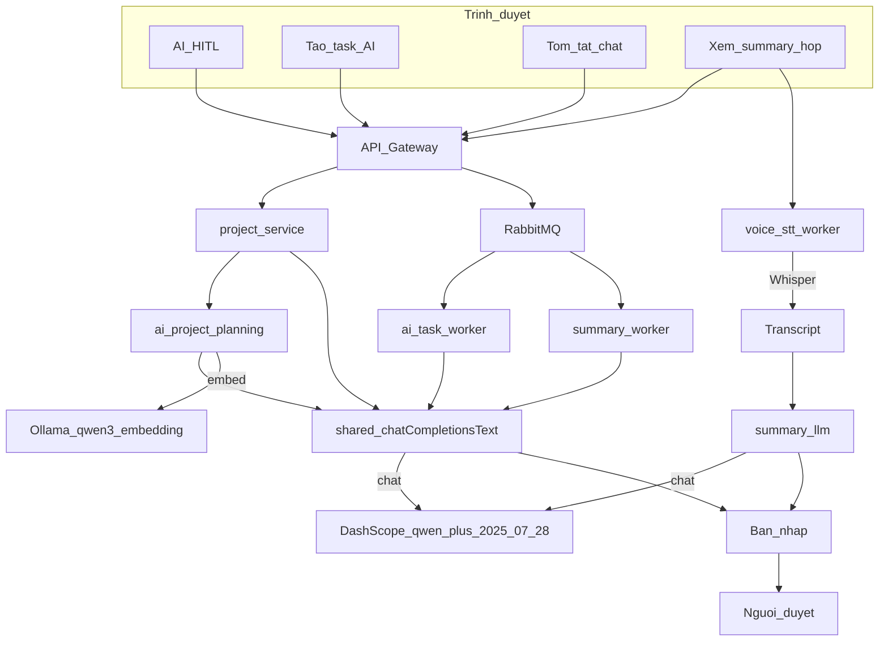
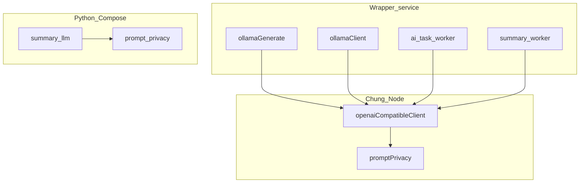
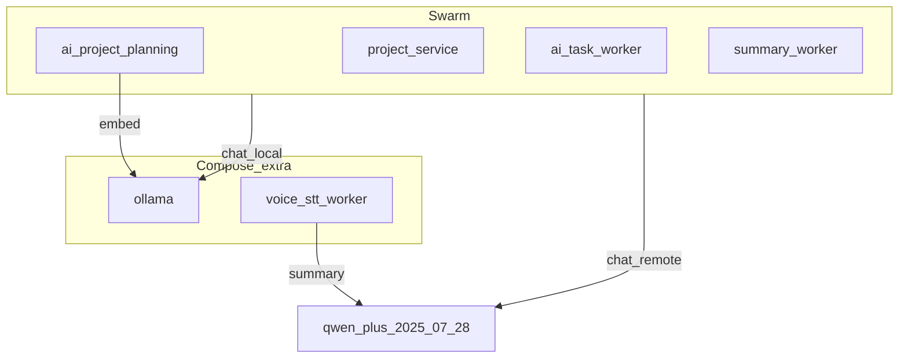

# Báo cáo team — Chuyển chat LLM: Ollama → Alibaba DashScope

**Phạm vi:** adapter OpenAI-compatible + env; **không** đổi HITL / gateway / schema / FE.

---

## 1. Tóm tắt

| | |
|---|---|
| **Mục tiêu** | Chat AI nhanh hơn, bớt phụ thuộc GPU local; Ollama dự phòng + nhúng vector; AI đề xuất, người duyệt chốt |
| **Cách làm** | Lớp gọi chung `/chat/completions` (DashScope intl); bật bằng `LLM_PROVIDER=openai_compatible` — không SDK Alibaba |
| **Đã bật** | Service chat (Swarm) + tóm tắt họp `voice-stt-worker` (Compose); model DashScope **`qwen-plus-2025-07-28`** (`LLM_CHAT_MODEL`) |
| **UI** | FE không sửa. Smoke `voicehub.local`: AI HITL `draft`, Gate 1 chờ BA (Accept/Edit/Reject) — không tự duyệt |
| **Bảo mật** | Key trong `.env` (không commit); che email/SĐT trước khi gọi API DashScope; retry ≤2 lần (429/502–504/timeout) |
| **Còn lại** | Thu hồi khóa API cũ trên console Alibaba; thử flip `ollama` rồi đặt lại `openai_compatible` |

**Một dòng:** Chat LLM qua DashScope = **`qwen-plus-2025-07-28`**; nhúng vector = Ollama local `qwen3-embedding:0.6b` (không gọi DashScope); STT và HITL không chuyển.

---

## 2. Đã làm / không làm

| Đã làm | Không làm |
|--------|-----------|
| Shared JS: HTTP + mask + retry | Nhúng vector G7 → DashScope |
| 4 wrapper Node nhánh remote | Đổi STT |
| Python tóm tắt họp (mask/retry song song) | SDK Alibaba; đổi gateway/auth/queue/schema |
| Env Swarm + Compose STT; unit/smoke/UI HITL | Sửa `client/`; `ollamaRewriteExperience.js` |

---

## 3. Vấn đề → giải pháp

- **Vấn đề:** Ollama local chậm / phụ thuộc máy; khó scale demo AI.
- **Giải pháp:** Adapter OpenAI-compatible → DashScope; flip `LLM_PROVIDER`; giữ wrapper `generateJson` / `callOllama`.
- **Tại sao:** Đổi tối thiểu, một chỗ HTTP cho Node; rollback = đặt lại `ollama`.

| Biến | Ý nghĩa |
|------|---------|
| `LLM_PROVIDER` | `ollama` hoặc `openai_compatible` (alias: `dashscope`, `openai`, …). Giá trị `alibaba` **không** nhận → vẫn Ollama |
| `OPENAI_BASE_URL` / `DASHSCOPE_BASE_URL` | Base URL intl |
| `DASHSCOPE_API_KEY` | Bearer (không ghi giá trị) |
| `LLM_CHAT_MODEL` | Bắt buộc khi remote — hiện tại **`qwen-plus-2025-07-28`** (DashScope intl) |
| `OLLAMA_MODEL` | Chỉ khi local (vd. `qwen2.5:3b-instruct`) |

---

## 4. Alibaba đảm nhận gì

Mọi chỗ chat LLM remote **dùng chung một model** qua `LLM_CHAT_MODEL` (không tách turbo/plus theo từng việc trong code hiện tại).

| Việc nghiệp vụ | Gọi API DashScope? | Model | Service |
|----------------|-------------------|--------|---------|
| Phân tích yêu cầu / phase-run / AI revise | **Có** | DashScope **`qwen-plus-2025-07-28`** | `project-service` |
| Planning generate JSON (G4, WBS…) | **Có** | DashScope **`qwen-plus-2025-07-28`** | `ai-project-planning-service` |
| Tách việc từ tin nhắn chat | **Có** | DashScope **`qwen-plus-2025-07-28`** | `ai-task-worker` |
| Tóm tắt hội thoại chat | **Có** | DashScope **`qwen-plus-2025-07-28`** | `summary-worker` |
| Tóm tắt họp **sau** transcript | **Có** | DashScope **`qwen-plus-2025-07-28`** | `voice-stt-worker` (`summary_llm`) |
| Nhúng vector G7 → Qdrant | **Không** | Ollama local `qwen3-embedding:0.6b` (không qua API DashScope) | `ollamaEmbed.js` |
| Speech → text (STT) | **Không** | Whisper self-hosted | `stt_adapters.py` |
| Duyệt HITL / JWT / gateway / FE | **Không** | — | Giữ nguyên |
| Summary `voice-recording-worker` | **Không** | Ollama local (`OLLAMA_MODEL`) | Chưa nối DashScope |

---

## 5. Làm ra sao (cơ chế)

1. User bấm nút UI → FE gọi `/api/...` (gateway) — **không** gọi DashScope từ browser.
2. Service/worker gọi wrapper cũ: `generateJson` / `callOllama`.
3. Nếu `LLM_PROVIDER` remote → `shared/llm/openaiCompatibleClient.js` → `chatCompletionsText`.
4. Che email/SĐT → `POST {OPENAI_BASE_URL}/chat/completions` + Bearer + model **`qwen-plus-2025-07-28`** (`LLM_CHAT_MODEL`; `messages: [{ role: user, content }]`).
5. Lấy `choices[0].message.content` → bỏ che → parse JSON như cũ.
6. Retry ≤2 lần chỉ khi 429 / 502–504 / timeout.
7. Kết quả vào **bản nháp** → người duyệt (HITL). AI không tự approve.

Python họp: cùng ý trong `summary_llm.py` + `prompt_privacy.py` (Compose không import `@enterprise/shared`).

---

## 6. Các luồng LLM với Alibaba

| Luồng | Kích hoạt UI | Đường chạy | Model |
|-------|--------------|------------|--------|
| **A — Phân tích HITL** | `/ai-hitl` — AI revise / Chạy AI WHAT; tab Duyệt Gate 1 | Gateway → project (+ planning) → shared → bản nháp `draft` | DashScope **`qwen-plus-2025-07-28`** |
| **B — Tách việc chat** | Sparkles / “Tạo task (AI)” → modal | API extract → queue → `ai-task-worker` → shared → draft → user confirm | DashScope **`qwen-plus-2025-07-28`** |
| **C — Tóm tắt chat** | Catch-up “Tóm tắt AI” | Queue → `summary-worker` → shared | DashScope **`qwen-plus-2025-07-28`** |
| **D — Họp** | Phòng voice / recording | (1) STT Whisper local (2) `summary_llm` → DashScope | (1) Whisper · (2) DashScope **`qwen-plus-2025-07-28`** |
| **E — Planning + retrieval** | Cùng pipeline planning | Generate JSON → DashScope; **embed** → Ollama → Qdrant | Generate: DashScope **`qwen-plus-2025-07-28`** · Embed: Ollama `qwen3-embedding:0.6b` |

---

## 7. Shared vs riêng

| | Path | Lý do |
|---|------|--------|
| **Chung** | `shared/llm/openaiCompatibleClient.js`, `promptPrivacy.js` | Một chỗ Bearer / mask / retry cho Node |
| **Wrapper** | `ollamaGenerate.js`, `ollamaClient.js`, `ai-task-worker`, `summary-worker` | Giữ API cũ + parse JSON; fallback Ollama |
| **Riêng** | `voice-stt-worker` `summary_llm.py`, `prompt_privacy.py` | Compose Python không import `@enterprise/shared` |

---

## 8. Service — Swarm / Compose

| Service | LLM remote (DashScope) | Model | Ghi chú |
|---------|------------------------|--------|---------|
| `project-service` | Có | DashScope **`qwen-plus-2025-07-28`** | Phân tích / phase-run |
| `ai-project-planning-service` | Có | Chat: **`qwen-plus-2025-07-28`** · Embed: Ollama `qwen3-embedding:0.6b` | Planning + retrieval |
| `ai-task-worker` | Có | DashScope **`qwen-plus-2025-07-28`** | Tách việc chat |
| `summary-worker` | Có | DashScope **`qwen-plus-2025-07-28`** | Tóm tắt hội thoại |
| `voice-stt-worker` | Có (Python) | Summary: **`qwen-plus-2025-07-28`** · STT: Whisper | Chỉ summary sau STT |
| `ollama` | Không (host local) | `OLLAMA_MODEL` / `qwen3-embedding:0.6b` | Rollback chat + embed |
| `voice-recording-worker` | Không | Ollama local (`OLLAMA_MODEL`) | Chưa tích hợp DashScope |

---

## 9. UI bị ảnh hưởng gián tiếp (FE không đổi)

| Chỗ | Surface | Nút / tab | Model khi `openai_compatible` |
|-----|---------|-----------|-------------------------------|
| Projects AI HITL | `/app/projects/:id/ai-hitl` | Monitor / Duyệt; AI revise; Gate 1 Accept/Edit/Reject | DashScope **`qwen-plus-2025-07-28`** |
| Chat — tách việc | Modal tạo task AI | Sparkles / “Tạo task (AI)” | DashScope **`qwen-plus-2025-07-28`** |
| Chat — tóm tắt | Catch-up card | “Tóm tắt AI” | DashScope **`qwen-plus-2025-07-28`** |
| Voice họp | Phòng / recording | Xem summary | DashScope **`qwen-plus-2025-07-28`** (sau STT Whisper) |

System admin không vào suite Projects — demo HITL bằng tài khoản BA.

---

## 10. Bảo mật

| | Hành vi |
|---|--------|
| Key | `.env` + Swarm/Compose; không commit; không log giá trị |
| PII | Khi gọi DashScope: che email + SĐT trước POST; bỏ che sau response |
| Retry | ≤2 lần; chỉ 429 / 502–504 / timeout |
| HITL | Không đổi — không tự duyệt |

---

## 11. Không đổi — tại sao

| Thành phần | Tại sao |
|------------|---------|
| Gateway / auth | Flip LLM không cần đổi trust |
| HITL / RabbitMQ / schema | Contract đề xuất → duyệt đã ổn |
| `ollamaEmbed.js` | Tránh re-index; chat only |
| STT adapters | Khác lớp với chat LLM |
| `ollamaRewriteExperience.js` | Ngoài phạm vi |
| `client/` | Không gọi LLM trực tiếp |
| `voice-recording-worker` | Chưa gắn DashScope |

---

## 12. Rủi ro

| Rủi ro | Xử lý |
|--------|--------|
| Model/region sai → 403 | Curl 200 trước khi flip |
| PII gửi lên DashScope | Mask trước khi gọi API remote |
| 429 / timeout | Retry giới hạn |
| Key lộ | Đổi `.env`; **thu hồi key cũ trên console** |
| Mask làm hỏng JSON | Chỉ email/SĐT; unmask trước dùng |

---

## 13. Test

| Lớp | Kết quả |
|-----|---------|
| Unit JS (`promptPrivacy`, `openaiCompatibleClient`) | Pass |
| Unit Python (`test_summarize_provider`) | Pass |
| Smoke container (generateJson, planning, task, summary, voice, embed) | Pass — chat DashScope **`qwen-plus-2025-07-28`**; embed Ollama `qwen3-embedding:0.6b` |
| UI HITL Gate 1 (BA, Smart City) | Pass — `draft`, chờ duyệt |
| Flip Ollama formal / thu hồi key cũ | **Chưa xong** — việc team |

---

## 14. File review nhanh

- Chung: `shared/llm/openaiCompatibleClient.js`, `promptPrivacy.js`
- Wrapper: `.../ollamaGenerate.js`, `.../ollamaClient.js`, `ai-task-worker/src/worker.js`, `summary-worker/src/promptBuilder.js`
- Python: `voice-stt-worker/src/summary_llm.py`, `prompt_privacy.py`
- Giữ Ollama: `ollamaEmbed.js`, `stt_adapters.py`
- Deploy: `docker-stack.yml`, `docker-compose.swarm-extra.yml`
