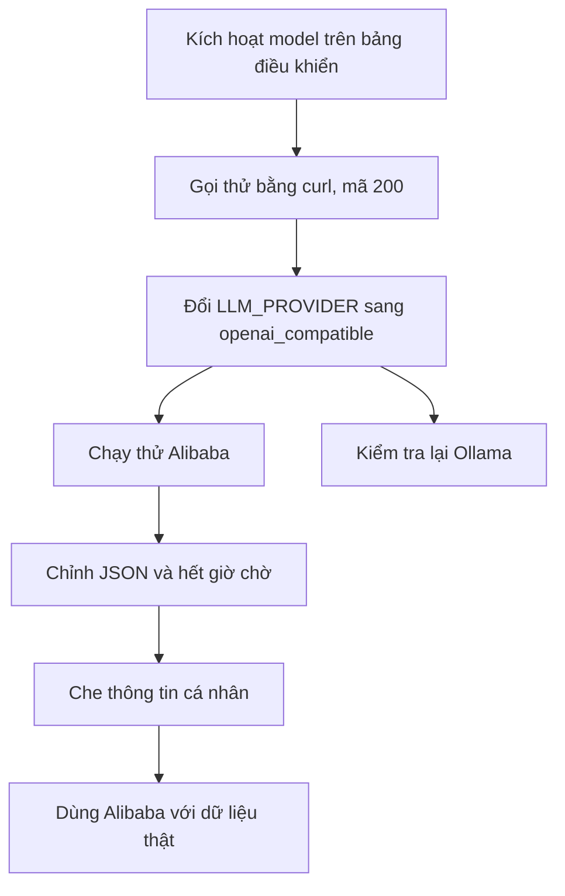
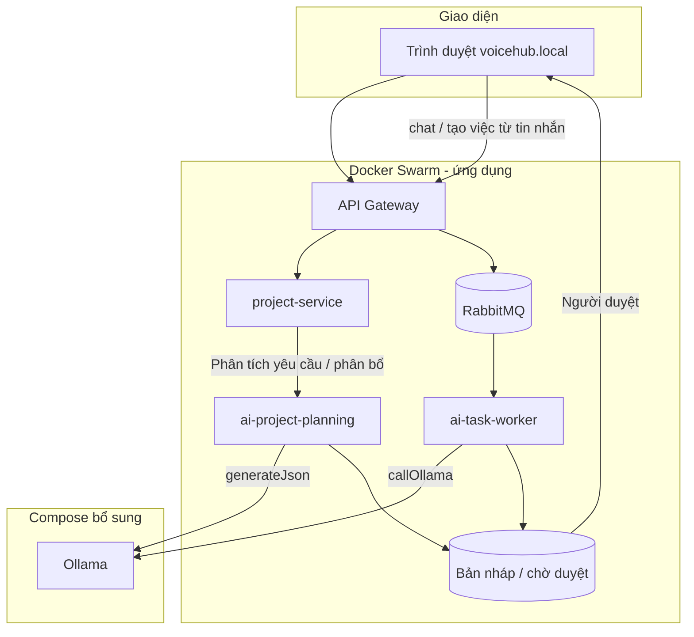
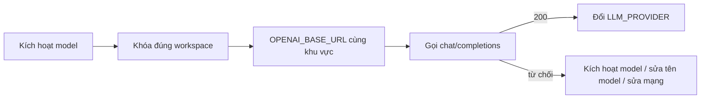
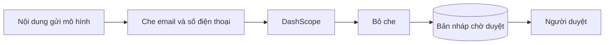

# Chuyển mô hình ngôn ngữ: Ollama trên máy → Alibaba DashScope (Qwen)

**Mục tiêu:** chạy AI nhanh hơn, bớt phụ thuộc card đồ họa máy local; vẫn giữ Ollama dự phòng; AI chỉ đề xuất, người dùng duyệt mới chốt.  
**Nguyên tắc:** không đập code cũ; không dùng thư viện riêng của Alibaba; không đụng cổng duyệt, hàng đợi RabbitMQ, cơ sở dữ liệu, đăng nhập.  
**Đọc mục 1 trước khi bật mây.** Không đổi nhà cung cấp và không gắn khóa mới cho đến khi model đã được kích hoạt trên bảng điều khiển (mục 1.4).

**Hiện tại trong code:** lớp gọi chung đã có tại `shared/llm/openaiCompatibleClient.js`. Mặc định vẫn là Ollama (`LLM_PROVIDER=ollama`), gọi `/api/generate`. Bật mây bằng `LLM_PROVIDER=openai_compatible` (tên phụ được nhận: `openai-compatible`, `dashscope`, `openai`). Giá trị `alibaba` **không** được nhận — ghi vậy thì code vẫn gọi Ollama.

| File chat đã nối nhánh mây |
|---|
| `services/ai-project-planning-service/src/runtime/ollamaGenerate.js` |
| `services/project-service/src/utils/aiAnalysis/ollamaClient.js` |
| `services/ai-task-worker/src/worker.js` (hàm `callOllama`) |
| `services/summary-worker/src/promptBuilder.js` |
| Nhúng vector `services/ai-project-planning-service/src/runtime/ollamaEmbed.js` — **không đổi**, vẫn Ollama |

**Cách chạy dịch vụ:** phần AI của ứng dụng nằm trên Docker Swarm. Ollama nằm trong Compose bổ sung (`docker-compose.swarm-extra.yml`). Alibaba gọi ra Internet bằng HTTPS (không cần container Ollama). Muốn quay lại Ollama thì vẫn cần Compose bổ sung. Mặc định trên Swarm vẫn `ollama`. Worker tóm tắt mặc định `mock` chỉ khi biến gốc để trống.



---

## 1. Hệ thống hiện tại → cần đổi gì

| | |
|---|---|
| **Làm gì** | Nắm ai gọi mô hình, nội dung gửi Ollama khác DashScope thế nào, kích hoạt model rồi mới gọi thử bằng curl |
| **Ở đâu** | Bốn file chat ở bảng đầu → `openaiCompatibleClient.js` → Ollama hoặc DashScope |
| **Sửa sao** | Code giai đoạn bộ chuyển đổi đã có. Việc còn lại là kích hoạt model, curl thành công, rồi mới đổi biến môi trường. Hàng đợi, người duyệt, cơ sở dữ liệu giữ nguyên |

### 1.1. Luồng VoiceHub khi vẫn dùng Ollama



Khi `LLM_PROVIDER=openai_compatible`, bốn chỗ chat và tóm tắt cuộc họp thoại (`voice-stt-worker`) đổi từ Ollama sang DashScope. Bước người duyệt không đổi. Nhúng vector vẫn đi Ollama.

### 1.2. So sánh nội dung gửi Ollama và DashScope

| | Ollama (mặc định hiện tại) | DashScope (khi đã bật mây) |
|---|---|---|
| Địa chỉ | `{OLLAMA_BASE_URL}/api/generate` | `{OPENAI_BASE_URL}/chat/completions` |
| Xác thực | Không | `Authorization: Bearer {DASHSCOPE_API_KEY}` |
| Thân yêu cầu | `model`, `prompt`, `stream:false`, `options` gồm nhiệt độ, `num_predict`, `num_ctx` | `model`, `messages` (vai trò + nội dung), nhiệt độ, `max_tokens` (thay cho `num_predict`) |
| Chỗ lấy chữ trả về | trường `response` | `choices[0].message.content` |
| Thống kê token | `prompt_eval_count`, `eval_count` | `usage.prompt_tokens`, `usage.completion_tokens` |
| Lấy JSON | hàm tách JSON sẵn — **giữ** | Cùng hàm sau khi lấy `content` |

Nếu `OPENAI_BASE_URL` trống, code đọc `DASHSCOPE_BASE_URL`. Khóa gọi được model đã bật trên hạn mức miễn phí dùng địa chỉ quốc tế Singapore `https://dashscope-intl.aliyuncs.com/compatible-mode/v1`. Địa chỉ workspace `*.maas.aliyuncs.com` chỉ nhận khóa của đúng workspace đó.

**Cách hiểu nhanh:** Ollama nhận **một chuỗi chữ dài** (câu lệnh + nội dung cần AI xử lý) trong trường tên `prompt`. DashScope không nhận một khối chữ đó trực tiếp — phải bỏ vào danh sách tin nhắn kiểu chat: mỗi tin có `role` (vai trò, thường là `user` = người dùng) và `content` (nội dung chữ). Code đã gói chuỗi cũ thành `messages: [{ "role": "user", "content": "…chuỗi đó…" }]`.

**Tên model:** khi nhà cung cấp là mây, code chỉ đọc `LLM_CHAT_MODEL` (đã gọi được: `qwen-plus-2025-07-28`). Không gửi `OLLAMA_MODEL`. Ollama trên máy vẫn đọc `OLLAMA_MODEL` (`qwen2.5:3b-instruct`). Thiếu `LLM_CHAT_MODEL` thì lỗi `LLM_CHAT_MODEL_missing`.

### 1.3. Lệnh curl mẫu

Chỉ chạy sau khi bảng điều khiển đã kích hoạt đúng tên model (mục 1.4). Địa chỉ và tên model phải trùng workspace, không copy nguyên địa chỉ công khai nếu khóa là khóa workspace.

```bash
# OPENAI_BASE_URL = https://dashscope-intl.aliyuncs.com/compatible-mode/v1
# model = LLM_CHAT_MODEL, ví dụ qwen-plus-2025-07-28. Không dùng qwen2.5:3b-instruct
curl -sS "$OPENAI_BASE_URL/chat/completions" \
  -H "Authorization: Bearer $DASHSCOPE_API_KEY" \
  -H "Content-Type: application/json" \
  -d '{
    "model": "qwen-plus",
    "messages": [{"role":"user","content":"Trả về JSON duy nhất: {\"ok\":true}"}],
    "temperature": 0.1,
    "max_tokens": 64
  }'
```

Đổi `"model"` thành đúng tên đã kích hoạt (`qwen-plus`, `qwen-turbo`, hoặc `qwen3.8-max` nếu workspace đã mở model đó).

**Đạt:** mã HTTP 200, trường `choices[0].message.content` đọc được thành JSON.  
**Lỗi hay gặp:** model chưa kích hoạt trên workspace; khóa và địa chỉ khác khu vực; hết hạn mức; máy hoặc Swarm không ra Internet. Lỗi này không phải do header trong code.

### 1.4. Kích hoạt model trên workspace trước khi đổi nhà cung cấp

| | |
|---|---|
| **Làm gì** | Trên bảng điều khiển Alibaba (khu vực Singapore), bật đúng model sẽ gọi. Đợi trạng thái đã kích hoạt. |
| **Ở đâu** | Workspace gắn với `OPENAI_BASE_URL` hiện có. Không tạo khóa mới để thử khi model chưa bật. |
| **Sửa sao** | Chưa kích hoạt thì mọi khóa đều bị từ chối. Giữ `LLM_PROVIDER=ollama` và `OLLAMA_MODEL=qwen2.5:3b-instruct`. Không commit file `.env`. |

Thứ tự bắt buộc: kích hoạt model → curl mục 1.3 trả 200 với đúng tên model → lúc đó mới đặt `LLM_PROVIDER=openai_compatible` và đặt `OLLAMA_MODEL` thành **đúng tên model mây đã kích hoạt** (tên local và tên mây đang chung một biến; tách biến riêng là việc sau, khi curl đã 200).

---

## 2. Kết nối Alibaba

| | |
|---|---|
| **Làm gì** | Curl thành công rồi mới đổi biến. Sau đó chạy thử Alibaba và kiểm tra lại Ollama |
| **Ở đâu** | Cùng địa chỉ `OPENAI_BASE_URL` đã curl, code đã gọi `{địa chỉ}/chat/completions` |
| **Sửa sao** | Khóa và địa chỉ cùng workspace Singapore. Hết giờ chờ và thử lại khi quá tải là bước sau (mục 6), chưa làm trong code |
| **Ổn định** | Không hứa mạng không bao giờ lỗi. Sẵn sàng khi đủ checklist mục 8 |



---

## 3. Bộ chuyển đổi nhà cung cấp mô hình

| | |
|---|---|
| **Làm gì** | Một chỗ gọi: `ollama` hoặc `openai_compatible` theo biến môi trường |
| **Ở đâu** | `shared/llm/openaiCompatibleClient.js` và bốn file chat ở đầu tài liệu |
| **Sửa sao** | Đã map theo bảng mục 1.2. Không sửa thêm code cho đến khi curl 200 |
| **Biến môi trường** | `LLM_PROVIDER`, `OPENAI_BASE_URL` (ưu tiên), `DASHSCOPE_BASE_URL` (dự phòng), `DASHSCOPE_API_KEY`, `LLM_CHAT_MODEL` (mây), `OLLAMA_MODEL` (máy). Giữ `OLLAMA_BASE_URL` cho Ollama và cho nhúng vector |

```mermaid
flowchart LR
  Viec[Phân tích yêu cầu / Worker] --> Goi[generateJson hoặc callOllama]
  Goi -->|ollama| OllamaApi[/api/generate]
  Goi -->|openai_compatible| DashApi[/chat/completions]
  Goi --> Json[Tách JSON]
  Json --> Duyet[Bản nháp rồi người duyệt]
```

**Không làm:** cài gói thư viện `dashscope` của Alibaba; xóa Ollama; đổi đường API công khai, cấu trúc hàng đợi, hay bảng dữ liệu; build lại image chỉ để sửa tài liệu này.

---

## 4. Quyết định cần team chốt

### Quyết định 1 · Khu vực máy chủ (quốc tế hay Trung Quốc)

| | |
|---|---|
| **Đề xuất** | **Singapore (quốc tế)**, đúng workspace đang có trong `OPENAI_BASE_URL` |
| **Làm gì / Ở đâu / Sửa** | Không trộn khóa workspace Singapore với địa chỉ máy chủ Trung Quốc |
| **Chốt** | |

### Quyết định 2 · Mặc định `LLM_PROVIDER` trên Swarm

| | |
|---|---|
| **Đề xuất** | **Giữ `ollama`**. Chỉ đặt `openai_compatible` sau curl 200 |
| **Làm gì / Ở đâu / Sửa** | File `.env` gốc. Không đổi mặc định cả cụm khi model chưa kích hoạt |
| **Chốt** | |

### Quyết định 3 · Che thông tin cá nhân trước khi dùng dữ liệu thật?

| | |
|---|---|
| **Đề xuất** | **Trước** khi gửi tài liệu yêu cầu hoặc thông tin cá nhân thật lên mây |
| **Làm gì / Ở đâu / Sửa** | Chưa làm trong code. Khi thử chỉ dùng dữ liệu giả. Che email, tên, số điện thoại là bước sau |
| **Chốt** | |

### Quyết định 4 · Ai trả phí / hạn mức ra sao?

| | |
|---|---|
| **Đề xuất** | Một tài khoản phòng thí nghiệm; khi thử chỉ dùng hạn mức miễn phí; một người giữ khóa |
| **Làm gì / Ở đâu / Sửa** | Xem hạn mức trên bảng điều khiển. Việc nhẹ dùng `qwen-turbo`. Việc cần JSON dùng `qwen-plus`, nếu model đó đã kích hoạt |
| **Chốt** | |

| # | Câu hỏi thêm | Đề xuất |
|---|---|---|
| 5 | Mô hình theo từng việc? | turbo = tách việc nhanh; plus = JSON phân tích yêu cầu. Chỉ tên đã kích hoạt |
| 6 | Alibaba lỗi thì sao? | Báo lỗi rõ và chạy lại. Quay về Ollama bằng cách đặt lại `LLM_PROVIDER=ollama` |
| 7 | Nhúng vector? | Giữ Ollama |
| 8 | Ghi nhật ký nội dung gửi mô hình? | Không ghi email, tên, số điện thoại, không ghi khóa |

---

## 5. Bảo mật

| | |
|---|---|
| **Làm gì** | Khóa chỉ trong `.env`; người duyệt; che thông tin cá nhân trước dữ liệu thật |
| **Ở đâu** | Lớp gọi mô hình, trước khi gọi ra Internet |
| **Sửa sao** | Không đưa khóa vào git. Không ghi đầy đủ thân tin nhắn vào log. Khi mây: che email và số điện thoại trước POST (`shared/llm/promptPrivacy.js`, `voice-stt-worker` `prompt_privacy.py`), bỏ che trên chữ trả về |



**Cấm:** thư viện riêng Alibaba; gửi khóa vào git hoặc chat; log nguyên thân tin nhắn.

---

## 6. JSON lệch · Hết giờ chờ

| Vấn đề | Làm gì | Ở đâu | Sửa sao |
|---|---|---|---|
| JSON lệch định dạng | Phân tích JSON ổn như khi dùng Ollama | Lớp gọi mô hình và câu lệnh | So hai mô hình; gỡ khối markdown; nhiệt độ thấp |
| Hết giờ / lỗi quá tải 429 | Không để hàng đợi bị treo một lần lỗi tạm | `openaiCompatibleClient.js` và `summary_llm.py` | Thử lại tối đa 2 lần khi 429 / 502–504 / hết giờ, khoảng chờ ngắn; lỗi 401/403 không thử lại |

---

## 7. Việc làm theo thứ tự

| Bước | Làm gì | Xong khi |
|---|---|---|
| 0 | Đọc mục 1. Giữ `LLM_PROVIDER=ollama` | Nêu được bốn chỗ chat và chỗ nhúng vector không đổi |
| 1 | Kích hoạt model trên workspace Singapore | Bảng điều khiển báo model đã kích hoạt |
| 2 | Curl mục 1.3 với đúng tên model | HTTP 200 |
| 3 | Đổi `LLM_PROVIDER=openai_compatible` và `OLLAMA_MODEL` = tên model mây | Một việc AI ra bản nháp chờ duyệt |
| 4 | Kiểm tra lại `ollama` | Đặt lại hai biến local, luồng cũ vẫn chạy |
| 5 | Hết giờ chờ / thử lại | Hàng đợi không treo |
| 6 | Che thông tin cá nhân | Không còn email hoặc SĐT thô trên đường truyền mây |

Bước 5 và 6 **đã có trong code:** retry 429/502–504/timeout (tối đa 2 lần) và che email/SĐT khi remote — xem `shared/llm/openaiCompatibleClient.js`, `shared/llm/promptPrivacy.js`, `services/voice-stt-worker/src/summary_llm.py`. Báo cáo team: [bao-cao-chuyen-llm-ollama-alibaba.md](./bao-cao-chuyen-llm-ollama-alibaba.md). Build/update image các service chat + `voice-stt-worker` sau khi kéo code này.

---

## 8. Checklist hiểu hệ thống / demo

**Hiểu**

- [ ] Hai luồng gọi mô hình: phân tích yêu cầu, và ai-task-worker qua RabbitMQ.
- [ ] Bốn file chat đã nối; nhúng vector không đụng; cổng duyệt, hàng đợi, cơ sở dữ liệu không đụng.
- [ ] Khác biệt `/api/generate` và `/chat/completions` (bảng 1.2).
- [ ] Giá trị bật mây là `openai_compatible`, không phải `alibaba`.
- [ ] Ollama = Compose bổ sung; Alibaba = workspace Singapore; phải kích hoạt model trước.
- [ ] Không gửi `qwen2.5:3b-instruct` lên DashScope.
- [ ] Người duyệt vẫn bắt buộc sau khi đổi mô hình.

**Chạy / demo**

- [ ] Model đã kích hoạt trên bảng điều khiển.
- [ ] Curl mục 1.3 thành công.
- [ ] `LLM_PROVIDER=openai_compatible` và tên model mây → một việc AI ra bản nháp chờ duyệt.
- [ ] `LLM_PROVIDER=ollama` và `OLLAMA_MODEL=qwen2.5:3b-instruct` → luồng cũ vẫn ổn.
- [ ] Giao diện chờ người duyệt (không tự phê duyệt).
- [ ] Không có khóa API trong git.

---

## 9. Nguồn đọc · Việc không làm trong đợt này

| Nguồn | Lấy gì |
|---|---|
| [DashScope tương thích OpenAI](https://www.alibabacloud.com/help/en/model-studio/compatibility-of-openai-with-dashscope) | Địa chỉ, thân yêu cầu |
| [Địa chỉ Model Studio theo khu vực](https://www.alibabacloud.com/help/en/model-studio/base-url) | quốc tế / Beijing |
| [Hạn mức miễn phí](https://www.alibabacloud.com/help/en/model-studio/new-free-quota) | hạn mức thử |
| Tài liệu chuẩn `docs/ai-automation-srs-sot.md` | Người duyệt, AI không tự chốt |

**Không làm trong đợt này:** Socket, chỉ mục cơ sở dữ liệu, giao diện kiểu ClickUp, đổi nhúng vector sang mây, đổi STT.  
**Đã làm (xem báo cáo team):** lớp gọi chung + che email/SĐT + retry transient; bật `LLM_PROVIDER=openai_compatible` trên service chat; [bao-cao-chuyen-llm-ollama-alibaba.md](./bao-cao-chuyen-llm-ollama-alibaba.md).
