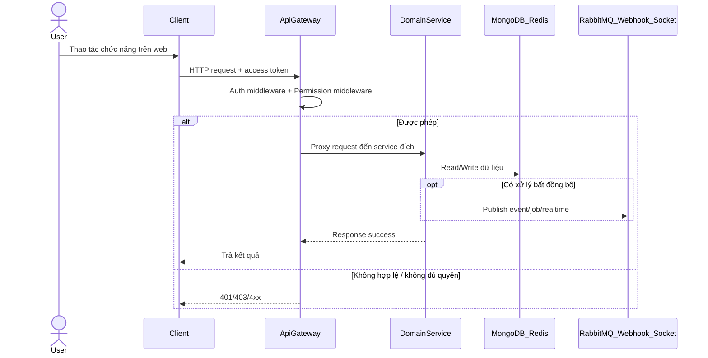

# Tổng quan luồng nghiệp vụ VoiceHub (bám sát code)

Tài liệu này là bản đồ đọc nhanh toàn bộ chức năng hiện có trước khi đi vào từng file flow chi tiết.

## 1) Phạm vi chức năng hiện có

- Cổng vào chung: `api-gateway` (auth + permission + proxy).
- Dịch vụ chính: `auth-service`, `user-service`, `friend-service`, `organization-service`, `role-permission-service`, `chat-service`, `notification-service`, `task-service`, `ai-task-service`, `voice-service`, `document-service`, `socket-service`, `webhook-service`.
- Frontend: `client` gọi API qua `/api/*`, một số nghiệp vụ tổng hợp ở client (đặc biệt là Dashboard Search).

## 2) Thứ tự ưu tiên triển khai tài liệu (chuẩn học tuần tự)

### Batch 1 (nền tảng truy cập hệ thống)
1. `01-auth-business-flow.md`
2. `02-organization-membership-flow.md`
3. `03-rbac-permission-flow.md`

### Batch 2 (social + profile + tìm kiếm + cấu trúc tổ chức)
4. `09-friend-flow.md`
5. `10-notification-flow.md`
6. `11-user-profile-flow.md`
7. `12-dashboard-search-flow.md`
8. `13-department-channel-flow.md`

### Batch 3 (giao tiếp và công việc cốt lõi)
9. `04-chat-message-flow.md`
10. `05-task-flow.md`
11. `06-ai-task-flow.md`
12. `07-voice-meeting-flow.md`
13. `14-document-flow.md`

## 2.1) Ảnh workflow trực tiếp trong từng file

- Mỗi file flow đã có mục `Sơ đồ PNG chi tiết`.
- Ảnh được đặt tại: `docs/luong nghiep vu/images/*.png`.
- Nguồn chỉnh sửa sơ đồ: `docs/luong nghiep vu/images/*.mmd` (Mermaid source).

## 3) Cách đọc mỗi file flow

Mỗi chức năng đều theo đúng 4 bước:
1. Bóc tách kỹ thuật (route -> middleware -> controller/service -> DB/queue/cache)
2. Cắt nghĩa nghiệp vụ (ngôn ngữ người dùng mới)
3. Sequence Diagram Mermaid (`alt/else` rõ nhánh thành công/thất bại)
4. Review độ tin cậy + điểm mù (lỗ hổng validate/exception/consistency)

## 3.1) Chuẩn Gold Standard

- File hạt nhân đã nâng cấp sâu: `02-organization-membership-flow.md` (endpoint/payload/middleware/DB/edge-case chi tiết theo code thật).
- Các flow còn lại đã bổ sung mục `Phụ lục Gold Standard` để tăng độ chi tiết endpoint và ngoại lệ.
- Khi review, ưu tiên đọc theo thứ tự: nội dung 4 bước chính -> sơ đồ PNG -> phụ lục Gold.

## 4) Sơ đồ khung chung toàn hệ thống

## 5) Lưu ý quan trọng khi đối chiếu code

- Nguồn sự thật là code đang chạy trong repo, không dựa tài liệu cũ khi mâu thuẫn.
- Một số service có route/controller legacy song song để tương thích ngược.
- Một số nghiệp vụ permission được check ở gateway, một số check nội bộ tại service domain.

## 6) Endpoint Matrix (siêu chi tiết cấp endpoint)

- `20-endpoint-matrix-auth-rbac-org.md`
- `21-endpoint-matrix-social-profile-search.md`
- `22-endpoint-matrix-chat-task-ai-voice-document.md`

## 7) Giáo trình học 7 ngày

- `30-7day-learning-curriculum.md`
