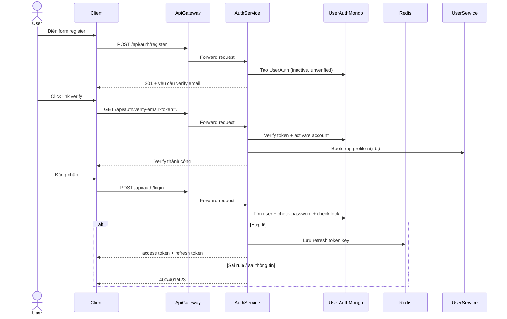
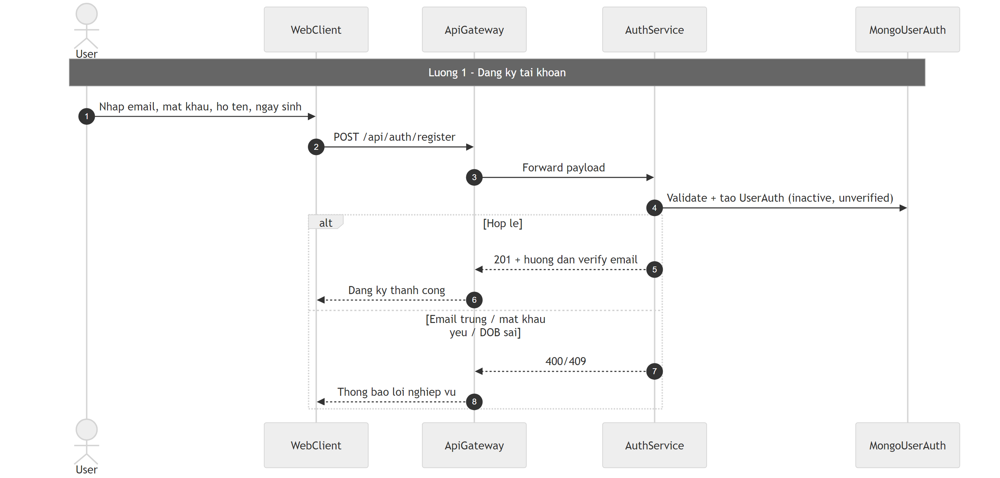
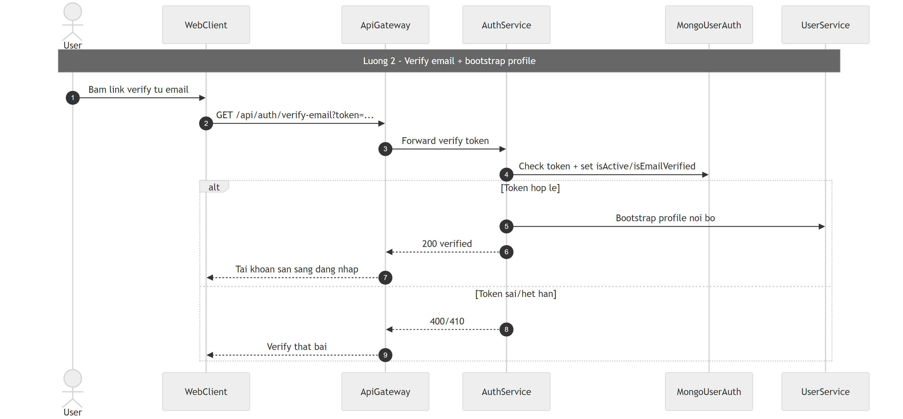
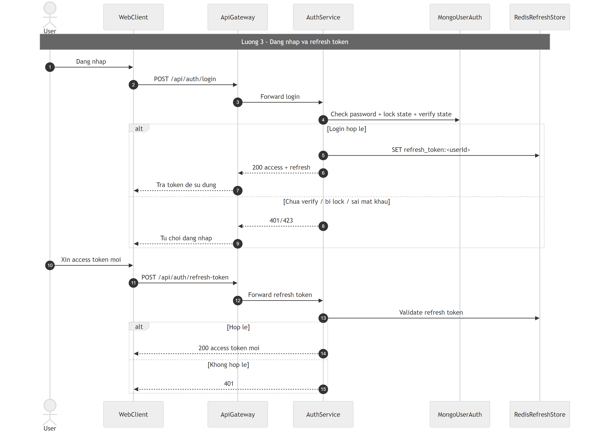

# Flow xác thực tài khoản (Auth)

## Bước 1: Bóc tách kỹ thuật (Code Breakdown)

### Điểm vào
- Public route qua gateway: `/api/auth/register`, `/api/auth/login`, `/api/auth/refresh-token`, `/api/auth/forgot-password`, `/api/auth/reset-password`, `/api/auth/verify-email`.
- Protected route: `/api/auth/logout`, `/api/auth/change-password`, `/api/auth/me`.

### Middleware và tầng xử lý
- Gateway route chain: `authMiddleware` (với route private) -> `permissionMiddleware` (có bypass một số route auth) -> `proxyMiddleware`.
- Auth service route: `services/auth-service/src/routes/auth.routes.js`.
- Controller: `services/auth-service/src/controllers/auth.controller.js`.
- Business logic: `services/auth-service/src/services/auth.service.js`.

### Dữ liệu và tích hợp
- Mongo collection: `UserAuth`.
- Redis: cache refresh token (`refresh_token:<userId>`).
- Tạo profile bên `user-service` sau verify email (bootstrap).
- JWT access/refresh qua util JWT nội bộ.

## Bước 2: Cắt nghĩa nghiệp vụ (Explain Like I Am New)

1. Người dùng đăng ký bằng email, mật khẩu, họ tên, ngày sinh.
2. Hệ thống kiểm tra luật: email chưa tồn tại, mật khẩu đủ mạnh, tuổi hợp lệ.
3. Tài khoản ban đầu chưa kích hoạt; user phải bấm link xác thực email.
4. Khi xác thực thành công, hệ thống bật trạng thái active và tạo hồ sơ user.
5. Người dùng đăng nhập, hệ thống kiểm tra tiếp:
   - email đã verify chưa,
   - tài khoản có đang bị lock do nhập sai nhiều lần không.
6. Nếu hợp lệ, hệ thống trả access token + refresh token.
7. Khi token hết hạn, client dùng refresh token để xin access token mới.

### Rule nghiệp vụ chính
- Chưa verify email thì không cho login.
- Sai mật khẩu nhiều lần thì khóa tạm thời.
- Forgot-password trả response chung để tránh lộ email tồn tại hay không.

## Bước 3: Sequence Diagram (Mermaid)

## Bước 4: Review độ tin cậy và điểm mù

- Điểm tốt:
  - Password policy và tuổi người dùng được kiểm tra rõ.
  - Có lock account tạm thời chống brute-force cơ bản.
  - Có chống email enumeration ở forgot/reset/resend.
- Điểm mù:
  - Nếu bước bootstrap profile lỗi sau verify email, tài khoản có thể đã active nhưng profile chưa đồng bộ.
  - Chưa thấy rate-limit chặt theo IP/email ở login/forgot-password.
  - Cần theo dõi thêm telemetry cho số lần lock/unlock để phát hiện tấn công.

## Sơ đồ PNG chi tiết

Để dễ đọc, flow Auth được tách thành 3 hình lớn theo từng chặng:

- Luồng 1 đăng ký: `images/01-auth-flow-register.mmd`
- Luồng 2 verify email: `images/01-auth-flow-verify.mmd`
- Luồng 3 đăng nhập và refresh token: `images/01-auth-flow-login-refresh.mmd`

## Phụ lục Gold Standard (bổ sung chi tiết endpoint)

### Endpoint chính + payload
- `POST /api/auth/register` body: `email`, `password`, `firstName`, `lastName`, `dateOfBirth`.
- `GET /api/auth/verify-email?token=...` query: `token`.
- `POST /api/auth/login` body: `email`, `password`.
- `POST /api/auth/refresh-token` body: `refreshToken`.
- `POST /api/auth/forgot-password` body: `email`.
- `POST /api/auth/reset-password` body: `token`, `newPassword`.

### Middleware flow thực tế
- Gateway: public auth routes được bypass permission; private route đi qua `authMiddleware` trước khi proxy.
- Auth service tự validate nghiệp vụ trong controller/service (không thấy Joi/Zod chung).

### DB operations nổi bật
- `UserAuth` lưu trạng thái verify/active/lock.
- Refresh token lưu Redis key theo `userId`.
- Verify email có bootstrap profile sang user-service.

### Edge cases quan trọng
- Email trùng: `409`.
- Token verify sai/hết hạn: `400/410`.
- Chưa verify hoặc bị lock khi login: `401/423`.
- Forgot password phản hồi generic để chống enumeration.
