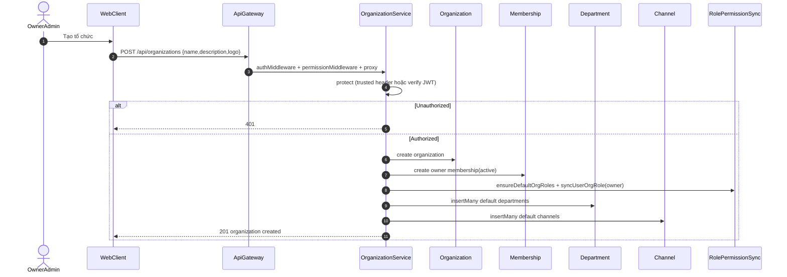
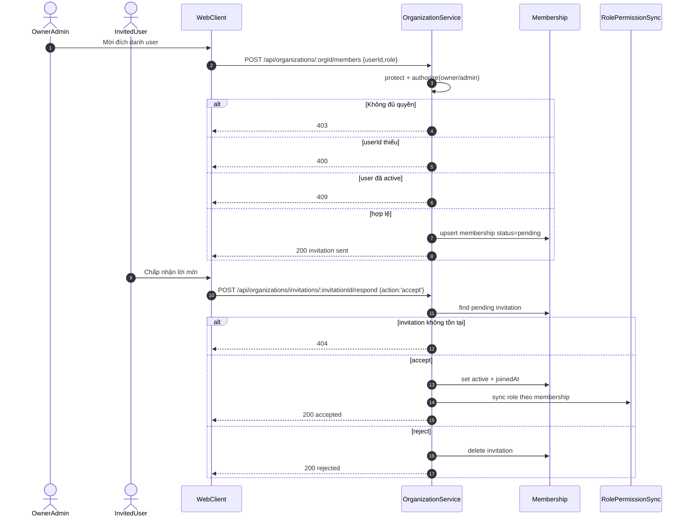
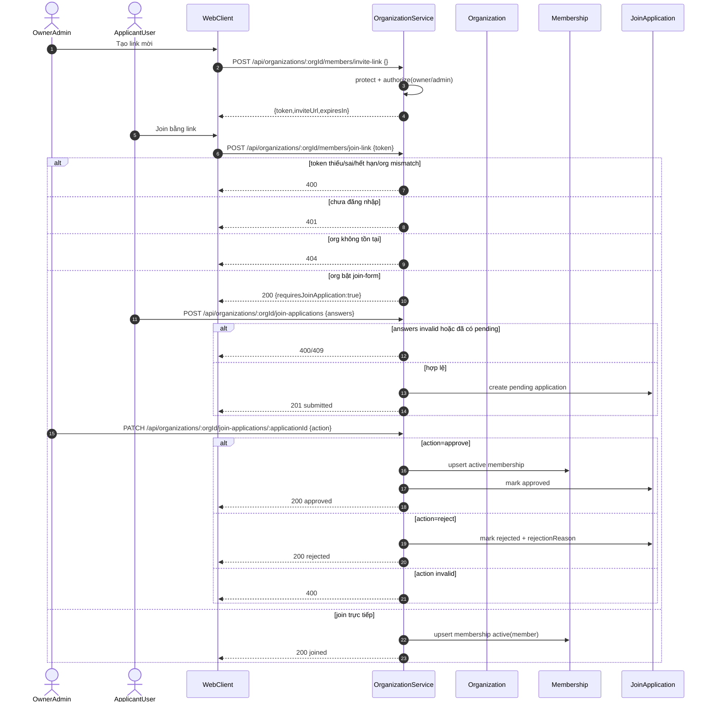
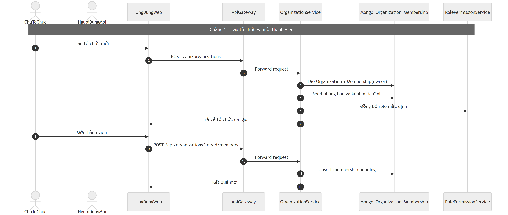
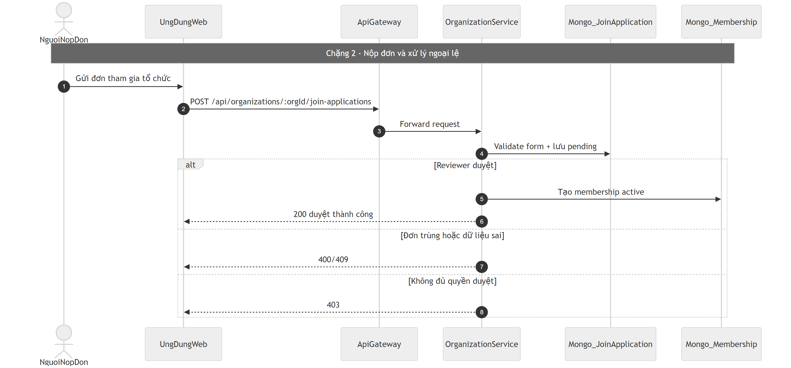

# Flow tổ chức và thành viên (Organization Membership) - Gold Standard

## Bước 1: Bóc tách kỹ thuật (chi tiết theo Endpoint)

### 1) Luồng middleware thực tế

- **API Gateway**: request private đi qua `authMiddleware` -> `permissionMiddleware` -> `proxy`.
- Với nhóm `organization:*`, gateway đang **bypass check role-service** ở `permission.middleware` và để `organization-service` tự quyết theo membership thật.
- **Organization service**:
  - `protect`: ưu tiên trust `x-user-id` khi request từ gateway hợp lệ; nếu không sẽ verify JWT qua `auth-service /api/auth/me`.
  - `authorize([...])`: check `Membership` với `status='active'` và role đã normalize.

### 2) Endpoint catalog (đúng theo route đang mount)

#### A. Organization core

- `GET /api/organizations/my`
  - Payload: không có body.
  - Middleware: gateway auth -> service `protect`.
  - DB: `Membership.find({ user, status:'active' }).populate(organization isActive=true)`.

- `POST /api/organizations`
  - Payload body:
    - bắt buộc thực tế: `name` (model sẽ quyết định thêm ràng buộc),
    - tùy chọn: `description`, `logo`.
  - Middleware: gateway auth -> service `protect`.
  - DB ops theo thứ tự:
    1. `Organization.create(...)`
    2. `Membership.create({ role:'owner', status:'active' })`
    3. `ensureDefaultOrgRoles(orgId)`
    4. `syncUserOrgRole(ownerId, orgId, 'owner')`
    5. seed mặc định `Department.insertMany(...)`
    6. seed `Channel.insertMany(...)`
  - Realtime: emit `organization:created`.
  - **Transaction**: không thấy dùng session/transaction bao ngoài chuỗi trên.

- `GET /api/organizations/:id`
  - Payload: không body.
  - Middleware: gateway auth -> service `protect`.
  - DB: tìm `Organization` + check `Membership` của user.
  - Lỗi: `404` org không tồn tại, `403` không có membership.

- `PUT /api/organizations/:id`
  - Payload body: `name`, `description`, `logo`, `settings` (tùy chọn).
  - Middleware: gateway auth -> service `protect` -> `authorize(['owner','admin'])`.
  - DB: `Organization.findByIdAndUpdate(..., runValidators:true)`.

- `DELETE /api/organizations/:id`
  - Payload: không body.
  - Middleware: gateway auth -> service `protect` -> `authorize(['owner'])`.
  - DB/side effects:
    - check ownerId,
    - gọi `purgeOrganizationEverywhere(orgId)` (cross-service purge),
    - emit realtime `organization:deleted`.
  - **Transaction**: không có transaction xuyên service.

#### B. Membership / invite trực tiếp

- `GET /api/organizations/:orgId/members`
  - Middleware: `protect` (route không bắt buộc authorize owner/admin trong file hiện tại).
  - DB: `Membership.find({ organization: orgId })`.

- `POST /api/organizations/:orgId/members` (hoặc `/invite`)
  - Payload body:
    - bắt buộc: `userId`,
    - tùy chọn: `role` (`owner|admin|member`, normalize từ input).
  - Middleware: `protect` -> `authorize(['owner','admin'])`.
  - DB:
    - check membership existing,
    - nếu active => `409`,
    - nếu chưa active: `findOneAndUpdate(..., upsert:true, status:'pending')`.
  - Realtime: `organization:invitation_received`.

- `POST /api/organizations/:orgId/members/leave`
  - Payload: không body.
  - Middleware: `protect`.
  - Rule:
    - không phải thành viên active -> `404`,
    - owner duy nhất -> `400`,
    - hợp lệ: delete membership + strip role.

- `PUT /api/organizations/:orgId/members/:userId/role`
  - Payload body: `role` (bắt buộc logic), `department`, `team` (tùy chọn).
  - Middleware: `protect` -> `authorize(['owner','admin'])`.
  - DB: `findOneAndUpdate` membership; sync role xuống role-permission.

- `DELETE /api/organizations/:orgId/members/:userId`
  - Middleware: `protect` -> `authorize(['owner','admin'])`.
  - DB: xóa membership + strip role.

#### C. Invite bằng link

- `POST /api/organizations/:orgId/members/invite-link`
  - Payload: không body.
  - Middleware: `protect` -> `authorize(['owner','admin'])`.
  - Tạo JWT token `{ type:'organization_invite', orgId, createdBy }`, có hạn dùng.
  - Response trả `token`, `inviteUrl`, `expiresIn`.

- `POST /api/organizations/:orgId/members/join-link`
  - Payload body:
    - bắt buộc: `token`.
  - Middleware: `protect`.
  - Check:
    - token có hợp lệ, đúng type, đúng orgId,
    - org tồn tại và active.
  - Nhánh:
    - nếu org bật join-form: trả `requiresJoinApplication=true`,
    - nếu không: upsert membership active role member + sync role.
  - Lỗi thường gặp: `400` token sai/hết hạn/mismatch, `401` chưa auth, `404` org không tồn tại.

#### D. Join application

- `GET /api/organizations/:orgId/join-application-form/public`
  - Không yêu cầu `authorize owner/admin`, nhưng vẫn đang nằm dưới `router.use(protect)` nên thực tế cần auth.
  - Trả schema form nếu enabled.

- `GET /api/organizations/:orgId/join-application-form`
  - Middleware: `protect` -> `authorize(['owner','admin'])`.
  - Trả cấu hình form hiện tại.

- `PUT /api/organizations/:orgId/join-application-form`
  - Middleware: `protect` -> `authorize(['owner','admin'])`.
  - Payload body:
    - `enabled`,
    - `defaultRoleOnApprove`,
    - `fields[]` (`id,label,type,required,options`).
  - Validate thủ công: regex fieldId, label bắt buộc, choice cần >=2 options.
  - DB: update `org.settings.joinApplicationForm`, tăng `formVersion` khi fieldsChanged.

- `POST /api/organizations/:orgId/join-applications`
  - Middleware: `protect`.
  - Payload body:
    - bắt buộc: `answers` object theo cấu trúc form.
  - Check:
    - org active, form enabled, có fields,
    - user chưa là active member,
    - user chưa có pending app.
  - DB: `JoinApplication.create(...)` với `formSnapshot`.
  - Side effects: notify moderators + realtime event.

- `GET /api/organizations/:orgId/join-applications`
  - Middleware: `protect` -> `authorize(['owner','admin'])`.
  - Query: `status=pending|approved|rejected|all`.

- `PATCH /api/organizations/:orgId/join-applications/:applicationId`
  - Middleware: `protect` -> `authorize(['owner','admin'])`.
  - Payload body:
    - bắt buộc: `action` (`approve|reject`),
    - tùy chọn: `rejectionReason`.
  - Nhánh approve:
    - upsert membership active,
    - update application approved,
    - notify applicant + realtime.
  - Nhánh reject:
    - update application rejected + reason,
    - notify applicant + realtime.

## Bước 2: Cắt nghĩa nghiệp vụ (nguyên nhân -> kết quả + tại sao)

- Người dùng tạo tổ chức -> hệ thống tự thêm người tạo làm owner và seed department/channel mặc định.  
  **Tại sao?** Để có workspace dùng được ngay, không phải setup rỗng.

- Owner/admin mời đích danh 1 user -> tạo membership `pending`.  
  **Tại sao?** Dùng trạng thái chờ để user tự chấp nhận/từ chối, tránh bị thêm thẳng không kiểm soát.

- User phản hồi lời mời:
  - accept -> membership `active` + sync quyền,
  - reject -> xóa bản ghi invitation.

- Owner/admin tạo invite link:
  - link có token JWT và expiry,
  - ai có link vẫn phải đăng nhập để join.
  **Tại sao?** Cân bằng giữa tiện chia sẻ và an toàn.

- User join bằng link:
  - nếu org bật join-form -> chưa join ngay, phải nộp đơn,
  - nếu không bật form -> vào thẳng role `member`.

- Quy trình join application:
  - user nộp câu trả lời theo form,
  - owner/admin review:
    - approve -> thành member active,
    - reject -> lưu lý do.
  **Tại sao?** Tổ chức có thể lọc thành viên trước khi cấp quyền.

### Edge cases quan trọng (đúng mã lỗi theo code)

- Đã là thành viên active mà vẫn được mời: `409 User already in organization`.
- Token mời sai/hết hạn: `400 Invalid or expired invite token`.
- Token mời đúng nhưng lệch orgId route: `400 Invite token organization mismatch`.
- Chưa đăng nhập mà vào luồng cần auth: `401`.
- Không đủ role owner/admin cho route quản trị: `403`.
- Owner duy nhất cố leave org: `400`.
- Đơn pending không tồn tại khi review: `404`.
- Nộp đơn trùng pending: `409`.

## Bước 3: Sequence Diagram (cực kỳ chi tiết)

## Bước 4: Review độ tin cậy và điểm mù (dựa trên code thật)

### Sự thật phũ từ code hiện tại

- **Thiếu transaction đa bước** ở các luồng quan trọng:
  - `createOrganization`: tạo org -> tạo membership -> sync role -> seed structure; fail giữa chừng có thể để lại dữ liệu lệch (org có nhưng thiếu owner membership/seed).
  - `reviewJoinApplication approve`: upsert membership + update app + notify; fail giữa chừng có thể inconsistent trạng thái.
  - `joinViaLink`: upsert membership + sync role + realtime; không có rollback.

- **Validate input chưa có lớp schema thống nhất** (Joi/Zod/express-validator):
  - Chủ yếu check thủ công trong controller + một phần validate từ model.
  - Ưu điểm: linh hoạt nhanh.
  - Nhược điểm: dễ lệch chuẩn giữa endpoint, khó bảo trì lớn.

- **Rò rỉ dữ liệu**:
  - `getMembers` trả raw `Membership` docs. Membership không có password hash, nên chưa lộ mật khẩu.
  - Nhưng vẫn có thể lộ metadata nội bộ không cần thiết (invitedBy, timestamps, v.v.) nếu FE không cần.

### Khuyến nghị hardening (ưu tiên cao -> thấp)

1. Dùng Mongo transaction/session cho các chuỗi multi-write trong cùng service.
2. Tách schema validation tập trung cho request body/query/params.
3. Chuẩn hóa response lỗi theo taxonomy chung (400/401/403/404/409/500).
4. Thu hẹp field trả về cho `getMembers` và các list endpoint.
5. Tăng audit log cho reviewer action (approve/reject/role-change/remove).

## Sơ đồ PNG chi tiết

Tách thành 2 ảnh lớn để dễ đọc: chặng luồng chính và chặng lỗi/ngoại lệ.

- Nguồn 1: `images/02-organization-membership-flow-parta.mmd`
- Nguồn 2: `images/02-organization-membership-flow-partb.mmd`

