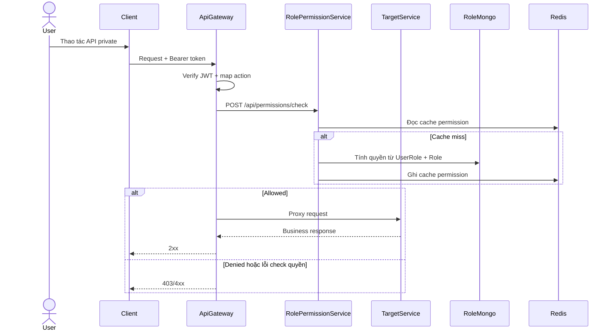
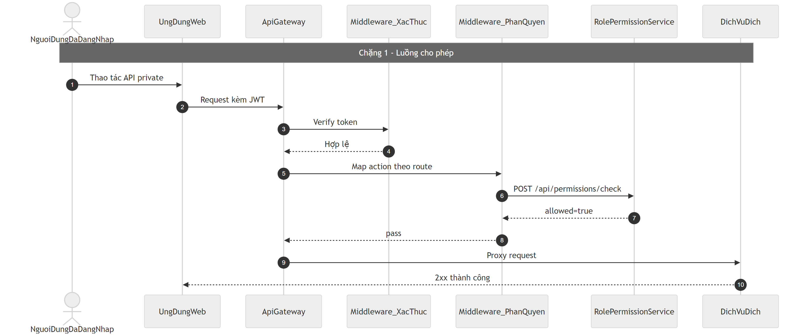
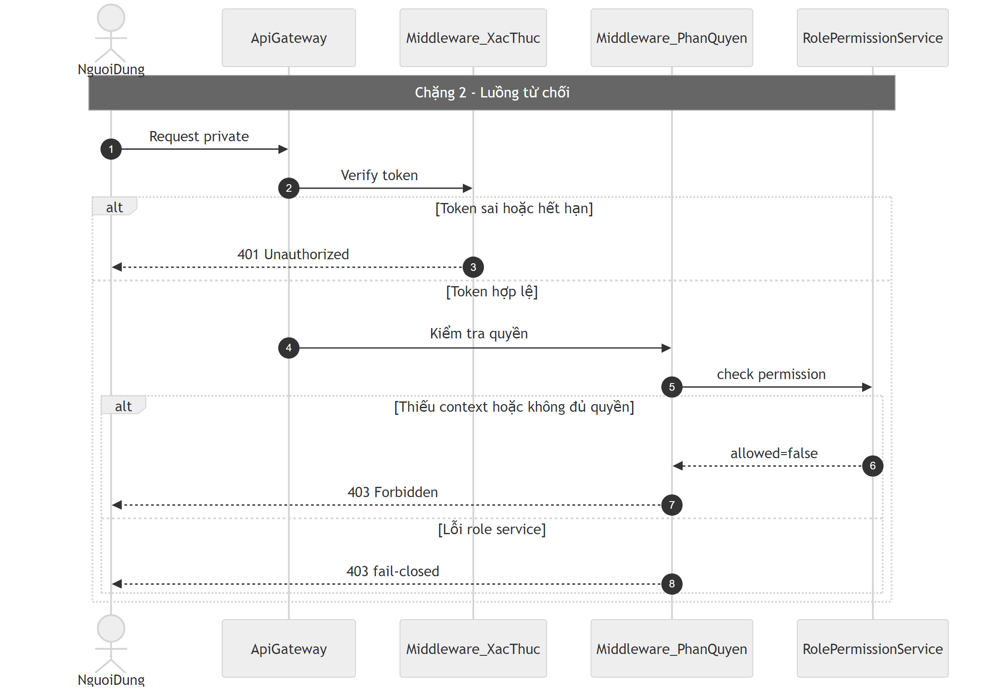

# Flow phân quyền RBAC (Gateway + Role/Permission Service)

## Bước 1: Bóc tách kỹ thuật (Code Breakdown)

### Điểm vào
- Mọi request private đi qua API Gateway.
- Gateway map action theo `method + path` bằng `api-gateway/src/config/permissions.js`.
- Gateway gọi `POST /api/permissions/check` sang role-permission-service.

### Middleware và tầng xử lý
- `auth.middleware.js`: verify JWT, nạp `req.user`.
- `permission.middleware.js`:
  - lấy action + server/org context,
  - gọi role service check quyền,
  - có cache in-memory theo key `userId|serverId|action`.
- Role-permission service:
  - `internalGatewayAuth` cho endpoint check nội bộ,
  - `permission.controller.js` -> `permission.service.js`.

### Dữ liệu và tích hợp
- Mongo collections: `Role`, `UserRole`.
- Redis cache permission tại role-permission-service.
- Gateway có cache cục bộ để giảm call check lặp.

## Bước 2: Cắt nghĩa nghiệp vụ (Explain Like I Am New)

1. User gửi request có token lên gateway.
2. Gateway xác thực người gửi là ai.
3. Gateway xác định hành động nghiệp vụ user đang đòi làm (ví dụ `chat:write`).
4. Gateway hỏi role-permission service: user này tại server/org đó có quyền không?
5. Nếu được phép thì request mới tới service nghiệp vụ.
6. Nếu không được thì chặn ngay ở gateway, trả 403.

### Rule nghiệp vụ chính
- Không xác định được context bắt buộc (server/org) thì trả lỗi.
- Permission check lỗi thì mặc định fail-closed (không cho đi tiếp).
- Một số route được bypass có chủ đích (public/noPermissionRoutes), không phải bug.

## Bước 3: Sequence Diagram (Mermaid)

## Bước 4: Review độ tin cậy và điểm mù

- Điểm tốt:
  - Quyền được chặn sớm ở gateway giúp giảm tải downstream.
  - Có fail-closed khi service quyền lỗi.
  - Có cache giúp giảm độ trễ.
- Điểm mù:
  - Bypass route nhiều thì cần tài liệu hóa rõ để tránh hiểu nhầm thành lỗ hổng.
  - In-memory cache ở gateway có thể stale ngắn hạn sau khi đổi role.
  - Nên có dashboard audit cho các quyết định allow/deny theo action để truy vết nhanh khi sự cố.

## Sơ đồ PNG chi tiết

Tách thành 2 ảnh lớn để dễ đọc: chặng luồng chính và chặng lỗi/ngoại lệ.

- Nguồn 1: `images/03-rbac-permission-flow-parta.mmd`
- Nguồn 2: `images/03-rbac-permission-flow-partb.mmd`

## Phụ lục Gold Standard (bổ sung chi tiết endpoint)

### Endpoint chính
- Gateway gọi `POST /api/permissions/check` (internal gateway token).
- Role service endpoint đọc quyền: `GET /api/permissions/user/:userId/server/:serverId`.

### Middleware flow thực tế
- Gateway: `authMiddleware` -> `permissionMiddleware` -> proxy.
- `permissionMiddleware` fail-closed khi check quyền lỗi.
- Route `organization:*` đang bypass ở gateway, để service domain tự check membership.

### DB operations
- Role-permission service dùng `UserRole`, `Role`, cache Redis quyền.
- Gateway có cache quyền cục bộ in-memory theo TTL.

### Edge cases
- Thiếu `serverId/organizationId` với action cần context: `400`.
- Không đủ quyền: `403`.
- JWT sai/hết hạn: `401`.
