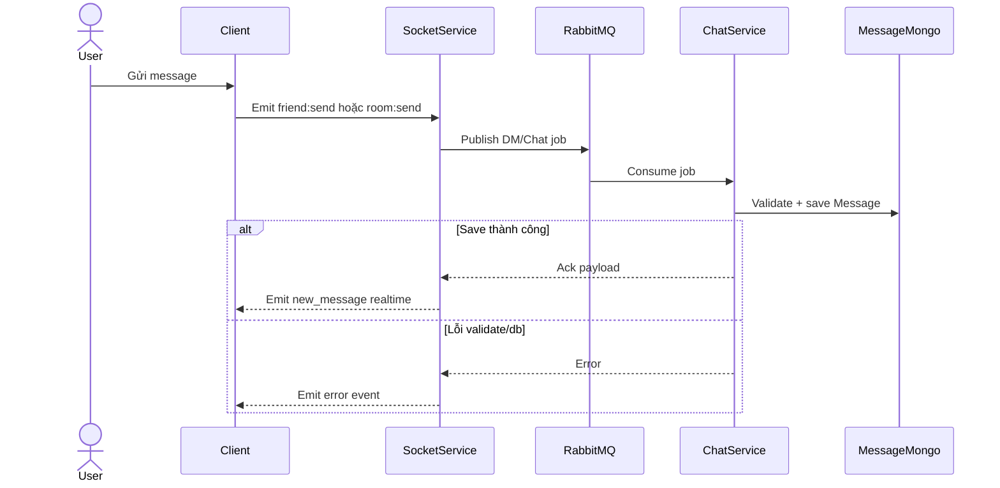
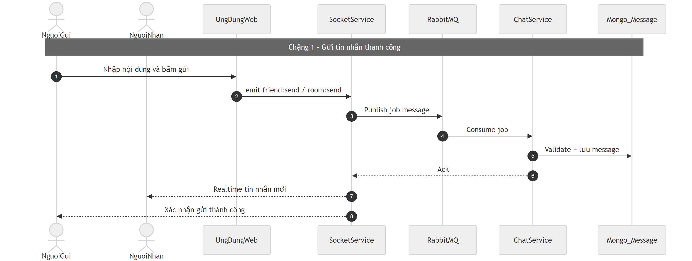
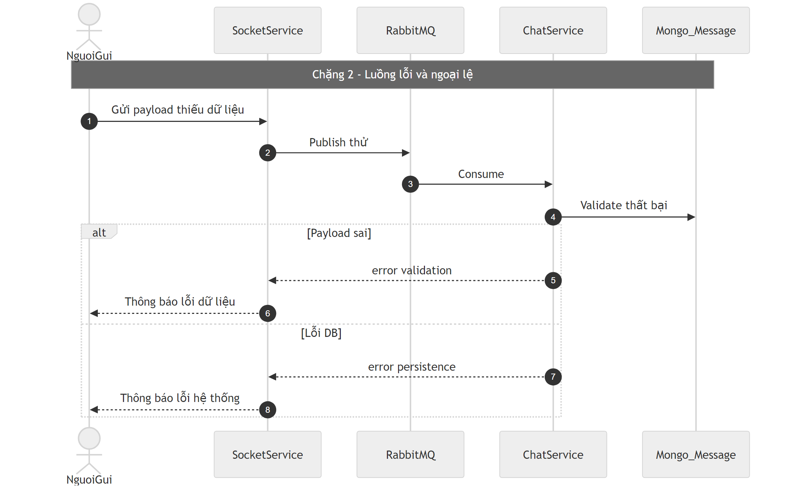

# Flow chat message (DM + phòng)

## Bước 1: Bóc tách kỹ thuật (Code Breakdown)

### Điểm vào
- Gateway proxy: `/api/messages/*`, `/api/chat/*` sang `chat-service`.
- Một số nhánh DM được gateway bypass permission theo server context do không gắn org/server.

### Middleware và tầng xử lý
- Chat service:
  - routes: `message.routes.js`,
  - controller: `message.controller.js`,
  - business: `message.service.js`.
- Realtime:
  - socket-service namespace `/chat`,
  - chat-service có worker consumer DM queue.
- Dòng dữ liệu có thể là đồng bộ HTTP hoặc bất đồng bộ queue/realtime.

### Dữ liệu và tích hợp
- Mongo collection: `Message`.
- Queue:
  - publish từ socket-service,
  - consume tại chat-service (`friendDmConsumer`).
- Realtime event phát qua socket-service.
- Tích hợp upload file tạm/thăng hạng file khi liên quan task.

## Bước 2: Cắt nghĩa nghiệp vụ (Explain Like I Am New)

1. User gửi tin nhắn (DM hoặc trong phòng).
2. Hệ thống kiểm tra payload hợp lệ, xác định đây là DM hay room message.
3. Lưu message vào DB.
4. Đẩy event realtime để người nhận thấy tin mới ngay.
5. Có các thao tác bổ sung như sửa/xóa/thu hồi/đánh dấu đã đọc.

### Rule nghiệp vụ chính
- DM dùng `receiverId`, room chat dùng `roomId`.
- Reply phải cùng ngữ cảnh hội thoại.
- Một số thao tác dùng soft-delete để giữ lịch sử cần thiết.

## Bước 3: Sequence Diagram (Mermaid)

## Bước 4: Review độ tin cậy và điểm mù

- Điểm tốt:
  - Tách rõ realtime và persist, hỗ trợ scale tốt hơn.
  - Có xử lý file và các trạng thái message thực tế.
  - Có hỗ trợ nhánh DM/room riêng.
- Điểm mù:
  - Một số endpoint đọc message theo id/chuyển read cần siết thêm authorization theo người dùng/ngữ cảnh.
  - Room unread hiện thiên về cờ read global trên message, chưa phải mô hình read-state per-user hoàn chỉnh.
  - Có hai lớp socket (chat-service và socket-service), cần chuẩn hóa contract event để tránh lệch hành vi.

## Sơ đồ PNG chi tiết

Tách thành 2 ảnh lớn để dễ đọc: chặng luồng chính và chặng lỗi/ngoại lệ.

- Nguồn 1: `images/04-chat-message-flow-parta.mmd`
- Nguồn 2: `images/04-chat-message-flow-partb.mmd`

## Phụ lục Gold Standard (bổ sung chi tiết endpoint)

### Endpoint chính + payload
- `POST /api/messages` body: `content` + (`receiverId` cho DM hoặc `roomId` cho room).
- `GET /api/messages` query: `receiverId` hoặc `roomId` + paging.
- `GET /api/messages/search` query: keyword/scope context.

### Middleware flow
- Gateway auth + permission theo action `chat:*`.
- DM không có org/server context được gateway cho qua nhánh đặc biệt.
- Chat-service validate chi tiết trong `message.service`.

### DB operations
- Lưu `Message` Mongo.
- Luồng realtime qua socket-service và queue consumer.

### Edge cases
- Payload thiếu context chat: `400`.
- Endpoint đọc/mark-read có điểm cần siết authorize theo ownership.
