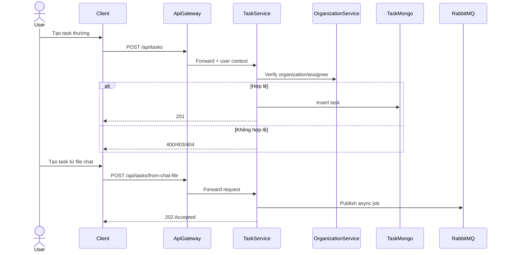
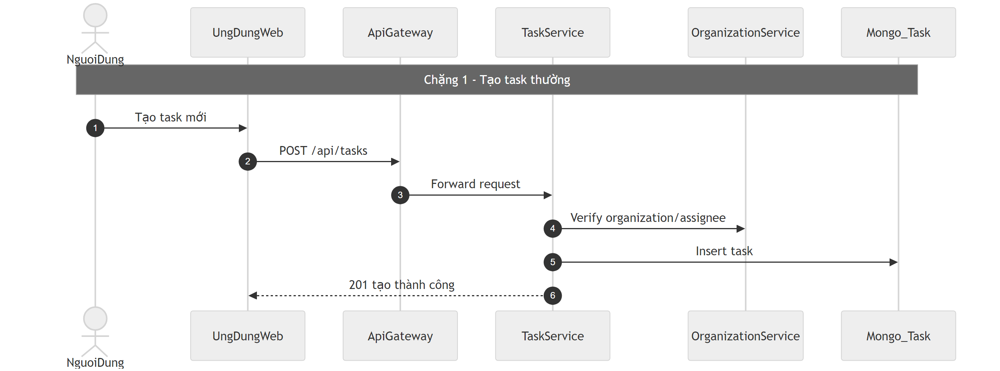
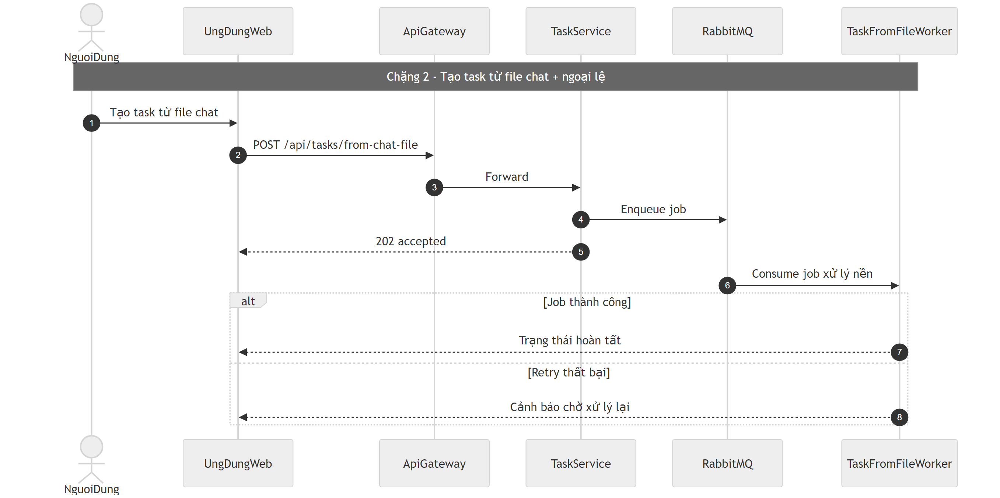

# Flow quản lý công việc (Task)

## Bước 1: Bóc tách kỹ thuật (Code Breakdown)

### Điểm vào
- Gateway proxy: `/api/tasks/*` tới `task-service`.
- Task-service dùng trusted gateway user middleware để lấy user context.

### Middleware và tầng xử lý
- Routes: `task.routes.js`.
- Controller: `task.controller.js`.
- Business: `task.service.js`.
- Có luồng async từ chat-file:
  - publisher `taskFromFilePublisher`,
  - worker `taskFromFileWorker`.

### Dữ liệu và tích hợp
- Mongo collection: `Task`.
- Tích hợp organization-service để verify tổ chức/assignee.
- Webhook gửi sự kiện task qua webhook-service.
- Realtime event khi tạo task từ file chat.

## Bước 2: Cắt nghĩa nghiệp vụ (Explain Like I Am New)

1. User tạo task trong phạm vi tổ chức.
2. Hệ thống kiểm tra user có ngữ cảnh hợp lệ, dữ liệu task hợp lệ.
3. Lưu task vào DB.
4. Nếu task được tạo từ file trong chat, hệ thống chạy bất đồng bộ qua queue:
   - nhận job,
   - promote file tạm,
   - tạo task chính thức.
5. User có thể cập nhật trạng thái, bình luận, hoặc xóa mềm theo luật service.

### Rule nghiệp vụ chính
- Task bắt buộc gắn `organizationId`.
- Một số thao tác chỉ cho creator/assignee.
- Luồng từ chat-file là async và trả accepted sớm.

## Bước 3: Sequence Diagram (Mermaid)

## Bước 4: Review độ tin cậy và điểm mù

- Điểm tốt:
  - Có luồng async cho tác vụ nặng từ chat-file.
  - Có kiểm tra tổ chức liên dịch vụ trước khi lưu task.
  - Middleware trusted gateway user rõ ràng.
- Điểm mù:
  - Nên bổ sung idempotency key cho luồng tạo task từ chat-file để tránh tạo trùng do retry.
  - Nên thống nhất phát webhook đầy đủ cho update/assign/complete, không chỉ create.
  - Cần quan sát DLQ/retry metrics sát hơn cho worker queue.

## Sơ đồ PNG chi tiết

Tách thành 2 ảnh lớn để dễ đọc: chặng luồng chính và chặng lỗi/ngoại lệ.

- Nguồn 1: `images/05-task-flow-parta.mmd`
- Nguồn 2: `images/05-task-flow-partb.mmd`

## Phụ lục Gold Standard (bổ sung chi tiết endpoint)

### Endpoint chính
- `POST /api/tasks` tạo task thường.
- `PATCH/PUT /api/tasks/:id` cập nhật task.
- `POST /api/tasks/from-chat-file` tạo task async từ file chat.

### Payload cốt lõi
- `organizationId` (bắt buộc), `title`, `description`, `assigneeId` (tùy chọn), trạng thái/priority theo model.

### Middleware flow
- Gateway auth -> task-service `gatewayUser` middleware.
- Task-service verify org/assignee qua service liên quan.

### DB/Queue
- Mongo `Task`.
- Queue job cho `from-chat-file`, worker xử lý nền.

### Edge cases
- Sai org context: `403/404`.
- Job async lỗi: retry/DLQ; client nhận `202` trước.
