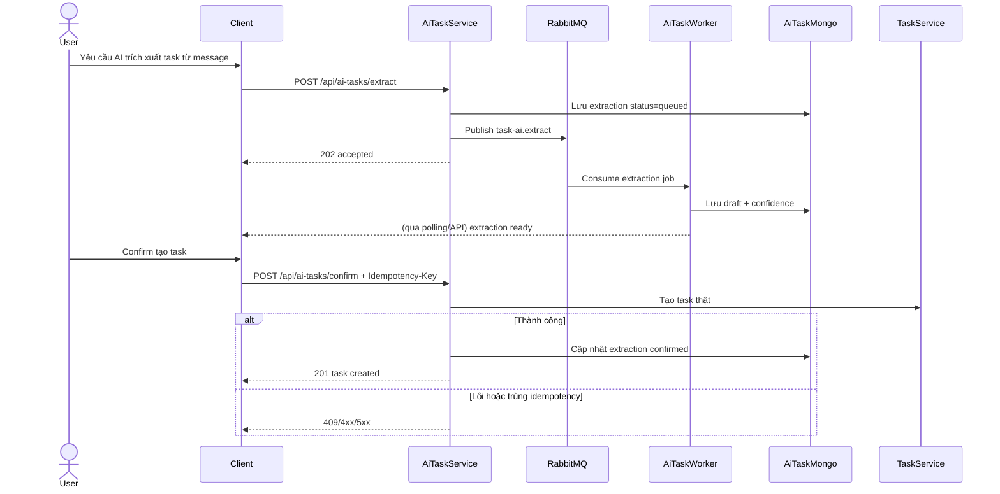
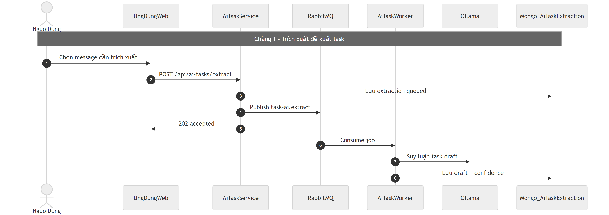
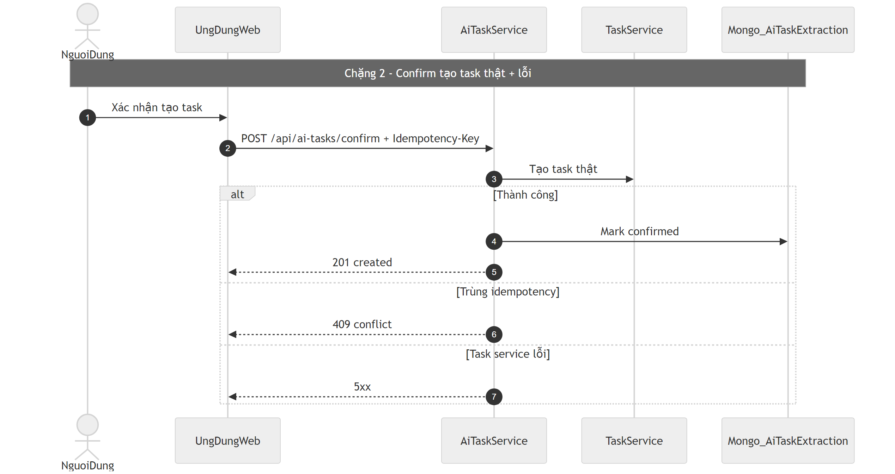

# Flow trích xuất task bằng AI (AI Task)

## Bước 1: Bóc tách kỹ thuật (Code Breakdown)

### Điểm vào
- Gateway proxy `/api/ai-tasks/*` tới `ai-task-service`.
- Route chính:
  - `/extract` (đưa message vào hàng đợi AI),
  - `/confirm` (xác nhận tạo task thật),
  - route sync suggestion liên quan message thay đổi.

### Middleware và tầng xử lý
- ai-task-service nhận request, lưu extraction trạng thái `queued`.
- Publish queue `task-ai.extract` hoặc `task-ai.sync`.
- `ai-task-worker` consume:
  - lấy dữ liệu message/file,
  - gọi model AI (Ollama),
  - ghi kết quả draft/confidence.

### Dữ liệu và tích hợp
- Mongo collections:
  - `AiTaskExtraction`,
  - `SyncSuggestion`.
- Queue: RabbitMQ + DLQ.
- Khi confirm:
  - gọi task-service để tạo task thật.
- Có idempotency key ở endpoint confirm.

## Bước 2: Cắt nghĩa nghiệp vụ (Explain Like I Am New)

1. User chọn tin nhắn cần AI trích xuất thành task.
2. Hệ thống không chạy AI ngay trên request chính, mà đẩy vào queue.
3. Worker xử lý nền và trả bản đề xuất task.
4. User xem đề xuất, chỉnh nếu cần, rồi bấm xác nhận.
5. Hệ thống tạo task thật trong task-service.
6. Nếu tin nhắn gốc bị sửa/xóa, hệ thống có thể sinh cảnh báo đồng bộ (sync suggestion).

### Rule nghiệp vụ chính
- Confirm phải idempotent để bấm lại không tạo trùng task.
- Nếu task đã vào trạng thái tiến triển sâu (`in_progress/review/done`) thì không tự sync đè.
- Tách rõ extraction queue và sync queue.

## Bước 3: Sequence Diagram (Mermaid)

## Bước 4: Review độ tin cậy và điểm mù

- Điểm tốt:
  - Thiết kế async queue phù hợp bài toán AI nặng.
  - Có idempotency cho bước confirm quan trọng.
  - Có mô hình sync suggestion khi nguồn chat thay đổi.
- Điểm mù:
  - Cần bảo đảm route internal purge của ai-task-service được mount đầy đủ để hỗ trợ cascade delete organization.
  - Cần thống nhất schema giữa service và worker để tránh drift field theo thời gian.
  - Cần kiểm tra đầy đủ trusted/internal headers khi worker gọi task-service.

## Sơ đồ PNG chi tiết

Tách thành 2 ảnh lớn để dễ đọc: chặng luồng chính và chặng lỗi/ngoại lệ.

- Nguồn 1: `images/06-ai-task-flow-parta.mmd`
- Nguồn 2: `images/06-ai-task-flow-partb.mmd`

## Phụ lục Gold Standard (bổ sung chi tiết endpoint)

### Endpoint chính
- `POST /api/ai-tasks/extract` enqueue extraction.
- `POST /api/ai-tasks/confirm` tạo task thật với idempotency key.

### Payload
- Extract: tham chiếu message/source + context.
- Confirm: extractionId + field xác nhận + `Idempotency-Key`.

### Middleware + xử lý
- Gateway auth -> ai-task-service.
- Worker xử lý queue `task-ai.extract` và `task-ai.sync`.

### DB/Queue
- `AiTaskExtraction`, `SyncSuggestion`.
- RabbitMQ + DLQ.

### Edge cases
- Confirm trùng key: `409`.
- LLM/task-service lỗi: `5xx`.
