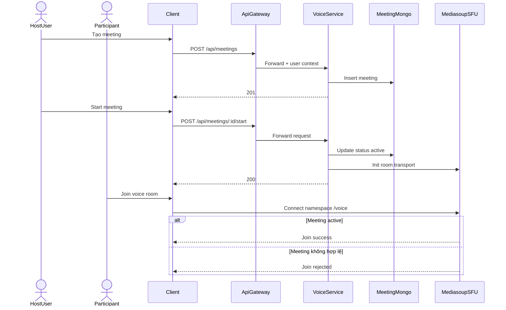
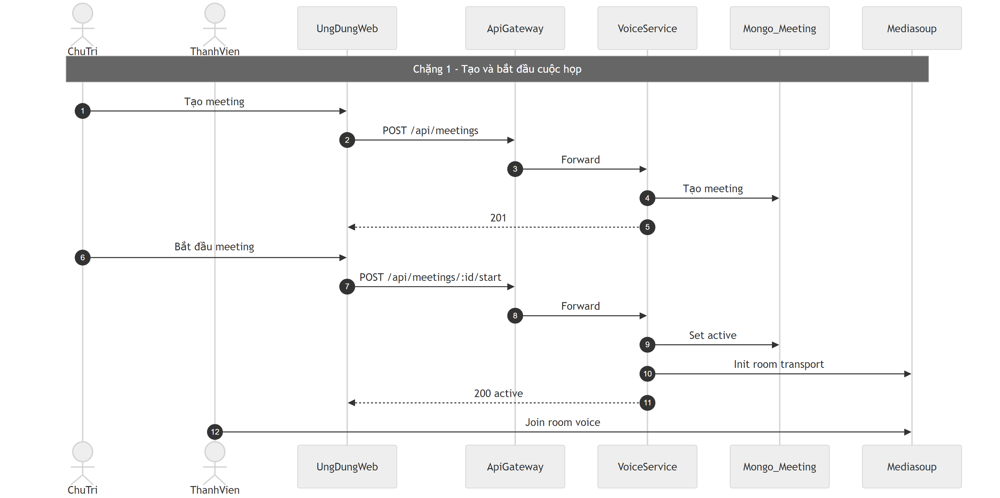
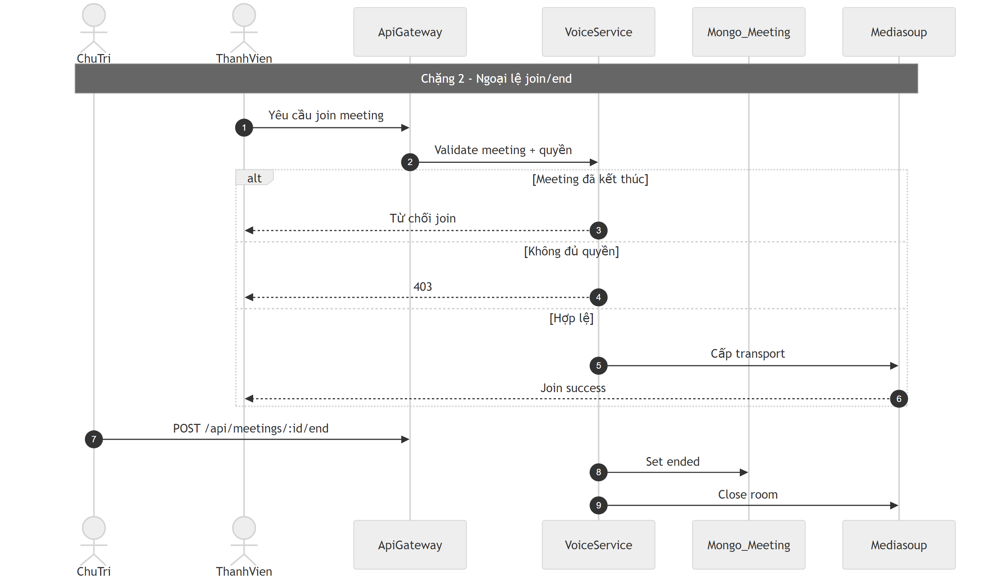

# Flow họp thoại (Voice Meeting)

## Bước 1: Bóc tách kỹ thuật (Code Breakdown)

### Điểm vào
- Gateway proxy `/api/meetings/*` tới `voice-service`.
- Voice-service quản lý cả API meeting lifecycle và socket realtime voice.

### Middleware và tầng xử lý
- Routes: `meeting.routes.js`.
- Controller: `meeting.controller.js`.
- Business: `meeting.service.js`.
- Middleware trusted gateway user để lấy actor.
- Socket namespace `/voice` + SFU manager (`mediasoup`).

### Dữ liệu và tích hợp
- Mongo collection: `Meeting`.
- Realtime voice: Socket.IO + mediasoup room transport.
- Có endpoint bootstrap room để client vào phiên nhanh.

## Bước 2: Cắt nghĩa nghiệp vụ (Explain Like I Am New)

1. User tạo cuộc họp với thông tin server/channel/time.
2. Hệ thống lưu meeting ở trạng thái chuẩn bị.
3. Chủ trì bấm start thì meeting chuyển active.
4. Người tham gia join/leave trong vòng đời cuộc họp.
5. Khi kết thúc, meeting chuyển ended và đóng các tài nguyên realtime liên quan.

### Rule nghiệp vụ chính
- Chỉ cho phép thao tác participant phù hợp theo trạng thái meeting.
- Luồng start/end cần actor hợp lệ theo quyền.
- Dữ liệu meeting cần gắn ngữ cảnh server/channel.

## Bước 3: Sequence Diagram (Mermaid)

## Bước 4: Review độ tin cậy và điểm mù

- Điểm tốt:
  - Tách rõ lifecycle meeting API và transport realtime.
  - Kiến trúc SFU phù hợp voice nhiều người.
  - Có middleware trusted gateway user.
- Điểm mù:
  - Một số check liên dịch vụ (verify server/channel) cần bảo đảm header auth nội bộ đầy đủ để tránh false negative.
  - Có đoạn populate ref user trong microservice cần kiểm tra model đăng ký local để tránh lỗi runtime.
  - Nên tăng quan sát chất lượng phòng họp (join fail rate, media transport fail, reconnect rate).

## Sơ đồ PNG chi tiết

Tách thành 2 ảnh lớn để dễ đọc: chặng luồng chính và chặng lỗi/ngoại lệ.

- Nguồn 1: `images/07-voice-meeting-flow-parta.mmd`
- Nguồn 2: `images/07-voice-meeting-flow-partb.mmd`

## Phụ lục Gold Standard (bổ sung chi tiết endpoint)

### Endpoint chính
- `POST /api/meetings` tạo meeting.
- `POST /api/meetings/:id/start` bắt đầu.
- `POST /api/meetings/:id/end` kết thúc.
- `POST /api/meetings/:id/participants` quản lý thành viên.

### Middleware flow
- Gateway auth -> voice-service `gatewayUser`.
- Voice namespace kiểm tra join room theo trạng thái meeting.

### DB/Realtime
- Mongo `Meeting`.
- SFU mediasoup cấp transport/đóng room.

### Edge cases
- Meeting không tồn tại: `404`.
- Không đủ quyền hoặc meeting đã kết thúc: `403` / join rejected.
