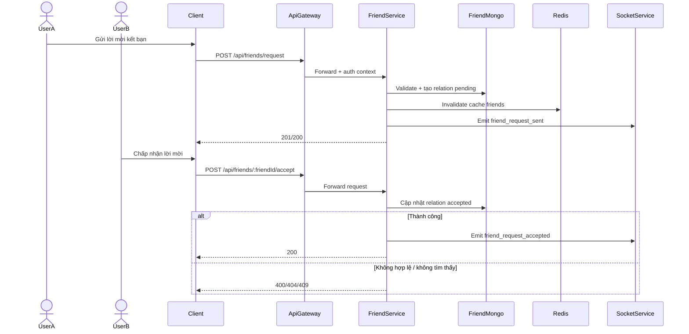
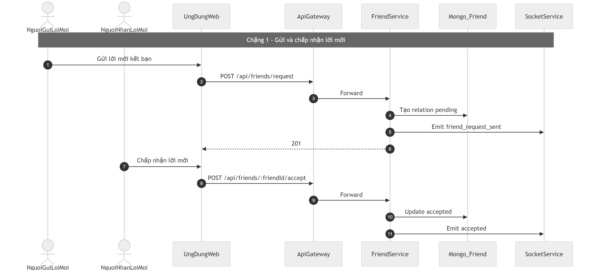
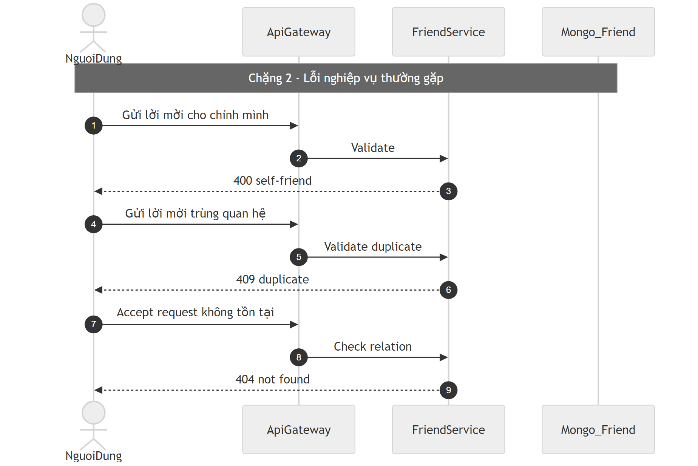

# Flow bạn bè (Friend)

## Bước 1: Bóc tách kỹ thuật (Code Breakdown)

### Điểm vào
- Gateway proxy `/api/friends/*` sang `friend-service`.
- Gateway vẫn auth, nhưng friend nằm nhóm route không ép permission theo server/org context.

### Middleware và tầng xử lý
- `friend-service/src/routes/friend.routes.js` dùng `router.use(protect)`.
- Middleware `protect` gọi `auth-service /api/auth/me` để xác thực user.
- Controller:
  - `friend.controller.js` (luồng mới),
  - `friendController.js` (legacy tương thích).
- Business logic chính: `friend.service.js`.

### Dữ liệu và tích hợp
- Mongo collection: `Friend` (quan hệ hai chiều, status `pending|accepted|blocked`).
- Redis cache danh sách bạn theo key `friends:<userId>`.
- Gọi `user-service` để enrich profile/presence.
- Gọi `chat-service` nội bộ khi unfriend để dọn DM.
- Realtime/webhook cho sự kiện gửi/chấp nhận/từ chối/chặn.

## Bước 2: Cắt nghĩa nghiệp vụ (Explain Like I Am New)

1. User A gửi lời mời kết bạn cho user B.
2. Hệ thống kiểm tra: không tự kết bạn với chính mình, không trùng quan hệ.
3. Tạo quan hệ trạng thái `pending`.
4. User B có thể chấp nhận hoặc từ chối:
   - chấp nhận -> đổi sang `accepted`,
   - từ chối -> xóa hoặc giữ trạng thái phù hợp theo code route xử lý.
5. Nếu block, hệ thống chuyển trạng thái `blocked`.
6. Khi hủy kết bạn, hệ thống có thể đồng thời dọn dữ liệu DM liên quan.

### Rule nghiệp vụ chính
- Cấm self-friend.
- Không tạo duplicate relation.
- Có state machine tối thiểu: pending -> accepted hoặc blocked.

## Bước 3: Sequence Diagram (Mermaid)

## Bước 4: Review độ tin cậy và điểm mù

- Điểm tốt:
  - Có kiểm tra self-friend và duplicate ở tầng service/model.
  - Có cache + realtime để UX nhanh hơn.
  - Có cơ chế fail-fast khi DB chưa sẵn sàng.
- Điểm mù:
  - Tồn tại controller/route legacy song song, dễ gây drift hành vi.
  - Cần chuẩn hóa rõ semantics reject/remove giữa các endpoint cũ mới.
  - Nên thêm idempotency cho accept/reject khi user bấm lặp nhanh.

## Sơ đồ PNG chi tiết

Tách thành 2 ảnh lớn để dễ đọc: chặng luồng chính và chặng lỗi/ngoại lệ.

- Nguồn 1: `images/09-friend-flow-parta.mmd`
- Nguồn 2: `images/09-friend-flow-partb.mmd`

## Phụ lục Gold Standard (bổ sung chi tiết endpoint)

### Endpoint chính
- `POST /api/friends/request` gửi lời mời.
- `POST /api/friends/:friendId/accept` chấp nhận.
- `POST /api/friends/:friendId/reject` từ chối.
- `POST /api/friends/:friendId/block`, `DELETE /api/friends/:friendId`.

### Payload
- Chủ yếu theo path param `friendId`; gửi lời mời cần user đích.

### Middleware flow
- Gateway auth -> friend-service `protect`.
- Validate nghiệp vụ ở `friend.service`.

### DB/Cache
- Mongo `Friend` (pending/accepted/blocked).
- Redis cache danh sách friend.

### Edge cases
- Tự kết bạn: `400`.
- Duplicate relation: `409`.
- Request không tồn tại: `404`.
