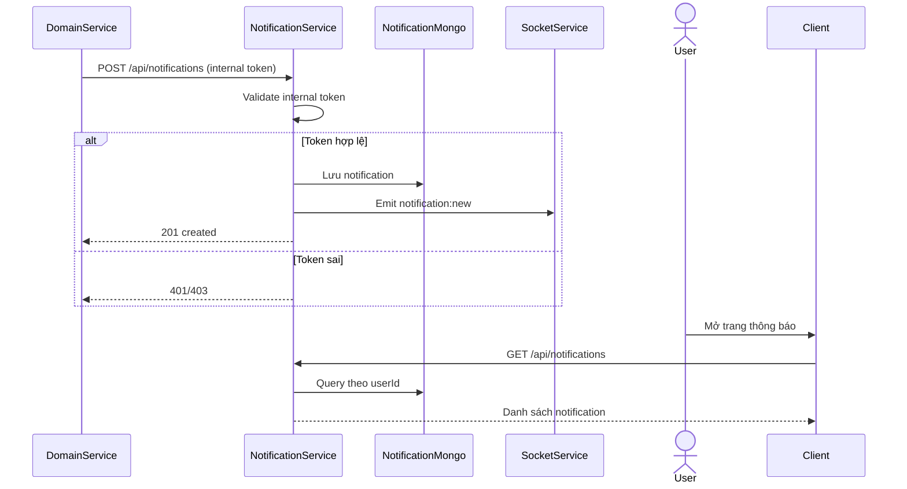
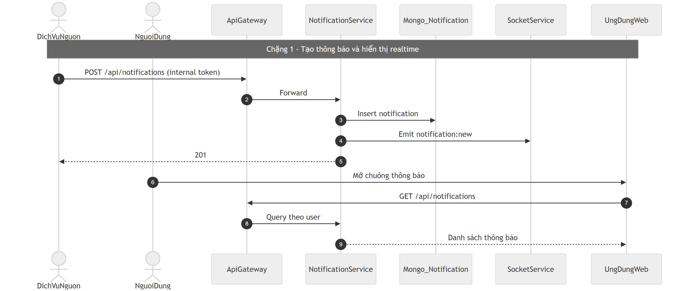
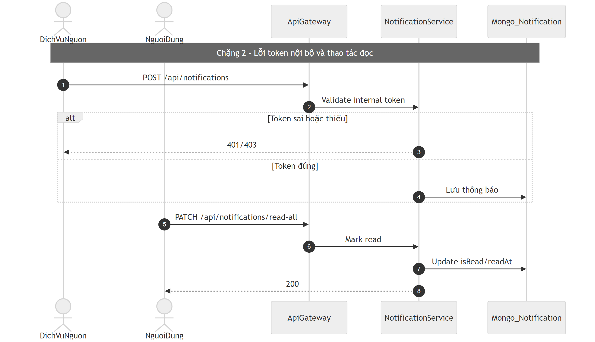

# Flow thông báo (Notification)

## Bước 1: Bóc tách kỹ thuật (Code Breakdown)

### Điểm vào
- Gateway proxy: `/api/notifications/*` sang `notification-service`.
- Các API tạo notification (`POST /`, `POST /bulk`) là nội bộ, cần internal token.

### Middleware và tầng xử lý
- `gatewayUserMiddleware` đọc trusted header user từ gateway.
- `internalNotificationAuth` kiểm tra `x-internal-notification-token` hoặc `x-internal-token` cho API nội bộ.
- Controller: `notification.controller.js`.
- Service: `notification.service.js`.

### Dữ liệu và tích hợp
- Mongo collection: `Notification`.
- Realtime events:
  - `notification:new`, `notification:bulk_new`,
  - `notification:read`, `notification:read_many`, `notification:read_all`,
  - `notification:deleted`.
- Có lớp xử lý encryption/lazy migration cho một số field nội dung.

## Bước 2: Cắt nghĩa nghiệp vụ (Explain Like I Am New)

1. Khi hệ thống khác (friend/task/organization...) muốn báo cho user, nó gọi API nội bộ notification-service.
2. Notification-service xác thực token nội bộ.
3. Nếu hợp lệ, hệ thống lưu bản ghi thông báo cho user.
4. Đồng thời bắn realtime để người dùng thấy chuông thông báo ngay.
5. Người dùng có thể:
   - xem danh sách,
   - đánh dấu đã đọc từng cái hoặc tất cả,
   - xóa thông báo.

### Rule nghiệp vụ chính
- API tạo notification không mở cho client public trực tiếp.
- Mark read chỉ áp dụng trên thông báo của chính user hiện tại.
- Có luồng chuyên dụng `read-friend-related` cho thông báo liên quan friend.

## Bước 3: Sequence Diagram (Mermaid)

## Bước 4: Review độ tin cậy và điểm mù

- Điểm tốt:
  - Ranh giới internal/public khá rõ cho API tạo thông báo.
  - Có event realtime đầy đủ cho create/read/delete.
  - Có index phù hợp cho truy vấn theo user + trạng thái đọc.
- Điểm mù:
  - Cần chuẩn hóa vòng đời encryption version (`encV`) trong kế hoạch migration dài hạn.
  - Nên thêm dead-letter hoặc retry policy rõ cho nguồn tạo thông báo bên ngoài nếu lỗi mạng.
  - Cần dashboard theo dõi tỷ lệ emit realtime lỗi để tránh “đã lưu DB nhưng không nổi chuông”.

## Sơ đồ PNG chi tiết

Tách thành 2 ảnh lớn để dễ đọc: chặng luồng chính và chặng lỗi/ngoại lệ.

- Nguồn 1: `images/10-notification-flow-parta.mmd`
- Nguồn 2: `images/10-notification-flow-partb.mmd`

## Phụ lục Gold Standard (bổ sung chi tiết endpoint)

### Endpoint chính
- `POST /api/notifications` (internal token bắt buộc).
- `POST /api/notifications/bulk`.
- `GET /api/notifications`, `PATCH /read-all`, `PATCH /:id/read`.

### Middleware flow
- Gateway auth + `gatewayUserMiddleware` cho API người dùng.
- `internalNotificationAuth` cho API tạo từ service nội bộ.

### DB/Realtime
- Mongo `Notification`.
- Emit realtime cho create/read/delete.

### Edge cases
- Thiếu/sai internal token: `401/403`.
- Notification không tồn tại khi mark/delete: `404`.
