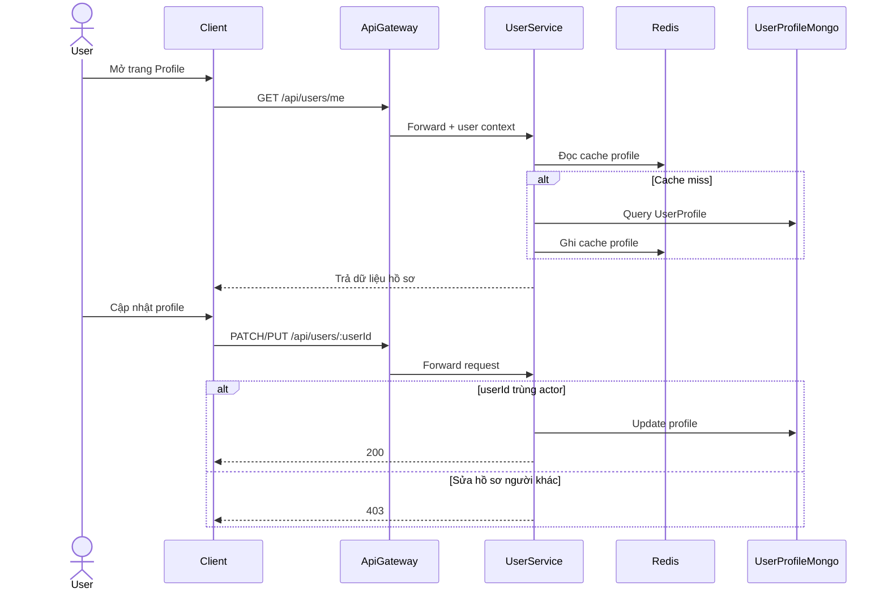
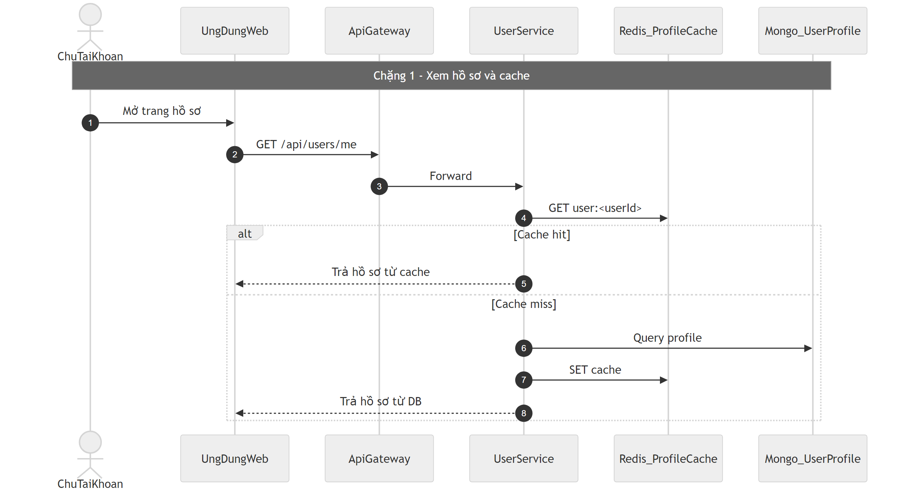
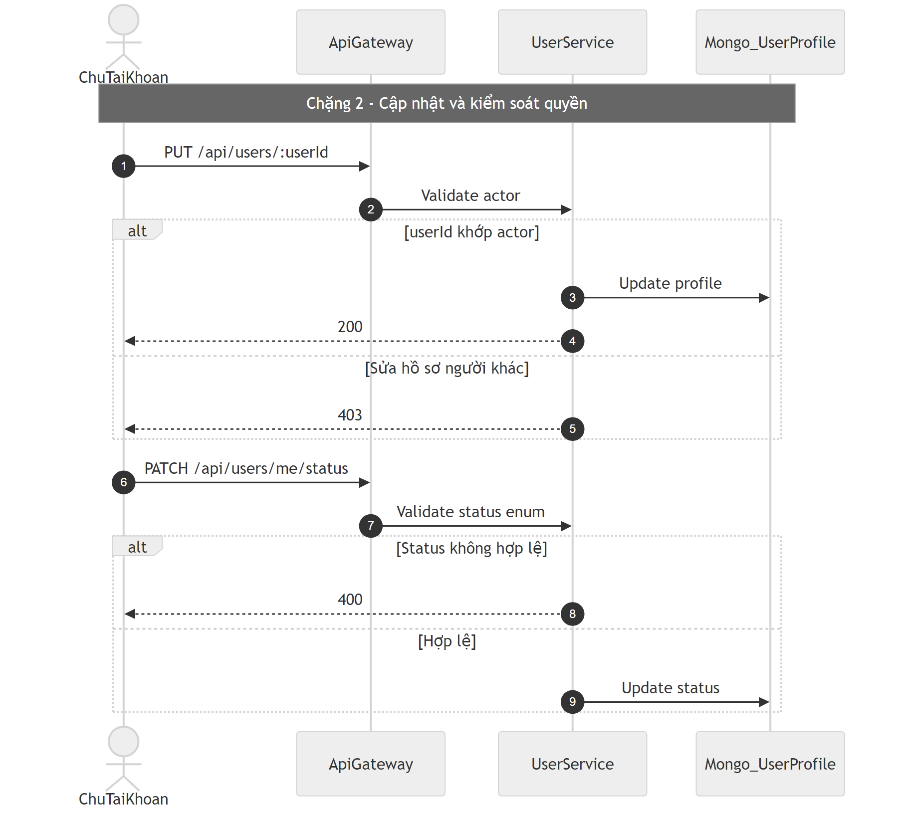

# Flow hồ sơ người dùng (User Profile)

## Bước 1: Bóc tách kỹ thuật (Code Breakdown)

### Điểm vào
- Gateway proxy: `/api/users/*` sang `user-service`.
- Một số route như `/api/users/me` được cho qua lớp permission của gateway, nhưng vẫn cần auth.

### Middleware và tầng xử lý
- User service route chính: `services/user-service/src/routes/user.routes.js`.
- Middleware:
  - `protect` (trusted gateway header hoặc verify JWT qua auth-service),
  - `userContext` chuẩn hóa user context,
  - `internalServiceAuth` cho route nội bộ.
- Controller: `user.controller.js`.
- Service: `user.service.js`.

### Dữ liệu và tích hợp
- Mongo collection: `UserProfile`.
- Redis cache profile `user:<userId>`.
- Presence status đọc batch từ Redis prefix presence.
- Internal endpoint cho friend/chat gọi enrich profile.

## Bước 2: Cắt nghĩa nghiệp vụ (Explain Like I Am New)

1. Sau khi đăng nhập, user mở trang hồ sơ của mình (`/me`).
2. Hệ thống lấy hồ sơ theo userId hiện tại.
3. User có thể cập nhật thông tin cá nhân của chính mình.
4. Hệ thống chặn nếu user cố sửa hồ sơ của người khác.
5. User có thể cập nhật trạng thái online/away/busy/offline.
6. Khi xóa tài khoản, service đang dùng hướng soft-delete (không xóa cứng ngay).

### Rule nghiệp vụ chính
- Chỉ chủ tài khoản được sửa hoặc xóa hồ sơ của chính mình.
- Status phải thuộc tập cho phép.
- Internal route bắt buộc internal token.

## Bước 3: Sequence Diagram (Mermaid)

## Bước 4: Review độ tin cậy và điểm mù

- Điểm tốt:
  - Có self-authorization ở tầng controller/service.
  - Có cache + endpoint nội bộ để phục vụ nhiều service khác.
  - Có soft-delete an toàn hơn hard-delete.
- Điểm mù:
  - Đồng tồn tại route/controller legacy có thể gây sai khác hành vi nếu không khóa chuẩn dùng.
  - Cần policy rõ vòng đời dữ liệu sau soft-delete (retention/anonymization).
  - Presence cập nhật fail-soft cần metric để tránh trạng thái “ảo”.

## Sơ đồ PNG chi tiết

Tách thành 2 ảnh lớn để dễ đọc: chặng luồng chính và chặng lỗi/ngoại lệ.

- Nguồn 1: `images/11-user-profile-flow-parta.mmd`
- Nguồn 2: `images/11-user-profile-flow-partb.mmd`

## Phụ lục Gold Standard (bổ sung chi tiết endpoint)

### Endpoint chính
- `GET /api/users/me`.
- `PUT/PATCH /api/users/:userId`.
- `DELETE /api/users/:userId` (soft delete).
- `PATCH /api/users/me/status`.

### Middleware flow
- Gateway auth -> user-service `protect`.
- `internalServiceAuth` cho route internal profile/presence.

### DB/Cache
- Mongo `UserProfile`.
- Redis cache profile + presence keys.

### Edge cases
- Sửa profile người khác: `403`.
- Status enum sai: `400`.
- Chưa auth: `401`.
