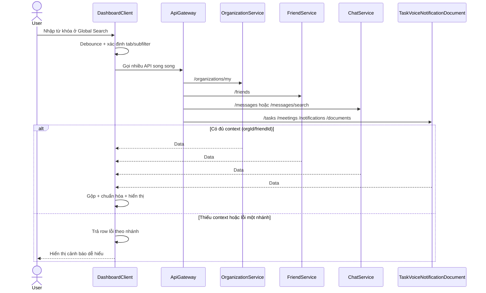
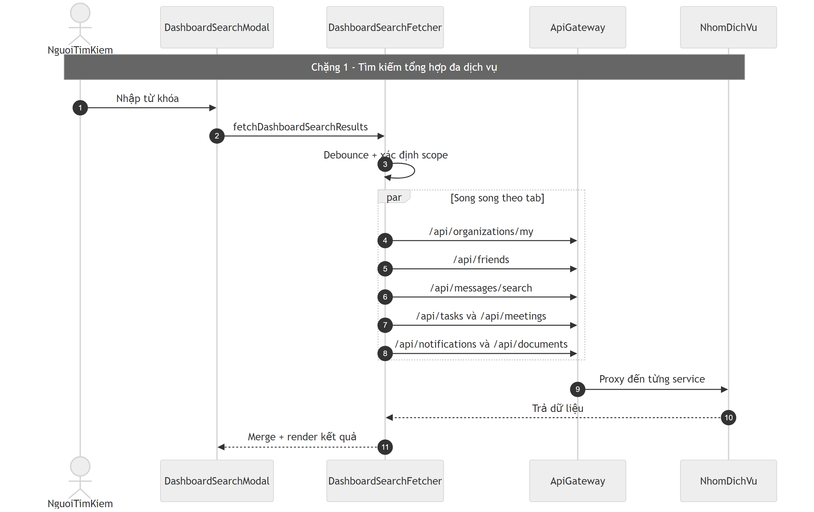
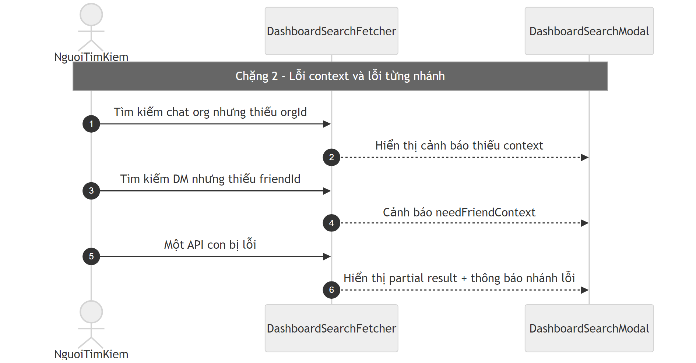

# Flow tìm kiếm tổng quan Dashboard (Dashboard Search)

## Bước 1: Bóc tách kỹ thuật (Code Breakdown)

### Điểm vào
- Đây là luồng tổng hợp phía client, không phải một endpoint backend đơn lẻ.
- Entry chính:
  - `client/src/features/dashboardSearch/fetchDashboardSearchResults.js`
  - `client/src/components/Dashboard/DashboardGlobalSearchModal.jsx`
  - `client/src/features/dashboardSearch/dashboardSearchConfig.js`

### Middleware và tầng xử lý
- Client gọi nhiều API song song qua lớp `client/src/services/api.js`:
  - organization (`/organizations/my`),
  - friends (`/friends`),
  - chat/messages search,
  - tasks, meetings, notifications, documents.
- Ở backend, mỗi endpoint vẫn đi qua gateway auth/permission tương ứng trước khi tới service đích.

### Dữ liệu và tích hợp
- Dữ liệu lấy từ nhiều service: organization/friend/chat/task/voice/notification/document.
- Có debounce query.
- Có nhánh `Promise.all` cho một số tab như calendar.
- Có merge local dữ liệu lịch trong trình duyệt với dữ liệu server.

## Bước 2: Cắt nghĩa nghiệp vụ (Explain Like I Am New)

1. User mở thanh tìm kiếm toàn cục trên Dashboard và gõ từ khóa.
2. Client không gọi 1 API duy nhất mà gọi nhiều API theo tab/subfilter.
3. Kết quả được chuẩn hóa về cùng một cấu trúc hiển thị.
4. Nếu user đang ở ngữ cảnh cụ thể (ví dụ DM với bạn nào, hoặc org nào), client tận dụng context để tìm chính xác hơn.
5. Nếu thiếu context bắt buộc (ví dụ chưa chọn org mà tìm trong org chat), client trả thông báo rõ cho user.

### Rule nghiệp vụ chính
- Tìm trong DM cần có `friendId` ở một số subfilter.
- Tìm trong org chat cần có `orgId`.
- Có giới hạn số bản ghi hiển thị để đảm bảo hiệu năng.

## Bước 3: Sequence Diagram (Mermaid)

## Bước 4: Review độ tin cậy và điểm mù

- Điểm tốt:
  - Luồng search được tách config rõ theo domain.
  - Có xử lý context và thông báo lỗi theo từng nhánh.
  - Có debounce để giảm spam request.
- Điểm mù:
  - Đây là orchestration phía client nên nếu một service đổi contract dễ gây lỗi dây chuyền.
  - Cần contract test định kỳ cho các API mà search phụ thuộc.
  - Cần thống nhất chiến lược pagination/truncation để kết quả giữa các tab không lệch kỳ vọng người dùng.

## Sơ đồ PNG chi tiết

Tách thành 2 ảnh lớn để dễ đọc: chặng luồng chính và chặng lỗi/ngoại lệ.

- Nguồn 1: `images/12-dashboard-search-flow-parta.mmd`
- Nguồn 2: `images/12-dashboard-search-flow-partb.mmd`

## Phụ lục Gold Standard (bổ sung chi tiết endpoint)

### Đặc thù kỹ thuật
- Đây là orchestration ở client, không phải 1 endpoint backend duy nhất.
- Gọi song song: organizations, friends, messages, tasks/meetings, notifications/documents.

### Context bắt buộc
- DM scope cần `friendId` cho một số subfilter.
- Org chat scope cần `orgId`.

### Edge cases
- Thiếu context: trả warning row có chủ đích.
- Một nhánh API lỗi: hiển thị partial result, không fail toàn bộ modal.
