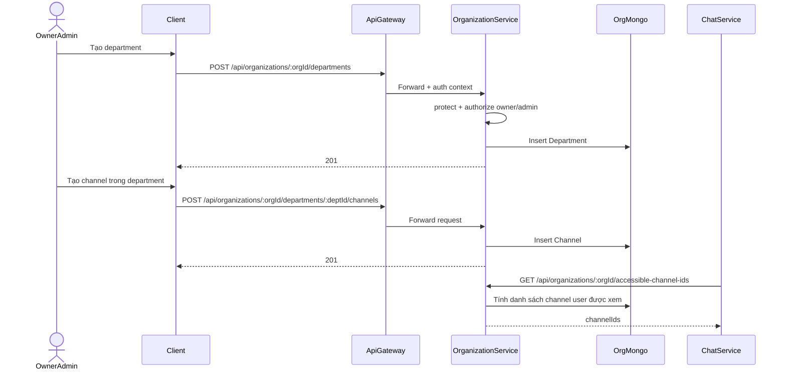
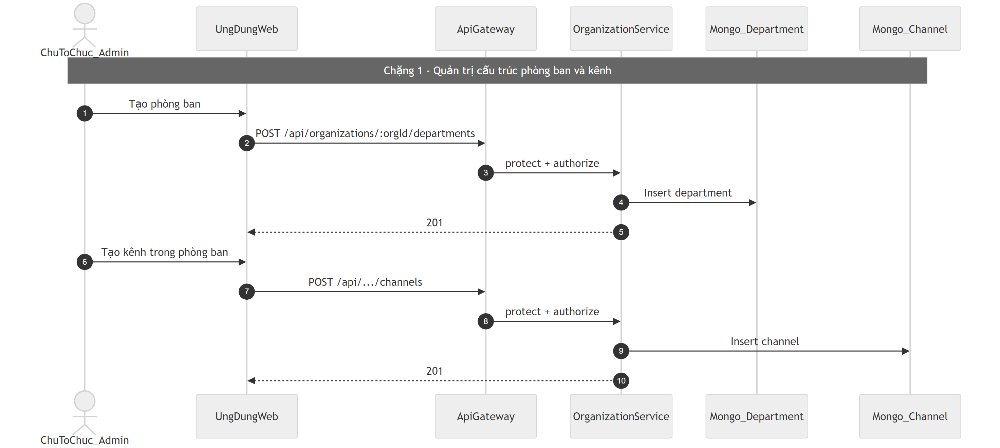
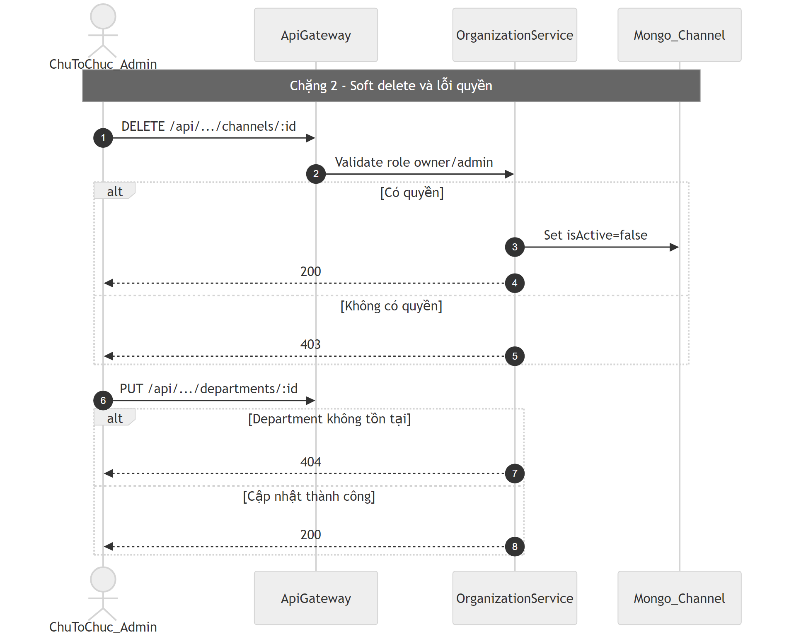

# Flow phòng ban và kênh (Department / Channel)

## Bước 1: Bóc tách kỹ thuật (Code Breakdown)

### Điểm vào
- Gateway proxy nhóm organization tới `organization-service`.
- Route chính:
  - `/api/organizations/:orgId/departments/*`
  - `/api/organizations/:orgId/departments/:deptId/channels/*`

### Middleware và tầng xử lý
- Tại organization-service:
  - `protect` xác thực user context,
  - `authorize(['owner','admin'])` cho thao tác quản trị.
- Controller:
  - `departmentController.js`,
  - `teamController.js` (được dùng như controller channel theo route hiện tại).

### Dữ liệu và tích hợp
- Mongo collections:
  - `Department`,
  - `Channel`,
  - `Membership` (để check quyền org role).
- Khi tạo organization mới sẽ seed department/channel mặc định.
- Có endpoint lấy accessible channel IDs để chat-service dùng kiểm soát phạm vi tìm kiếm.

## Bước 2: Cắt nghĩa nghiệp vụ (Explain Like I Am New)

1. Owner/admin vào trang cấu trúc tổ chức để tạo phòng ban.
2. Trong từng phòng ban, owner/admin có thể tạo các kênh trao đổi.
3. Người dùng thường chỉ thấy các kênh họ được phép truy cập.
4. Khi xóa channel, code đang theo hướng soft delete (`isActive=false`) để tránh mất dữ liệu đột ngột.
5. Luồng này là nền để chat/search biết user được xem dữ liệu kênh nào.

### Rule nghiệp vụ chính
- Chỉ owner/admin mới có quyền CRUD department/channel.
- Channel có thể công khai theo org hoặc giới hạn theo danh sách thành viên.
- Xóa channel ưu tiên soft-delete.

## Bước 3: Sequence Diagram (Mermaid)

## Bước 4: Review độ tin cậy và điểm mù

- Điểm tốt:
  - Permission theo membership role được giữ ở domain service.
  - Có endpoint hỗ trợ chat-service filter quyền truy cập kênh.
  - Có seed mặc định giúp org mới dùng ngay.
- Điểm mù:
  - Controller channel đang đặt trong `teamController.js`, cần chuẩn hóa naming để tránh nhầm domain.
  - Cần kiểm tra chặt validate payload channel/department (độ dài tên, ký tự cấm, trùng tên theo phạm vi).
  - Nên bổ sung audit log cho các thao tác admin thay đổi cấu trúc tổ chức.

## Sơ đồ PNG chi tiết

Tách thành 2 ảnh lớn để dễ đọc: chặng luồng chính và chặng lỗi/ngoại lệ.

- Nguồn 1: `images/13-department-channel-flow-parta.mmd`
- Nguồn 2: `images/13-department-channel-flow-partb.mmd`

## Phụ lục Gold Standard (bổ sung chi tiết endpoint)

### Endpoint chính
- `GET/POST /api/organizations/:orgId/departments`
- `PUT/DELETE /api/organizations/:orgId/departments/:id`
- `GET/POST/PUT/DELETE /api/organizations/:orgId/departments/:deptId/channels`

### Middleware flow
- Gateway auth -> organization-service `protect` -> `authorize(['owner','admin'])` cho thao tác quản trị.

### DB operations
- Mongo `Department`, `Channel`.
- Xóa channel theo soft-delete (`isActive=false`).

### Edge cases
- Không đủ quyền quản trị: `403`.
- Entity không tồn tại: `404`.
