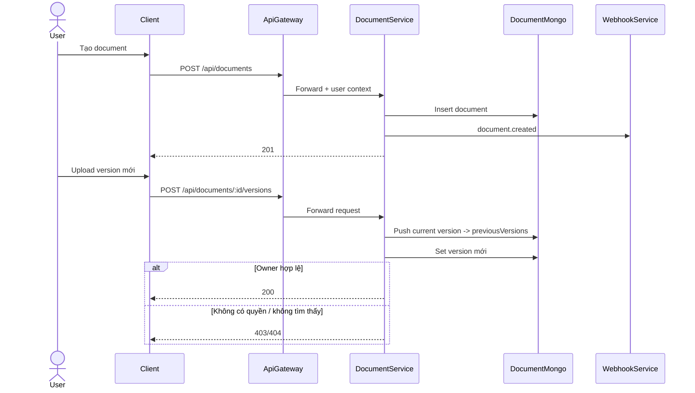
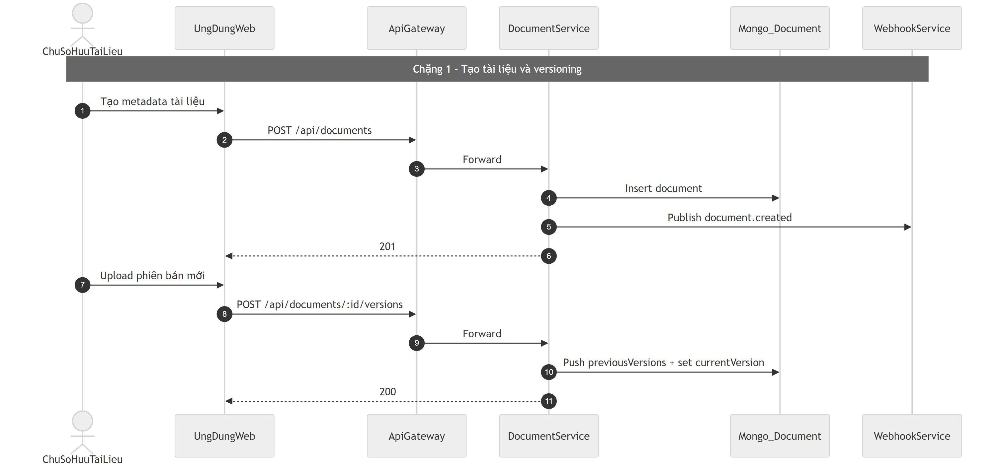
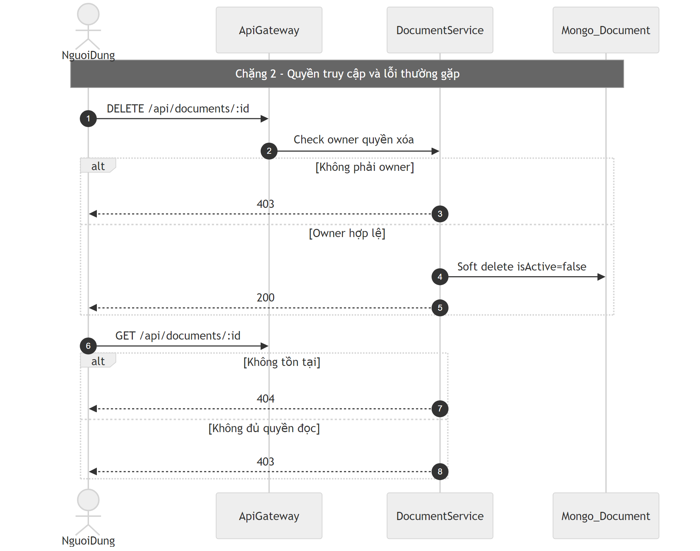

# Flow tài liệu và phiên bản (Document)

## Bước 1: Bóc tách kỹ thuật (Code Breakdown)

### Điểm vào
- Gateway proxy `/api/documents/*` tới `document-service`.
- Route chính:
  - tạo document,
  - lấy danh sách,
  - lấy chi tiết,
  - cập nhật,
  - tạo version,
  - soft delete.

### Middleware và tầng xử lý
- Routes: `document.routes.js`.
- Controller: `document.controller.js`.
- Service: `document.service.js`.
- Auth middleware xác thực user cho thao tác người dùng.

### Dữ liệu và tích hợp
- Mongo collection: `Document`.
- Mỗi lần upload phiên bản mới sẽ đẩy bản cũ vào `previousVersions`.
- Có webhook sự kiện document gửi sang webhook-service.

## Bước 2: Cắt nghĩa nghiệp vụ (Explain Like I Am New)

1. User tạo metadata tài liệu.
2. User upload phiên bản nội dung.
3. Nếu cập nhật phiên bản mới, hệ thống giữ lịch sử phiên bản trước đó.
4. User chỉ được sửa/xóa tài liệu do mình sở hữu (hoặc theo policy chia sẻ/public tương ứng).
5. Xóa thường là soft-delete để còn khả năng truy vết.

### Rule nghiệp vụ chính
- Owner-centric update/delete.
- Versioning bắt buộc lưu lịch sử.
- Query list có thể lọc theo uploader/org/server.

## Bước 3: Sequence Diagram (Mermaid)

## Bước 4: Review độ tin cậy và điểm mù

- Điểm tốt:
  - Có versioning rõ ràng, phù hợp truy vết thay đổi.
  - Có soft-delete để tránh mất dữ liệu đột ngột.
  - Có webhook tích hợp với hệ thống thông báo/quy trình ngoài.
- Điểm mù:
  - Cần bảo đảm internal purge route được mount và bảo vệ auth nội bộ để hỗ trợ xóa theo tổ chức an toàn.
  - Query document theo org/server cần siết kiểm tra membership để tránh lộ dữ liệu ngoài phạm vi.
  - Một số populate ref user cần rà soát tính hợp lệ model local trong kiến trúc microservice.

## Sơ đồ PNG chi tiết

Tách thành 2 ảnh lớn để dễ đọc: chặng luồng chính và chặng lỗi/ngoại lệ.

- Nguồn 1: `images/14-document-flow-parta.mmd`
- Nguồn 2: `images/14-document-flow-partb.mmd`

## Phụ lục Gold Standard (bổ sung chi tiết endpoint)

### Endpoint chính
- `POST /api/documents` tạo metadata.
- `POST /api/documents/:id/versions` tạo phiên bản mới.
- `GET /api/documents`, `GET /api/documents/:id`, `PUT/PATCH`, `DELETE`.

### Middleware flow
- Gateway auth -> document-service auth middleware.
- Quyền update/delete thiên về owner.

### DB operations
- Mongo `Document` + `previousVersions`.
- Soft delete với `isActive=false`.

### Edge cases
- Không đủ quyền owner: `403`.
- Không tìm thấy document: `404`.
- Route internal purge cần được mount đúng để cascade delete đầy đủ.
